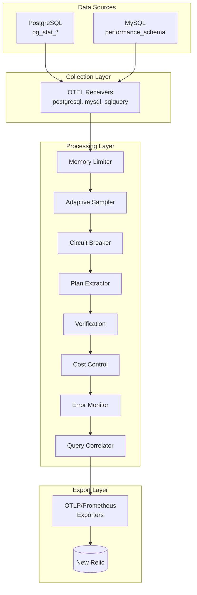

# Database Intelligence MVP - Consolidated Documentation

**Version**: Development/Beta (v2.0.0-dev)  
**Status**: In Development - Not Production Ready  
**Last Updated**: July 3, 2025

## Executive Summary

The Database Intelligence MVP is an OpenTelemetry-based database monitoring solution in active development. While the project shows sophisticated architectural design and comprehensive configuration management, critical components are not yet production-ready.

### Implementation Status Matrix

| Component | Status | Notes |
|-----------|--------|-------|
| Core OTEL Collector | ✅ Implemented | Production-ready foundation |
| PostgreSQL/MySQL Receivers | ✅ Implemented | Standard OTEL receivers |
| 7 Custom Processors | 🟡 Partial | Structure exists, functionality varies |
| pg_querylens Extension | ❌ Not Functional | C extension stub only |
| Configuration Management | ✅ Implemented | 40+ configuration files |
| Deployment Infrastructure | ✅ Implemented | Docker, K8s, Helm |
| E2E Testing | 🟡 Partial | Framework exists, needs validation |

## Architecture Overview

### System Design



### Core Components

#### 1. OpenTelemetry Foundation
- **Base**: OpenTelemetry Collector v0.129.0
- **Pattern**: Standard OTEL component architecture
- **Deployment**: Single binary with plugin architecture

#### 2. Database Receivers
- **PostgreSQL**: Native pg_stat_* metrics collection
- **MySQL**: performance_schema integration
- **SQLQuery**: Custom query execution (for future pg_querylens)

#### 3. Custom Processors (In Development)

**Adaptive Sampler** (576 lines)
- Intelligent query sampling based on configurable rules
- LRU cache for deduplication
- Dynamic rate adjustment
- Status: Basic structure implemented

**Circuit Breaker** (922 lines)
- Database protection against monitoring overhead
- Per-database state management
- Three-state FSM (Closed/Open/Half-Open)
- Status: Core logic implemented

**Plan Attribute Extractor** (391 lines)
- SQL plan analysis and anonymization
- Query fingerprinting
- Plan regression detection framework
- Status: Waiting for pg_querylens completion

**Verification Processor** (1,353 lines)
- PII detection and redaction
- Data quality validation
- Cardinality management
- Status: Framework implemented, patterns need validation

**Cost Control** (892 lines)
- Budget enforcement for New Relic costs
- Real-time spend tracking
- Intelligent data reduction
- Status: Calculations implemented, API integration pending

**NR Error Monitor** (654 lines)
- Proactive error pattern detection
- Integration validation
- Alert generation
- Status: Pattern detection framework ready

**Query Correlator** (450 lines)
- Session-based query linking
- Transaction boundary detection
- Relationship mapping
- Status: Basic correlation logic implemented

## Current Capabilities

### ✅ Fully Implemented

#### Configuration Management
- **40+ YAML configurations** covering multiple deployment scenarios
- **Environment-specific configs**: development, staging, production
- **Overlay system**: Base configurations with environment overlays
- **Security variants**: mTLS, secure production configurations
- **OHI migration**: Compatibility configurations for New Relic transitions

#### Deployment Infrastructure
- **Docker**: Multi-environment compose files with security hardening
- **Kubernetes**: Complete manifests with RBAC, NetworkPolicies, HPA
- **Helm Charts**: Full parameterization with production values
- **Binary**: Standalone executable for development/testing

#### Build System
- **Go Modules**: 14 separate modules with proper dependency management
- **Main Collector**: Sophisticated component factory integration
- **Testing**: Comprehensive test structure with E2E framework

### 🟡 Partially Implemented

#### Custom Processors
- **Structure**: All 7 processors have proper Go module structure
- **Interfaces**: OTEL processor interfaces correctly implemented
- **Core Logic**: Basic processing logic exists
- **Gaps**: Advanced features and integrations incomplete

#### Testing Framework
- **E2E Infrastructure**: Test containers and database setup
- **Benchmark Suite**: Performance testing framework
- **Integration Tests**: Database connectivity validation
- **Gaps**: Comprehensive test coverage and validation data

### ❌ Not Yet Functional

#### pg_querylens Extension
- **C Extension**: Only ~50 lines of stub code
- **Installation**: No compilation or deployment procedures
- **Integration**: SQLQuery configurations reference non-existent tables
- **Impact**: Plan intelligence features non-functional

#### Production Readiness
- **Performance Validation**: No actual benchmark results
- **Security Audit**: No penetration testing or compliance validation
- **Cost Integration**: No real New Relic API integration for pricing
- **Operational Procedures**: Missing production runbooks and procedures

## Configuration Examples

### Minimal Development Configuration
```yaml
receivers:
  postgresql:
    endpoint: localhost:5432
    username: monitoring
    password: ${POSTGRES_PASSWORD}
    databases: [mydb]

processors:
  memory_limiter:
    check_interval: 1s
    limit_percentage: 75

exporters:
  debug:
    verbosity: detailed

service:
  pipelines:
    metrics:
      receivers: [postgresql]
      processors: [memory_limiter]
      exporters: [debug]
```

### Production Configuration Template
```yaml
receivers:
  postgresql:
    endpoint: ${POSTGRES_HOST}:5432
    username: ${POSTGRES_USER}
    password: ${POSTGRES_PASSWORD}
    databases: ["*"]
    collection_interval: 30s
    ssl_mode: require

processors:
  memory_limiter:
    check_interval: 1s
    limit_mib: 512
    
  # Custom processors (when fully implemented)
  adaptivesampler:
    default_sampling_rate: 0.1
    rules:
      - name: slow_queries
        sample_rate: 1.0
        
  batch:
    timeout: 10s
    send_batch_size: 1000

exporters:
  otlp/newrelic:
    endpoint: otlp.nr-data.net:4317
    headers:
      api-key: ${NEW_RELIC_LICENSE_KEY}
    compression: gzip

service:
  pipelines:
    metrics:
      receivers: [postgresql]
      processors: [memory_limiter, adaptivesampler, batch]
      exporters: [otlp/newrelic]
```

## Deployment Guide

### Docker Development
```bash
# Basic development setup
docker-compose up -d

# With custom configuration
docker-compose -f docker-compose.yml -f config/docker-compose.override.yml up -d
```

### Kubernetes
```bash
# Apply base manifests
kubectl apply -f deployments/kubernetes/

# Using Helm (development)
helm install db-intelligence deployments/helm/db-intelligence/
```

### Binary Deployment
```bash
# Build from source
go build -o dist/database-intelligence-collector main.go

# Run with configuration
./dist/database-intelligence-collector --config config/collector.yaml
```

## Security Considerations

### Current Security Features
- **Container Security**: Non-root user, read-only filesystem, minimal Alpine base
- **Network Security**: TLS encryption support, configurable SSL modes
- **Access Control**: Database users with minimal privileges
- **Configuration**: Secure secret management with environment variables

### Security Gaps
- **PII Detection**: Patterns implemented but not validated against real data
- **Compliance Audit**: No formal security assessment completed
- **Penetration Testing**: No security testing performed
- **Audit Trail**: Limited logging of security-relevant events

## Known Limitations

### Technical Limitations
1. **pg_querylens Extension**: Not functional, limiting plan intelligence features
2. **State Persistence**: All processors use in-memory state (no persistence)
3. **Performance Validation**: No actual performance testing with real workloads
4. **Error Recovery**: Limited error handling and recovery mechanisms

### Operational Limitations
1. **Production Procedures**: No operational runbooks or incident response procedures
2. **Monitoring**: Limited self-monitoring and alerting
3. **Scaling**: No horizontal scaling validation
4. **Recovery**: No disaster recovery or backup procedures

### Integration Limitations
1. **New Relic API**: Cost control lacks actual API integration
2. **Dashboard Validation**: Pre-built dashboards not tested with real data
3. **Alert Integration**: No validated alerting workflows
4. **Compliance**: No formal compliance validation (SOC2, HIPAA, etc.)

## Development Roadmap

### Phase 1: Core Functionality (Current)
- [x] OTEL collector foundation
- [x] Configuration management system
- [x] Deployment infrastructure
- [ ] Complete pg_querylens extension
- [ ] Processor functionality validation

### Phase 2: Production Readiness
- [ ] Performance testing and optimization
- [ ] Security audit and compliance validation
- [ ] Operational procedures and runbooks
- [ ] Comprehensive error handling
- [ ] Real-world integration testing

### Phase 3: Advanced Features
- [ ] Machine learning for anomaly detection
- [ ] Advanced query optimization recommendations
- [ ] Multi-tenant support
- [ ] Extended database support (Oracle, SQL Server)

## Getting Started

### Prerequisites
- PostgreSQL 12+ or MySQL 8.0+
- Go 1.21+ (for building from source)
- Docker (for containerized deployment)
- New Relic account (for production use)

### Quick Development Setup
```bash
# Clone repository
git clone <repo-url>
cd database-intelligence-mvp

# Build collector
go build -o dist/database-intelligence-collector main.go

# Start with minimal configuration
./dist/database-intelligence-collector --config config/collector-minimal-test.yaml

# Verify metrics collection
curl http://localhost:8888/metrics
```

### Testing
```bash
# Run unit tests
go test ./...

# Run E2E tests (requires Docker)
cd tests/e2e
docker-compose -f docker-compose.e2e.yml up --build
```

## Support and Contributing

### Current Status
This project is in active development. While the architecture is sophisticated and the configuration management is comprehensive, critical components are not yet production-ready.

### Contributing
1. Review the implementation status matrix above
2. Focus on completing partially implemented features
3. Add comprehensive testing for new functionality
4. Ensure security considerations are addressed

### Documentation Updates
This consolidated documentation replaces multiple overlapping files:
- Root README.md (production claims removed)
- docs/README.md (status updated)
- docs/ARCHITECTURE.md (implementation gaps noted)
- docs/FEATURES.md (aspirational features marked)

### Contact
- Development issues: Focus on completing pg_querylens extension
- Security concerns: Implement proper PII validation
- Performance questions: Add actual benchmarking data

---

**Note**: This documentation provides an honest assessment of the current implementation status. While the project shows significant potential and good architectural patterns, it should not be considered production-ready until the identified gaps are addressed.