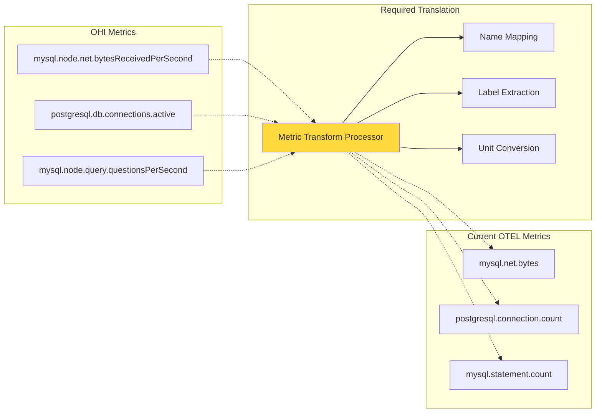
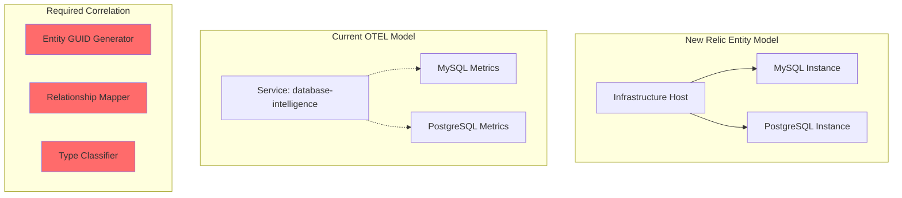
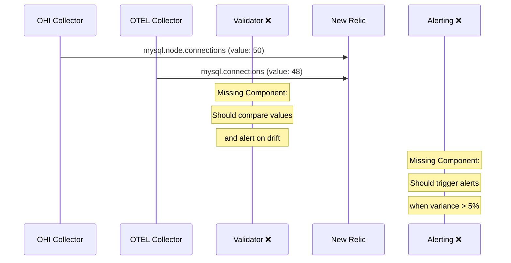
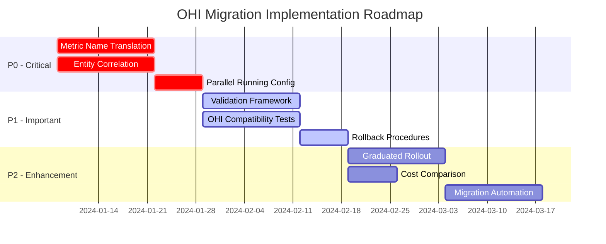
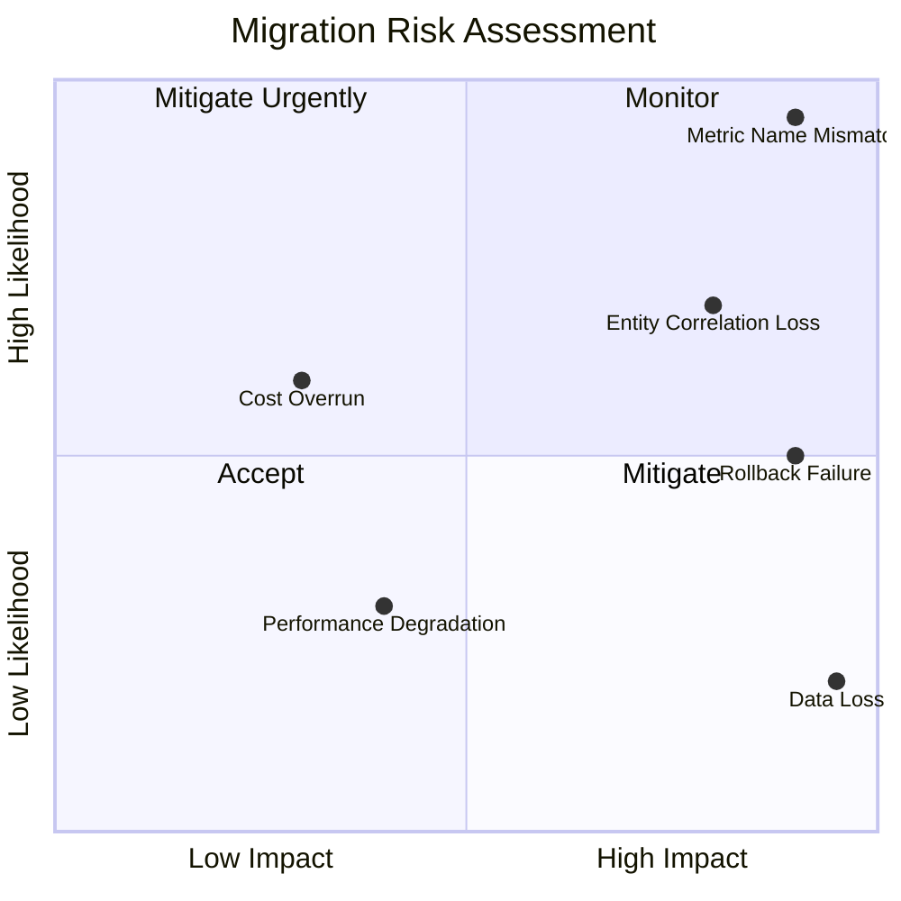
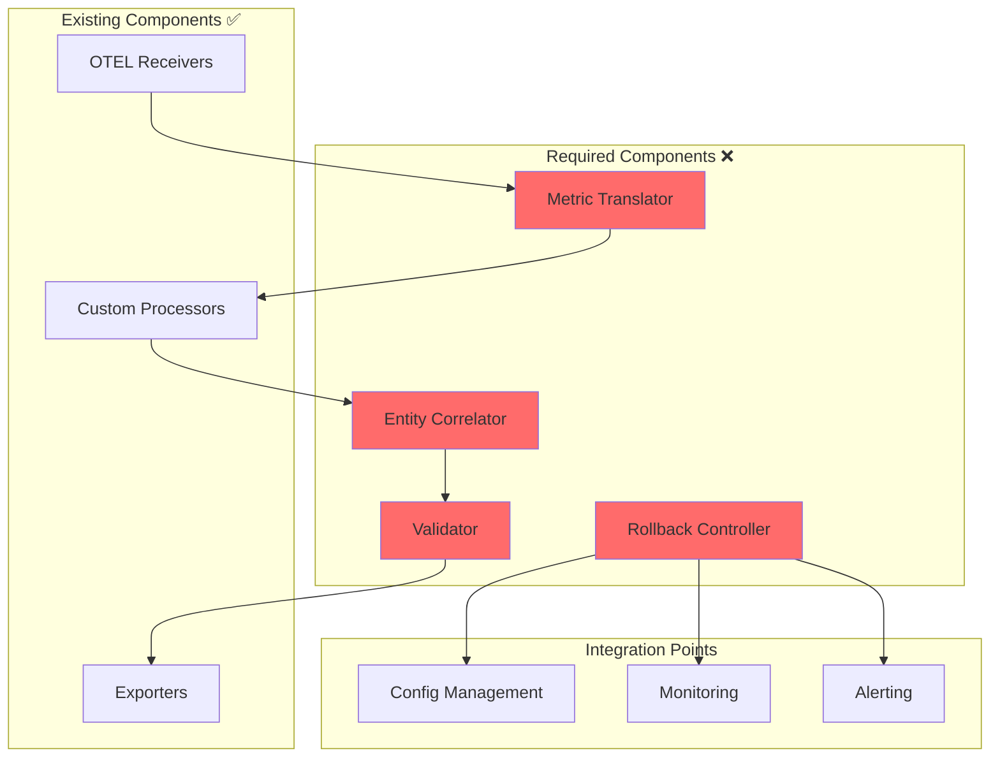

# OHI to OTEL Migration - Gap Analysis Diagram

## Current State vs Required State

```mermaid
graph TB
    subgraph "Current Implementation"
        A[Native OTEL Receivers] --> B[Custom Processors]
        B --> C[OTLP Export to NR]
        
        subgraph "Processors"
            D[AdaptiveSampler]
            E[CircuitBreaker]
            F[PlanExtractor]
            G[Verification]
            H[CostControl]
        end
    end
    
    subgraph "Required for OHI Migration"
        I[OHI + OTEL Receivers] --> J[Translation Layer]
        J --> K[Validation Layer]
        K --> L[Dual Export]
        
        subgraph "Missing Components"
            M[Metric Name Translator]
            N[Entity Correlator]
            O[Real-time Validator]
            P[Rollback Controller]
        end
    end
    
    subgraph "Migration Flow"
        Q[Phase 1: Discovery] -.-> R[Phase 2: Parallel Run]
        R -.-> S[Phase 3: Validation]
        S -.-> T[Phase 4: Cutover]
    end
    
    style M fill:#ff6b6b
    style N fill:#ff6b6b
    style O fill:#ff6b6b
    style P fill:#ff6b6b
```

## Metric Translation Gap

## Entity Correlation Gap

## Validation Framework Gap

## Recommended Implementation Priority

## Risk Heat Map

## Component Dependency Graph

