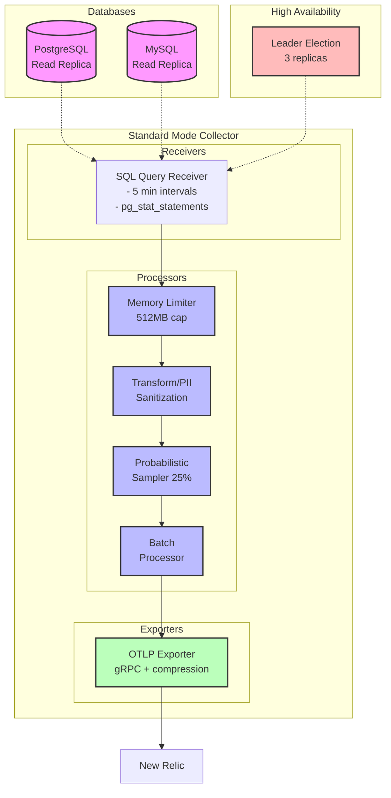
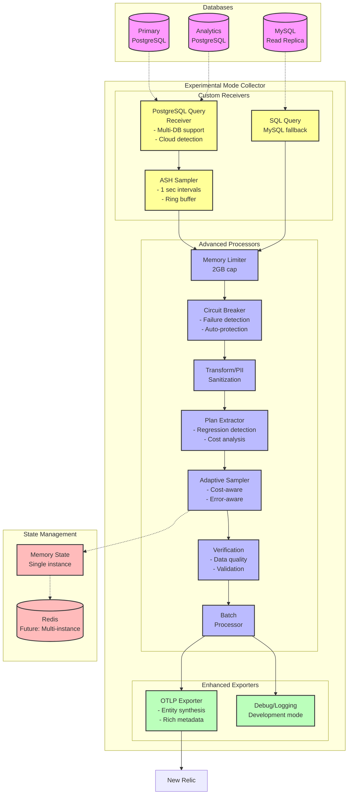

# Technical Architecture

## Overview

This document details the technical architecture of the Database Intelligence MVP, focusing on a safety-first, iterative approach using OpenTelemetry components.

## Standard Mode: Production Architecture

This mode provides a highly available and scalable solution for collecting database metadata.

### Core Design Principles

*   **Safety and Stability**: Built on standard, battle-tested OpenTelemetry components with no custom Go code in the critical data path.
*   **High Availability**: Designed for horizontal scalability using Kubernetes leader election to prevent data duplication.
*   **Metadata, Not Plans**: Collects query metadata and performance metrics from `pg_stat_statements` and Performance Schema, avoiding full query execution plans for safety.

### Production Data Flow

### State Management

*   **Stateless Processors**: Allows safe horizontal scaling.
*   **Leader Election**: Ensures only one collector instance actively queries databases.
*   **No `file_storage` for State**: Avoids single-instance constraints.

### Deployment

Recommended deployment is Kubernetes `Deployment` with multiple replicas (`deploy/k8s/ha-deployment.yaml`).

## Experimental Mode: Advanced Capabilities

This mode includes custom-built Go components for advanced monitoring.

### Custom Components

*   **`planattributeextractor`**: Parses detailed attributes from JSON execution plans.
*   **`adaptivesampler`**: Intelligent, stateful sampler for sophisticated sampling decisions.
*   **`circuitbreaker`**: Automatically halts data collection from unhealthy databases.
*   **`postgresqlquery` receiver**: Advanced receiver with ASH sampling and deeper PostgreSQL integration.

### Experimental Data Flow

## Security Architecture

The project employs a defense-in-depth security model:

1.  **Network**: Connects to read-replica endpoints only; uses Kubernetes `NetworkPolicy` to restrict traffic.
2.  **Authentication**: Uses dedicated, read-only database users.
3.  **Authorization**: Applies the principle of least privilege.
4.  **Data**: PII sanitization redacts sensitive information from query text.
5.  **Transport**: All data is sent to New Relic over a secure TLS connection.