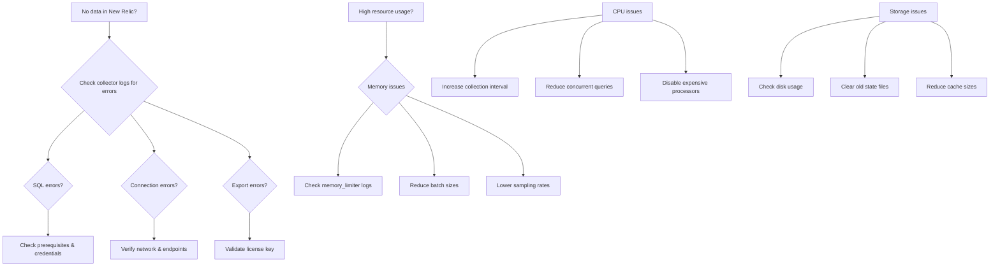

# Troubleshooting Guide

## Quick Diagnosis Flowchart

## Common Issues & Solutions

### 1. No Plans Collected

*   **Symptoms**: Collector running but no data in New Relic, no errors in logs, 0 received records.
*   **Diagnosis**: Test database connectivity (`psql`), check `pg_stat_statements` access, verify EXPLAIN works, check receiver logs.
*   **Solutions**: Enable `pg_stat_statements`, lower slow query thresholds, reduce collection interval.

### 2. Connection Pool Exhaustion

*   **Symptoms**: "Too many connections" errors, database connection limit reached, intermittent collection failures.
*   **Diagnosis**: Check active connections in PostgreSQL (`pg_stat_activity`) or MySQL (`performance_schema.processlist`).
*   **Solutions**: Reduce connection pool size, use a connection pooler (e.g., PgBouncer), increase database connection limit.

### 3. PII Leakage

*   **Symptoms**: Sensitive data visible in New Relic (emails, customer IDs).
*   **Diagnosis**: Search collector logs for PII patterns, check sanitization processor logs.
*   **Solutions**: Add more PII patterns to `transform/sanitize_pii`, enable strict mode to remove all literals.

### 4. State Corruption

*   **Symptoms**: Duplicate data after restart, inconsistent sampling, "State file corrupted" errors.
*   **Diagnosis**: Check state files (`ls -la /var/lib/otel/storage/`), look for storage errors in collector logs.
*   **Solutions**: Clear corrupted state and restart, temporarily disable state.

### 5. Performance Degradation

*   **Symptoms**: Slow query processing, increasing latency, memory growth.
*   **Diagnosis**: Check processing metrics (`curl localhost:8888/metrics`), monitor memory growth.
*   **Solutions**: Optimize regex patterns in `transform/sanitize_pii`, reduce processing complexity in `plan_attribute_extractor`.

### 6. Clock Skew

*   **Symptoms**: Future timestamps in data, correlation failures, "Invalid timestamp" errors.
*   **Diagnosis**: Check system time (`date`, `ntpq -p`), compare with database time (`psql -c "SELECT now();"`).
*   **Solutions**: Enable NTP on collector host, add timestamp validation in `transform` processor.

## Performance Tuning

*   **Memory Optimization**: Reduce `memory_limiter` and `batch` sizes, reduce `adaptive_sampler` cache size.
*   **CPU Optimization**: Increase `sqlquery` collection interval, disable expensive processors.
*   **Network Optimization**: Ensure `gzip` compression, batch more aggressively, retry less aggressively.

## Debug Tools

*   **Enable Detailed Logging**: Set `service.telemetry.logs.level: debug` in collector config.
*   **Use zPages Extension**: Access `http://localhost:55679/debug/tracez` (experimental only).
*   **Manual Testing**: Test EXPLAIN manually (`psql`), test file log parsing.

## Getting Help

### Before Asking for Help

1.  Check all logs.
2.  Verify prerequisites.
3.  Test components individually.
4.  Simplify configuration.
5.  Check known issues.

### Information to Provide

*   Collector version (`otelcol --version`).
*   Configuration (sanitized).
*   Recent logs (`kubectl logs`).
*   Metrics snapshot (`curl localhost:8888/metrics`).
*   Database version (`psql -c "SELECT version();"`).

### Support Channels

*   GitHub Issues (bugs/features).
*   Community Slack.
*   Support Ticket (customers).
*   Stack Overflow (tagged `opentelemetry`).
