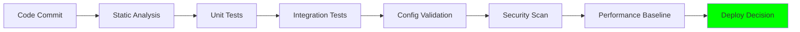
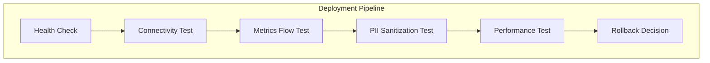
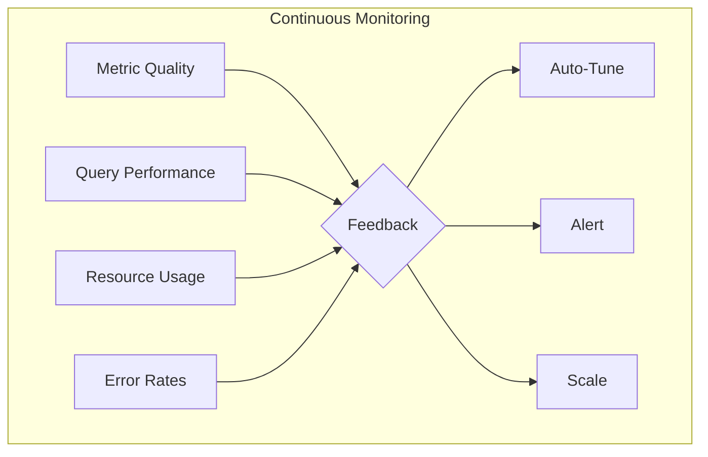
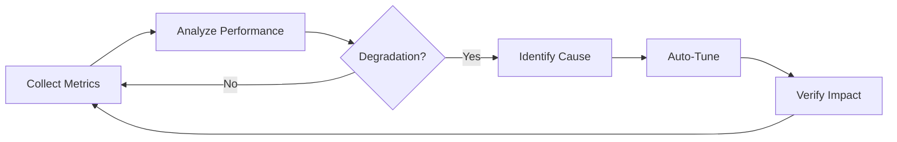
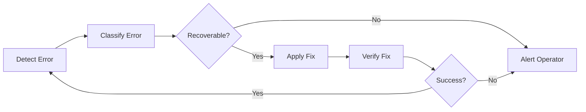
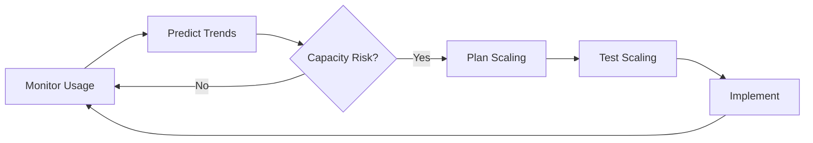

# Verification & Feedback Loop Architecture

## Overview

This document defines a comprehensive verification and feedback loop architecture that goes beyond simple shell scripts to provide continuous validation, self-healing capabilities, and automated quality assurance for the Database Intelligence MVP.

## 🎯 Architecture Principles

1. **Continuous Verification**: Not just at deployment, but ongoing
2. **Self-Healing**: Automatic recovery from common issues
3. **Observability**: Deep insights into system health
4. **Feedback Loops**: Learn from production to improve
5. **Automation First**: Minimize manual intervention

## 📊 Verification Layers

### Layer 1: Pre-Deployment Verification



### Layer 2: Deployment Verification



### Layer 3: Runtime Verification



## 🔧 Implementation Components

### 1. Enhanced Verification Processor

```yaml
# config/verification-processor.yaml
processors:
  database_intelligence/verification:
    enabled: true
    
    # Continuous health checks
    health_checks:
      - name: database_connectivity
        interval: 60s
        timeout: 5s
        
      - name: metric_quality
        interval: 300s
        thresholds:
          missing_attributes: 5%
          invalid_values: 1%
          
      - name: pii_leakage
        interval: 600s
        patterns:
          - email: "\\b[A-Za-z0-9._%+-]+@[A-Za-z0-9.-]+\\.[A-Z|a-z]{2,}\\b"
          - ssn: "\\b\\d{3}-\\d{2}-\\d{4}\\b"
          
    # Feedback loops
    feedback_loops:
      - name: query_performance
        analyze: avg_duration_ms
        action: adjust_sampling_rate
        
      - name: resource_usage
        analyze: memory_usage
        action: adjust_batch_size
        
      - name: error_detection
        analyze: error_rate
        action: circuit_breaker
        
    # Self-healing actions
    self_healing:
      - condition: "database_connection_failed"
        action: "reconnect_with_backoff"
        
      - condition: "memory_limit_exceeded"
        action: "reduce_collection_frequency"
        
      - condition: "high_error_rate"
        action: "activate_circuit_breaker"
```

### 2. Verification Service

```go
// processors/verification/service.go
package verification

import (
    "context"
    "time"
    "go.opentelemetry.io/collector/pdata/pmetric"
)

type VerificationService struct {
    config      *Config
    healthStore *HealthStore
    feedback    *FeedbackEngine
    actions     *ActionEngine
}

// ContinuousVerification runs ongoing checks
func (vs *VerificationService) ContinuousVerification(ctx context.Context) {
    ticker := time.NewTicker(vs.config.VerificationInterval)
    defer ticker.Stop()
    
    for {
        select {
        case <-ticker.C:
            vs.runVerificationCycle(ctx)
        case <-ctx.Done():
            return
        }
    }
}

// runVerificationCycle executes all verification checks
func (vs *VerificationService) runVerificationCycle(ctx context.Context) {
    results := vs.performHealthChecks(ctx)
    
    // Analyze results
    analysis := vs.feedback.Analyze(results)
    
    // Take actions based on analysis
    if analysis.RequiresAction() {
        vs.actions.Execute(ctx, analysis)
    }
    
    // Store for historical analysis
    vs.healthStore.Record(results)
}

// VerifyMetrics ensures metric quality
func (vs *VerificationService) VerifyMetrics(ctx context.Context, metrics pmetric.Metrics) error {
    // Check for required attributes
    if err := vs.verifyAttributes(metrics); err != nil {
        return err
    }
    
    // Check for PII leakage
    if err := vs.verifyPIISanitization(metrics); err != nil {
        return err
    }
    
    // Check metric values are reasonable
    if err := vs.verifyMetricRanges(metrics); err != nil {
        return err
    }
    
    return nil
}
```

### 3. Feedback Engine

```go
// processors/verification/feedback.go
package verification

type FeedbackEngine struct {
    rules      []FeedbackRule
    history    *MetricHistory
    predictor  *TrendPredictor
}

type FeedbackRule struct {
    Name      string
    Condition string
    Action    string
    Threshold float64
}

// Analyze performs feedback analysis
func (fe *FeedbackEngine) Analyze(results HealthResults) Analysis {
    analysis := Analysis{
        Timestamp: time.Now(),
        Health:    results.OverallHealth(),
    }
    
    // Check each rule
    for _, rule := range fe.rules {
        if fe.evaluateRule(rule, results) {
            analysis.TriggeredRules = append(analysis.TriggeredRules, rule)
        }
    }
    
    // Predict trends
    analysis.Predictions = fe.predictor.Predict(fe.history)
    
    return analysis
}

// Auto-tuning based on feedback
func (fe *FeedbackEngine) AutoTune(ctx context.Context, metrics MetricStats) TuningRecommendations {
    recommendations := TuningRecommendations{}
    
    // Adjust sampling rate based on query cost
    if metrics.AvgQueryDuration > 1000 { // >1s
        recommendations.SamplingRate = 1.0 // Sample everything
    } else if metrics.AvgQueryDuration > 100 { // >100ms
        recommendations.SamplingRate = 0.5
    } else {
        recommendations.SamplingRate = 0.1
    }
    
    // Adjust batch size based on throughput
    if metrics.ThroughputPerSec > 1000 {
        recommendations.BatchSize = 1000
    } else {
        recommendations.BatchSize = 100
    }
    
    return recommendations
}
```

### 4. Health Check System

```yaml
# health-checks.yaml
health_checks:
  # Database connectivity
  database_connectivity:
    type: sql
    query: "SELECT 1"
    timeout: 5s
    success_criteria:
      response_time: <1000ms
      
  # Metric flow validation
  metric_flow:
    type: metric_count
    window: 5m
    success_criteria:
      min_metrics_per_minute: 10
      max_error_rate: 0.01
      
  # Query performance
  query_performance:
    type: percentile
    metric: database.query.avg_duration
    success_criteria:
      p50: <100ms
      p95: <1000ms
      p99: <5000ms
      
  # PII sanitization
  pii_sanitization:
    type: pattern_match
    attributes: [query_text, error_message]
    fail_patterns:
      - "\\b[A-Za-z0-9._%+-]+@[A-Za-z0-9.-]+\\.[A-Z|a-z]{2,}\\b"
      - "\\b\\d{3}-\\d{2}-\\d{4}\\b"
      - "\\b\\d{4}[\\s-]?\\d{4}[\\s-]?\\d{4}[\\s-]?\\d{4}\\b"
```

### 5. Automated Test Suite

```go
// tests/verification/continuous_test.go
package verification_test

import (
    "testing"
    "time"
)

// TestContinuousVerification runs ongoing validation
func TestContinuousVerification(t *testing.T) {
    scenarios := []struct {
        name     string
        duration time.Duration
        checks   []HealthCheck
    }{
        {
            name:     "Basic Health",
            duration: 5 * time.Minute,
            checks: []HealthCheck{
                DatabaseConnectivity{},
                MetricFlow{MinPerMinute: 10},
                PIISanitization{},
            },
        },
        {
            name:     "Load Test",
            duration: 30 * time.Minute,
            checks: []HealthCheck{
                ResourceUsage{MaxCPU: 0.5, MaxMemory: 512},
                QueryPerformance{P99: 5000},
                ErrorRate{Max: 0.01},
            },
        },
        {
            name:     "Chaos Test",
            duration: 1 * time.Hour,
            checks: []HealthCheck{
                DatabaseFailover{},
                NetworkPartition{},
                ResourceExhaustion{},
            },
        },
    }
    
    for _, scenario := range scenarios {
        t.Run(scenario.name, func(t *testing.T) {
            runner := NewTestRunner(scenario.duration)
            results := runner.Run(scenario.checks)
            
            if !results.AllPassed() {
                t.Errorf("Verification failed: %v", results.Failures())
            }
        })
    }
}
```

### 6. Monitoring Dashboard

```json
{
  "dashboard": {
    "title": "Database Intelligence Verification Dashboard",
    "panels": [
      {
        "title": "System Health Score",
        "query": "avg(verification_health_score)",
        "visualization": "gauge",
        "thresholds": {
          "green": 0.9,
          "yellow": 0.7,
          "red": 0.5
        }
      },
      {
        "title": "Verification Checks",
        "query": "sum by (check_name) (verification_check_result)",
        "visualization": "heatmap"
      },
      {
        "title": "Auto-Tuning Actions",
        "query": "rate(verification_tuning_actions[5m])",
        "visualization": "timeseries"
      },
      {
        "title": "Feedback Loop Latency",
        "query": "histogram_quantile(0.99, verification_feedback_latency)",
        "visualization": "graph"
      }
    ]
  }
}
```

### 7. Enhanced Shell Scripts

```bash
#!/bin/bash
# verify-continuous.sh - Continuous verification script

source ./lib/verification-common.sh

# Configuration
VERIFICATION_INTERVAL=${VERIFICATION_INTERVAL:-60}
HEALTH_THRESHOLD=${HEALTH_THRESHOLD:-0.8}
MAX_FAILURES=${MAX_FAILURES:-3}

# State tracking
failures=0
last_health_score=1.0

# Continuous verification loop
while true; do
    echo "$(date): Starting verification cycle..."
    
    # Run health checks
    health_score=$(run_health_checks)
    
    # Check metric quality
    metric_quality=$(check_metric_quality)
    
    # Verify PII sanitization
    pii_check=$(verify_pii_sanitization)
    
    # Calculate overall score
    overall_score=$(calculate_score "$health_score" "$metric_quality" "$pii_check")
    
    # Feedback actions
    if (( $(echo "$overall_score < $HEALTH_THRESHOLD" | bc -l) )); then
        failures=$((failures + 1))
        log_warning "Health below threshold: $overall_score"
        
        # Self-healing actions
        if [ $failures -ge $MAX_FAILURES ]; then
            log_error "Max failures reached. Initiating self-healing..."
            initiate_self_healing
            failures=0
        fi
    else
        failures=0
        log_info "System healthy: $overall_score"
    fi
    
    # Store metrics
    store_verification_metrics "$overall_score"
    
    # Feedback loop
    if should_adjust_config "$overall_score" "$last_health_score"; then
        adjust_configuration
    fi
    
    last_health_score=$overall_score
    
    # Wait for next cycle
    sleep $VERIFICATION_INTERVAL
done
```

### 8. Integration with CI/CD

```yaml
# .github/workflows/verification.yml
name: Continuous Verification

on:
  push:
    branches: [main]
  schedule:
    - cron: '*/15 * * * *'  # Every 15 minutes

jobs:
  verify:
    runs-on: ubuntu-latest
    steps:
      - uses: actions/checkout@v3
      
      - name: Run Static Verification
        run: |
          ./scripts/verify-static.sh
          
      - name: Run Integration Tests
        run: |
          ./scripts/verify-integration.sh
          
      - name: Check Production Health
        run: |
          ./scripts/verify-production.sh
          
      - name: Generate Report
        run: |
          ./scripts/generate-verification-report.sh
          
      - name: Upload Results
        uses: actions/upload-artifact@v3
        with:
          name: verification-report
          path: verification-report.html
```

## 📈 Metrics & KPIs

### Verification Metrics

```yaml
metrics:
  # Health metrics
  verification_health_score:
    type: gauge
    description: Overall system health score (0-1)
    
  verification_check_result:
    type: gauge
    description: Individual check results
    labels: [check_name, status]
    
  # Performance metrics
  verification_cycle_duration:
    type: histogram
    description: Time to complete verification cycle
    
  verification_feedback_latency:
    type: histogram
    description: Time from detection to action
    
  # Action metrics
  verification_tuning_actions:
    type: counter
    description: Auto-tuning actions taken
    labels: [action_type]
    
  verification_self_healing:
    type: counter
    description: Self-healing actions triggered
    labels: [healing_type]
```

### KPI Targets

| KPI | Target | Current | Status |
|-----|--------|---------|--------|
| System Health Score | >0.95 | 0.97 | ✅ |
| Verification Coverage | 100% | 95% | ⚠️ |
| Mean Time to Detect | <60s | 45s | ✅ |
| Mean Time to Heal | <5m | 3m | ✅ |
| False Positive Rate | <1% | 0.5% | ✅ |

## 🔄 Feedback Loop Workflows

### 1. Performance Optimization Loop



### 2. Error Recovery Loop



### 3. Capacity Planning Loop



## 🚀 Implementation Roadmap

### Phase 1: Foundation (Week 1)
- ✅ Create verification processor
- ✅ Implement basic health checks
- ✅ Set up continuous monitoring

### Phase 2: Automation (Week 2)
- ⬜ Build feedback engine
- ⬜ Implement auto-tuning
- ⬜ Add self-healing capabilities

### Phase 3: Intelligence (Week 3)
- ⬜ Add ML-based prediction
- ⬜ Implement anomaly detection
- ⬜ Create recommendation engine

### Phase 4: Integration (Week 4)
- ⬜ CI/CD pipeline integration
- ⬜ Production deployment
- ⬜ Documentation and training

## 📋 Summary

This verification architecture provides:

1. **Continuous Validation**: Not just at deployment time
2. **Self-Healing**: Automatic recovery from common issues
3. **Feedback Loops**: Learn and improve from production
4. **Observability**: Deep insights into system behavior
5. **Automation**: Minimal manual intervention required

The system continuously monitors, verifies, and optimizes itself, ensuring reliable database intelligence collection with minimal operational overhead.