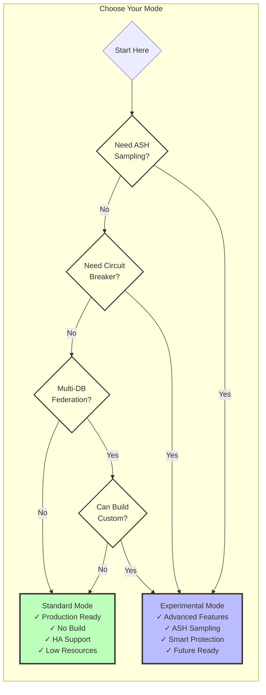
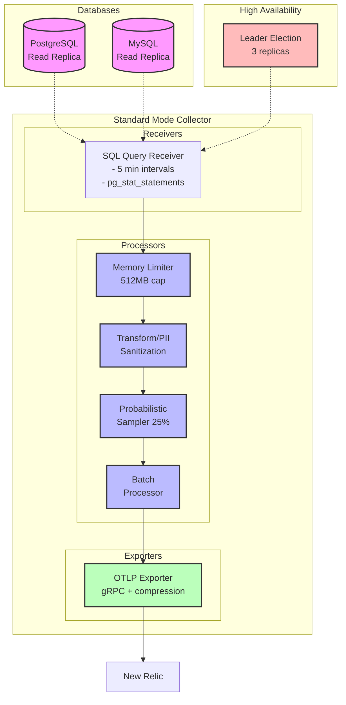
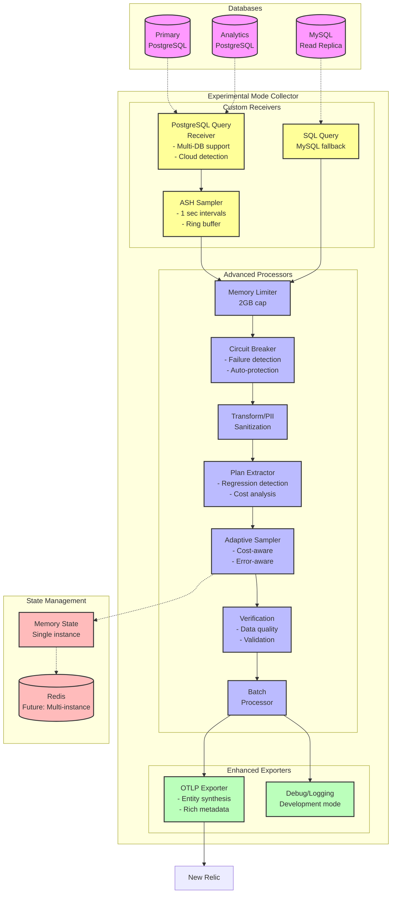

# Architecture Diagrams

This document contains the architecture diagrams for Database Intelligence MVP in Mermaid format.

## Decision Flow



## Standard Mode Architecture



## Experimental Mode Architecture



## Rendering These Diagrams

### Option 1: View in GitHub
GitHub automatically renders Mermaid diagrams in markdown files.

### Option 2: Generate HTML
Run the Python script to generate an interactive HTML page:
```bash
python scripts/generate-architecture-diagram.py
open docs/architecture-diagrams.html
```

### Option 3: Use Mermaid CLI
```bash
npm install -g @mermaid-js/mermaid-cli
mmdc -i ARCHITECTURE-DIAGRAMS.md -o architecture.png
```