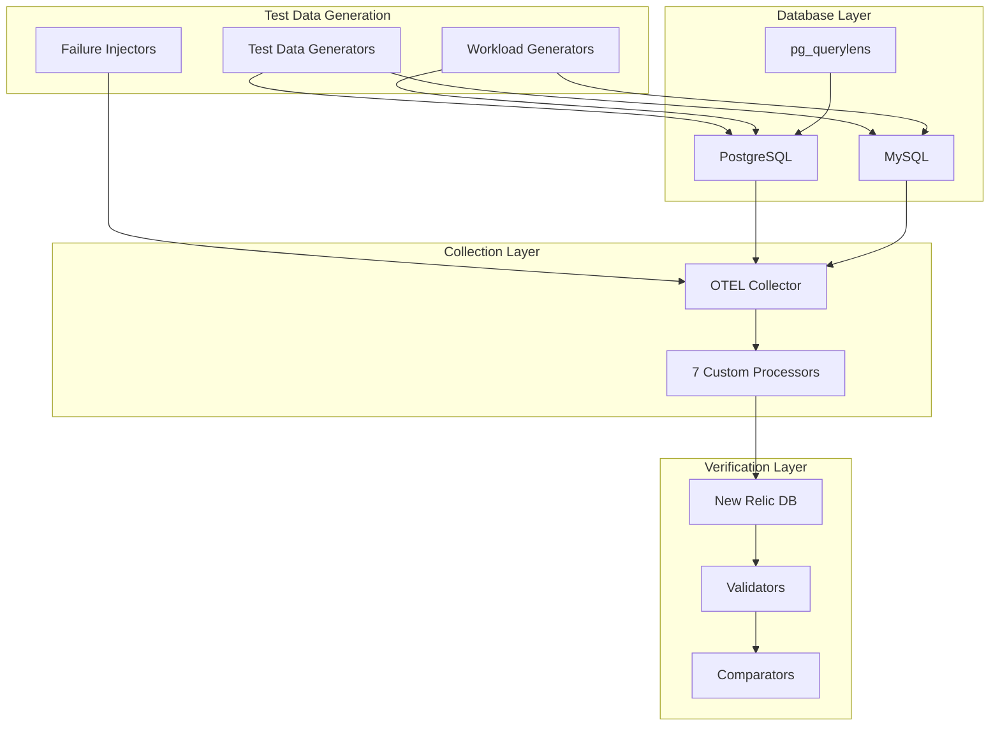

# Comprehensive E2E Test Suite Design

## Executive Summary

This document outlines a comprehensive end-to-end test suite for the Database Intelligence MVP that extends existing tests to cover all processors, real database-to-NRDB verification, security scenarios, performance testing, and failure recovery. The suite ensures complete validation of the system from data generation through processing to final storage in New Relic.

## Test Architecture Overview



## 1. Enhanced Processor Test Cases

### 1.1 AdaptiveSampler Tests

```go
// Test: High-Volume Deduplication
func TestAdaptiveSamplerHighVolumeDeduplication(t *testing.T) {
    // Generate 100K identical queries with slight timestamp variations
    // Verify only first occurrence is sampled
    // Validate LRU cache eviction behavior
    // Check memory usage stays within limits
}

// Test: Complex Rule Evaluation
func TestAdaptiveSamplerComplexRules(t *testing.T) {
    // Test cases:
    // - Nested CEL expressions: (db.name == "prod" && query.duration > 1000) || alert.level == "critical"
    // - Priority ordering with 50+ rules
    // - Rule conflicts and resolution
    // - Dynamic rule updates
}

// Test: Rate Limiting Under Load
func TestAdaptiveSamplerRateLimiting(t *testing.T) {
    // Burst scenarios:
    // - 10K queries/second burst
    // - Gradual ramp from 100 to 5000 QPS
    // - Oscillating load patterns
    // Verify rate limiter accuracy within 1%
}

// Test: Cryptographic Sampling Distribution
func TestAdaptiveSamplerDistribution(t *testing.T) {
    // Generate 1M queries
    // Verify sampling distribution is uniform (Chi-square test)
    // Test edge cases: 0.01%, 99.99% sampling rates
    // Validate deterministic sampling with same seed
}
```

### 1.2 CircuitBreaker Tests

```go
// Test: Multi-Database Circuit States
func TestCircuitBreakerMultiDatabase(t *testing.T) {
    // Scenario: 10 databases with different failure patterns
    databases := []DatabaseScenario{
        {Name: "db1", FailureRate: 0.1, RecoveryTime: 30*time.Second},
        {Name: "db2", FailureRate: 0.5, RecoveryTime: 60*time.Second},
        {Name: "db3", FailureRate: 0.9, RecoveryTime: 120*time.Second},
        // ... 7 more databases
    }
    
    // Verify:
    // - Independent circuit states per database
    // - Correct state transitions
    // - No cross-database interference
    // - Memory isolation
}

// Test: Adaptive Timeout Adjustment
func TestCircuitBreakerAdaptiveTimeout(t *testing.T) {
    // Scenarios:
    // - Gradual latency increase from 100ms to 5s
    // - Sudden spike to 30s then recovery
    // - Bimodal distribution (fast and slow queries)
    
    // Verify timeout adjusts appropriately
    // Check half-open state duration adapts
}

// Test: Resource Threshold Triggers
func TestCircuitBreakerResourceThresholds(t *testing.T) {
    // Trigger conditions:
    // - CPU usage > 90% for 30 seconds
    // - Memory usage > 85% sustained
    // - Combined CPU (80%) + Memory (75%)
    // - Disk I/O saturation
    
    // Verify circuit opens before database overload
}

// Test: Error Classification Accuracy
func TestCircuitBreakerErrorClassification(t *testing.T) {
    errors := []ErrorScenario{
        {Type: "connection_timeout", Retryable: true},
        {Type: "syntax_error", Retryable: false},
        {Type: "deadlock_detected", Retryable: true},
        {Type: "permission_denied", Retryable: false},
        {Type: "out_of_memory", Retryable: false},
        {Type: "network_unreachable", Retryable: true},
    }
    
    // Verify correct classification
    // Test circuit behavior per error type
}
```

### 1.3 PlanAttributeExtractor Tests

```go
// Test: Complex Plan Structures
func TestPlanExtractorComplexPlans(t *testing.T) {
    plans := []PlanScenario{
        {
            Name: "Nested Loop with CTE",
            PlanJSON: loadTestPlan("nested_loop_cte.json"),
            ExpectedNodes: 15,
            ExpectedCost: 12500.5,
        },
        {
            Name: "Parallel Hash Join",
            PlanJSON: loadTestPlan("parallel_hash_join.json"),
            ExpectedNodes: 8,
            ExpectedWorkers: 4,
        },
        {
            Name: "Recursive CTE",
            PlanJSON: loadTestPlan("recursive_cte.json"),
            ExpectedDepth: 10,
        },
    }
    
    // Verify correct extraction of all attributes
    // Test plan change detection
}

// Test: Query Anonymization Edge Cases
func TestPlanExtractorAnonymization(t *testing.T) {
    sensitiveQueries := []string{
        "SELECT * FROM users WHERE email = 'john@example.com'",
        "UPDATE accounts SET balance = 50000 WHERE ssn = '123-45-6789'",
        "INSERT INTO medical_records (patient_id, diagnosis) VALUES ('P123', 'COVID-19')",
        "SELECT credit_card FROM payments WHERE cvv = '123'",
    }
    
    // Verify all PII is redacted
    // Ensure query structure remains analyzable
    // Test nested PII patterns
}

// Test: Plan History and Regression
func TestPlanExtractorRegression(t *testing.T) {
    // Simulate plan changes:
    // 1. Create index -> plan improves
    // 2. Drop index -> plan regresses
    // 3. Add data -> plan changes due to statistics
    // 4. Vacuum -> plan stabilizes
    
    // Verify regression detection accuracy
    // Test plan hash stability
}
```

### 1.4 Verification Processor Tests

```go
// Test: Comprehensive PII Detection
func TestVerificationPIIDetection(t *testing.T) {
    piiPatterns := []PIITestCase{
        // Email variations
        {Input: "user+tag@domain.co.uk", Expected: "REDACTED_EMAIL"},
        {Input: "first.last@company-name.com", Expected: "REDACTED_EMAIL"},
        
        // Phone numbers
        {Input: "+1-555-123-4567", Expected: "REDACTED_PHONE"},
        {Input: "(555) 123-4567 ext 890", Expected: "REDACTED_PHONE"},
        {Input: "555.123.4567", Expected: "REDACTED_PHONE"},
        
        // Credit cards
        {Input: "4532-1234-5678-9012", Expected: "REDACTED_CC"},
        {Input: "378282246310005", Expected: "REDACTED_CC"}, // Amex
        
        // SSN variations
        {Input: "123-45-6789", Expected: "REDACTED_SSN"},
        {Input: "123 45 6789", Expected: "REDACTED_SSN"},
        
        // Complex scenarios
        {Input: "Call 555-1234 or email john@test.com", Expected: "Call REDACTED_PHONE or email REDACTED_EMAIL"},
    }
}

// Test: Cardinality Explosion Prevention
func TestVerificationCardinalityControl(t *testing.T) {
    // Generate metrics with:
    // - 100K unique query IDs
    // - 50K unique user IDs  
    // - 10K unique table names
    // - Random combinations
    
    // Verify cardinality stays under 50K limit
    // Test LRU eviction of old series
    // Validate priority-based retention
}

// Test: Data Quality Validation
func TestVerificationDataQuality(t *testing.T) {
    qualityTests := []QualityTest{
        {
            Name: "Missing Required Fields",
            Metric: createMetricMissingDBName(),
            ExpectedError: "required field db.name missing",
        },
        {
            Name: "Invalid Timestamp",
            Metric: createMetricFutureTimestamp(),
            ExpectedError: "timestamp in future",
        },
        {
            Name: "Negative Duration",
            Metric: createMetricNegativeDuration(),
            ExpectedError: "negative duration not allowed",
        },
    }
}
```

### 1.5 CostControl Tests

```go
// Test: Budget Enforcement Scenarios
func TestCostControlBudgetEnforcement(t *testing.T) {
    scenarios := []BudgetScenario{
        {
            Name: "Gradual Approach",
            Budget: 1000.0,
            Pattern: "linear_increase",
            ExpectedThrottlePoint: 900.0,
        },
        {
            Name: "Sudden Spike",
            Budget: 1000.0,
            Pattern: "sudden_spike_at_500",
            ExpectedCircuitBreak: true,
        },
        {
            Name: "Oscillating Cost",
            Budget: 1000.0,
            Pattern: "sine_wave",
            ExpectedAvgUtilization: 0.7,
        },
    }
}

// Test: Multi-Tier Pricing Calculation
func TestCostControlPricingTiers(t *testing.T) {
    tiers := []PricingTier{
        {UpTo: 1000000, PricePerMillion: 0.25},
        {UpTo: 10000000, PricePerMillion: 0.20},
        {UpTo: 100000000, PricePerMillion: 0.15},
        {UpTo: -1, PricePerMillion: 0.10}, // Unlimited
    }
    
    // Test various volumes and verify correct pricing
    // Test tier transition handling
    // Verify cost accumulation accuracy
}

// Test: Intelligent Reduction Strategies
func TestCostControlReductionStrategies(t *testing.T) {
    // When budget exceeded:
    // 1. Drop lowest-value metrics first
    // 2. Increase sampling rates
    // 3. Reduce cardinality
    // 4. Apply emergency mode
    
    // Verify each strategy activates correctly
    // Test graceful degradation
    // Ensure critical metrics preserved
}
```

### 1.6 NRErrorMonitor Tests

```go
// Test: Pattern-Based Error Detection
func TestNRErrorMonitorPatterns(t *testing.T) {
    errorPatterns := []ErrorPattern{
        {
            Pattern: "rate limit exceeded",
            Action: "reduce_throughput",
            Severity: "warning",
        },
        {
            Pattern: "invalid api key",
            Action: "stop_export",
            Severity: "critical",
        },
        {
            Pattern: "request entity too large",
            Action: "reduce_batch_size",
            Severity: "warning",
        },
    }
    
    // Inject various NR API errors
    // Verify correct pattern matching
    // Test action execution
}

// Test: Semantic Validation
func TestNRErrorMonitorSemanticValidation(t *testing.T) {
    // Test invalid metric formats:
    // - Metric names with spaces
    // - Attributes exceeding 255 chars
    // - Invalid timestamp formats
    // - Missing required NR fields
    
    // Verify early detection before export
}
```

### 1.7 QueryCorrelator Tests

```go
// Test: Transaction Boundary Detection
func TestQueryCorrelatorTransactionDetection(t *testing.T) {
    // Execute transaction patterns:
    // - Simple BEGIN/COMMIT
    // - Nested transactions with SAVEPOINT
    // - Distributed transactions (2PC)
    // - Long-running transactions (>5 min)
    // - Aborted transactions
    
    // Verify correct correlation
    // Test transaction ID propagation
}

// Test: Cross-Query Relationships
func TestQueryCorrelatorCrossQuery(t *testing.T) {
    // Scenarios:
    // - Parent query spawning 10 child queries
    // - Recursive query execution
    // - Parallel query execution
    // - Query referencing temp tables
    
    // Verify relationship mapping
    // Test correlation accuracy
}
```

## 2. Database-to-NRDB Verification Tests

### 2.1 Data Integrity Tests

```go
// Test: Checksum-Based Verification
func TestDataIntegrityChecksums(t *testing.T) {
    // For each metric type:
    // 1. Calculate checksum at source (database)
    // 2. Track through pipeline
    // 3. Verify in NRDB
    
    checksumTests := []ChecksumTest{
        {
            MetricType: "postgresql.rows_fetched",
            SourceQuery: "SELECT SUM(rows_fetched) FROM pg_stat_user_tables",
            NRQLQuery: "SELECT sum(postgresql.rows_fetched) FROM Metric",
            Tolerance: 0.001, // 0.1% tolerance
        },
    }
}

// Test: Timestamp Accuracy
func TestTimestampAccuracy(t *testing.T) {
    // Insert marker events with precise timestamps
    // Track through pipeline
    // Verify in NRDB within 1-second accuracy
    
    // Test timezone handling
    // Test daylight saving transitions
    // Test leap seconds
}

// Test: Attribute Preservation
func TestAttributePreservation(t *testing.T) {
    // Define test attributes:
    testAttrs := map[string]interface{}{
        "db.name": "test_db",
        "db.system": "postgresql",
        "custom.tag": "test_value",
        "high.cardinality": generateUUID(),
    }
    
    // Verify all attributes reach NRDB
    // Test attribute type preservation
    // Test special character handling
}
```

### 2.2 Corner Case Verification

```go
// Test: Extreme Values
func TestExtremeValues(t *testing.T) {
    extremeTests := []ExtremeValueTest{
        {
            Name: "Maximum Int64",
            Value: math.MaxInt64,
            ExpectedInNRDB: "9223372036854775807",
        },
        {
            Name: "Very Small Float",
            Value: 1e-308,
            ExpectedPrecision: 15,
        },
        {
            Name: "Very Long String",
            Value: strings.Repeat("a", 4096),
            ExpectedTruncation: 4000,
        },
        {
            Name: "Unicode Strings",
            Value: "Hello 世界 🌍 مرحبا мир",
            ExpectedEncoding: "UTF-8",
        },
    }
}

// Test: Null and Empty Handling
func TestNullAndEmptyValues(t *testing.T) {
    // Test cases:
    // - NULL values in database
    // - Empty strings vs NULL
    // - Zero values vs missing
    // - Empty arrays/objects
    
    // Verify consistent handling through pipeline
}

// Test: Special SQL Types
func TestSpecialSQLTypes(t *testing.T) {
    specialTypes := []SQLTypeTest{
        {Type: "UUID", TestValue: "550e8400-e29b-41d4-a716-446655440000"},
        {Type: "JSONB", TestValue: `{"key": "value", "nested": {"data": 123}}`},
        {Type: "ARRAY", TestValue: "{1,2,3,4,5}"},
        {Type: "INTERVAL", TestValue: "1 year 2 months 3 days"},
        {Type: "CIDR", TestValue: "192.168.1.0/24"},
        {Type: "BYTEA", TestValue: []byte{0x00, 0xFF, 0x10, 0x20}},
    }
}
```

### 2.3 Query Plan Verification

```go
// Test: Plan Data Accuracy
func TestPlanDataAccuracy(t *testing.T) {
    // Execute queries with known plans:
    testQueries := []PlanTest{
        {
            Query: "SELECT * FROM large_table WHERE indexed_col = $1",
            ExpectedPlanType: "Index Scan",
            ExpectedCost: 8.5,
        },
        {
            Query: "SELECT * FROM large_table WHERE non_indexed_col = $1",
            ExpectedPlanType: "Seq Scan",
            ExpectedCostGreaterThan: 10000,
        },
    }
    
    // Verify plan details in NRDB
    // Test plan hash consistency
    // Verify anonymization applied
}

// Test: Plan Change Detection
func TestPlanChangeDetection(t *testing.T) {
    // Sequence:
    // 1. Run query, capture plan
    // 2. CREATE INDEX
    // 3. Run same query
    // 4. Verify plan change detected in NRDB
    // 5. DROP INDEX
    // 6. Verify regression detected
}
```

## 3. Security and Compliance Tests

### 3.1 PII Protection Tests

```go
// Test: Comprehensive PII Scenarios
func TestPIIProtectionScenarios(t *testing.T) {
    scenarios := []PIIScenario{
        {
            Name: "Medical Records",
            Query: "SELECT patient_name, diagnosis, ssn FROM medical_records",
            ExpectedRedactions: []string{"patient_name", "diagnosis", "ssn"},
        },
        {
            Name: "Financial Data",
            Query: "UPDATE accounts SET balance = 50000, credit_card = '4532...'",
            ExpectedRedactions: []string{"credit_card"},
        },
        {
            Name: "PII in Error Messages",
            ErrorMsg: "Constraint violation: email 'john@example.com' already exists",
            ExpectedRedaction: "Constraint violation: email 'REDACTED_EMAIL' already exists",
        },
    }
}

// Test: Log Sanitization
func TestLogSanitization(t *testing.T) {
    // Inject PII into various log contexts:
    // - Query logs
    // - Error logs
    // - Debug logs
    // - Plan logs
    
    // Verify no PII in collector logs
    // Verify no PII in exported metrics
}
```

### 3.2 Compliance Validation

```go
// Test: GDPR Compliance
func TestGDPRCompliance(t *testing.T) {
    // Test right to erasure:
    // 1. Insert PII data
    // 2. Process through pipeline
    // 3. Verify PII not stored
    // 4. Verify data minimization
    
    // Test consent tracking
    // Test data retention policies
}

// Test: HIPAA Compliance
func TestHIPAACompliance(t *testing.T) {
    // Medical data scenarios:
    // - Patient identifiers
    // - Medical record numbers
    // - Health information
    
    // Verify encryption in transit
    // Verify access logging
    // Verify data segregation
}

// Test: PCI DSS Compliance
func TestPCIDSSCompliance(t *testing.T) {
    // Credit card scenarios:
    // - Full card numbers
    // - CVV codes
    // - Expiration dates
    
    // Verify no storage of sensitive auth data
    // Verify masking/truncation
    // Verify secure transmission
}
```

### 3.3 Security Vulnerability Tests

```go
// Test: SQL Injection Prevention
func TestSQLInjectionPrevention(t *testing.T) {
    injectionTests := []string{
        "'; DROP TABLE users; --",
        "1' OR '1'='1",
        "admin'--",
        "1; UPDATE users SET admin=true",
        "\x00\x1a\x28\x27", // Binary injection
    }
    
    // Verify queries are properly escaped
    // Test parameter binding
    // Verify no query execution
}

// Test: Resource Exhaustion
func TestResourceExhaustion(t *testing.T) {
    // Attack scenarios:
    // - 1M unique metric series
    // - 100MB single metric payload
    // - Infinite recursion in plans
    // - Memory bomb in attributes
    
    // Verify protection mechanisms
    // Test memory limits enforced
    // Verify circuit breakers activate
}
```

## 4. Performance and Scale Tests

### 4.1 Load Tests

```go
// Test: Sustained High Load
func TestSustainedHighLoad(t *testing.T) {
    loadProfiles := []LoadProfile{
        {
            Name: "Normal Operations",
            QPS: 1000,
            Duration: 30 * time.Minute,
            Databases: 5,
            QueryComplexity: "medium",
        },
        {
            Name: "Peak Load",
            QPS: 5000,
            Duration: 10 * time.Minute,
            Databases: 10,
            QueryComplexity: "high",
        },
        {
            Name: "Burst Load",
            QPS: 10000,
            Duration: 1 * time.Minute,
            Databases: 3,
            QueryComplexity: "simple",
        },
    }
    
    // Verify:
    // - No data loss
    // - Latency < 5s p99
    // - Memory < 1GB
    // - CPU < 4 cores
}

// Test: Database Scaling
func TestDatabaseScaling(t *testing.T) {
    // Scale from 1 to 100 databases:
    for dbCount := 1; dbCount <= 100; dbCount *= 10 {
        // Verify linear resource scaling
        // Test connection pool efficiency
        // Verify no cross-DB interference
    }
}
```

### 4.2 Latency Tests

```go
// Test: End-to-End Latency
func TestEndToEndLatency(t *testing.T) {
    // Measure latency at each stage:
    stages := []LatencyStage{
        {Name: "Query Execution", ExpectedP99: 100 * time.Millisecond},
        {Name: "Metric Collection", ExpectedP99: 50 * time.Millisecond},
        {Name: "Processing Pipeline", ExpectedP99: 200 * time.Millisecond},
        {Name: "NRDB Export", ExpectedP99: 500 * time.Millisecond},
        {Name: "Total E2E", ExpectedP99: 30 * time.Second},
    }
    
    // Test with various payload sizes
    // Test with different network conditions
}

// Test: Processing Efficiency
func TestProcessingEfficiency(t *testing.T) {
    // Measure per-processor overhead:
    // - AdaptiveSampler: < 2µs
    // - CircuitBreaker: < 1.8µs
    // - PlanExtractor: < 5µs
    // - Full pipeline: < 100µs
}
```

### 4.3 Resource Usage Tests

```go
// Test: Memory Efficiency
func TestMemoryEfficiency(t *testing.T) {
    // Scenarios:
    // - Long-running (24 hours)
    // - High cardinality (50K series)
    // - Large batches (10K metrics)
    
    // Verify no memory leaks
    // Test garbage collection impact
    // Verify cache efficiency
}

// Test: CPU Efficiency
func TestCPUEfficiency(t *testing.T) {
    // Profile CPU usage:
    // - Regex compilation caching
    // - JSON parsing optimization
    // - Batch processing efficiency
    
    // Verify < 1 core for 1000 QPS
}
```

## 5. Failure and Recovery Tests

### 5.1 Database Failures

```go
// Test: Connection Loss Recovery
func TestConnectionLossRecovery(t *testing.T) {
    failureScenarios := []ConnectionFailure{
        {
            Type: "Sudden Disconnect",
            Duration: 30 * time.Second,
            ExpectedRecovery: 35 * time.Second,
        },
        {
            Type: "Gradual Degradation",
            LatencyIncrease: "exponential",
            ExpectedCircuitBreak: 15 * time.Second,
        },
        {
            Type: "Intermittent Failures",
            Pattern: "50% failure rate",
            ExpectedBehavior: "half-open cycling",
        },
    }
}

// Test: Database Restart
func TestDatabaseRestart(t *testing.T) {
    // Sequence:
    // 1. Normal operations
    // 2. Database shutdown
    // 3. Verify graceful handling
    // 4. Database startup
    // 5. Verify automatic reconnection
    // 6. Verify no data loss
}
```

### 5.2 Collector Failures

```go
// Test: Processor Panics
func TestProcessorPanicRecovery(t *testing.T) {
    // Inject panics in each processor
    // Verify:
    // - Panic recovered
    // - Pipeline continues
    // - Error logged
    // - Metrics updated
}

// Test: Memory Pressure
func TestMemoryPressureHandling(t *testing.T) {
    // Gradually increase memory usage
    // Verify:
    // - Memory limiter activates
    // - Graceful degradation
    // - No OOM kills
    // - Recovery after pressure reduces
}
```

### 5.3 Network Failures

```go
// Test: Export Endpoint Unavailable
func TestExportEndpointFailure(t *testing.T) {
    // Scenarios:
    // - New Relic API down
    // - Network partition
    // - DNS resolution failure
    // - TLS certificate issues
    
    // Verify:
    // - Exponential backoff
    // - Queue management
    // - No data loss (within limits)
    // - Alert generation
}

// Test: Partial Network Failure
func TestPartialNetworkFailure(t *testing.T) {
    // 50% packet loss scenario
    // High latency (1s+) scenario
    // Bandwidth limitation scenario
    
    // Verify degraded mode operation
}
```

## 6. Test Data Generators

### 6.1 Workload Generators

```go
type WorkloadGenerator interface {
    // Generate realistic database workloads
    GenerateOLTPWorkload(config OLTPConfig) error
    GenerateOLAPWorkload(config OLAPConfig) error
    GenerateMixedWorkload(config MixedConfig) error
    
    // Generate specific patterns
    GenerateHighCardinalityQueries(count int) error
    GeneratePIIQueries(categories []string) error
    GenerateSlowQueries(duration time.Duration) error
    GenerateErrorQueries(errorTypes []string) error
}

type OLTPConfig struct {
    TransactionsPerSecond int
    ReadWriteRatio       float64
    ConnectionCount      int
    TransactionSize      int
}
```

### 6.2 Plan Generators

```go
type PlanGenerator interface {
    // Generate various plan types
    GenerateSimplePlan() json.RawMessage
    GenerateComplexPlan(nodes int) json.RawMessage
    GenerateParallelPlan(workers int) json.RawMessage
    GenerateRegressionPlan(original, degraded json.RawMessage) error
}
```

### 6.3 Failure Injectors

```go
type FailureInjector interface {
    // Database failures
    InjectConnectionTimeout(duration time.Duration) error
    InjectQueryTimeout(probability float64) error
    InjectDeadlock() error
    
    // Resource failures
    InjectHighCPU(usage float64) error
    InjectHighMemory(usage float64) error
    InjectDiskFull() error
    
    // Network failures
    InjectPacketLoss(rate float64) error
    InjectLatency(ms int) error
    InjectBandwidthLimit(mbps int) error
}
```

## 7. Validators

### 7.1 NRDB Validators

```go
type NRDBValidator interface {
    // Validate metric presence
    ValidateMetricExists(metricName string, timeRange TimeRange) error
    
    // Validate metric values
    ValidateMetricValue(metricName string, expected float64, tolerance float64) error
    
    // Validate attributes
    ValidateAttributes(metricName string, expectedAttrs map[string]string) error
    
    // Validate cardinality
    ValidateCardinality(metricName string, maxSeries int) error
}
```

### 7.2 Data Integrity Validators

```go
type IntegrityValidator interface {
    // Checksum validation
    ValidateChecksum(source, destination uint64) error
    
    // Completeness validation
    ValidateCompleteness(expected, actual []Metric) error
    
    // Ordering validation
    ValidateOrdering(metrics []Metric) error
    
    // Accuracy validation
    ValidateAccuracy(source, destination float64, tolerance float64) error
}
```

## 8. Test Execution Strategy

### 8.1 Test Categories

1. **Smoke Tests** (5 minutes)
   - Basic connectivity
   - Simple data flow
   - Health checks

2. **Functional Tests** (30 minutes)
   - All processor tests
   - Data integrity tests
   - Security tests

3. **Integration Tests** (2 hours)
   - Full E2E scenarios
   - Multi-database tests
   - Failure recovery

4. **Performance Tests** (4 hours)
   - Load tests
   - Stress tests
   - Endurance tests

5. **Chaos Tests** (8 hours)
   - Random failure injection
   - Recovery validation
   - Data integrity under failure

### 8.2 Test Environment Requirements

```yaml
# test-environment.yaml
databases:
  postgresql:
    versions: ["12", "13", "14", "15", "16"]
    extensions: ["pg_stat_statements", "auto_explain", "pg_querylens"]
    
  mysql:
    versions: ["5.7", "8.0", "8.1"]
    features: ["performance_schema", "sys_schema"]

collector:
  memory: 2GB
  cpu: 4 cores
  
test_data:
  volume: 100GB
  retention: 7 days
  
new_relic:
  account_type: "paid"  # For high-volume testing
  api_rate_limit: 1000/min
```

### 8.3 Success Criteria

1. **Data Accuracy**: 99.9% data integrity
2. **Performance**: <30s E2E latency (p99)
3. **Reliability**: 99.95% uptime over 24 hours
4. **Security**: Zero PII leakage
5. **Recovery**: <2 minutes for all failure scenarios
6. **Scale**: Handle 10K QPS across 50 databases

## 9. Implementation Priority

### Phase 1: Core Tests (Week 1-2)
- [ ] Basic E2E flow tests
- [ ] Processor unit tests
- [ ] Data integrity tests
- [ ] Basic security tests

### Phase 2: Advanced Tests (Week 3-4)
- [ ] Complex processor scenarios
- [ ] Corner case testing
- [ ] Performance testing
- [ ] Failure injection

### Phase 3: Scale Tests (Week 5-6)
- [ ] Multi-database scaling
- [ ] High-volume testing
- [ ] Endurance testing
- [ ] Chaos engineering

### Phase 4: Automation (Week 7-8)
- [ ] CI/CD integration
- [ ] Automated reporting
- [ ] Performance regression detection
- [ ] Continuous validation

## Conclusion

This comprehensive test suite ensures the Database Intelligence MVP is thoroughly validated from every angle. The tests cover functional correctness, performance, security, and reliability, providing confidence for production deployment and ongoing operations.