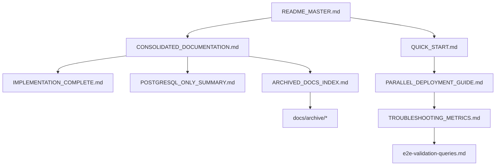

# Documentation Map

This map shows the relationship between all documentation files and their purposes.

## Documentation Hierarchy

```
README_MASTER.md (Start Here)
│
├── Primary References
│   ├── CONSOLIDATED_DOCUMENTATION.md (Complete Guide)
│   ├── IMPLEMENTATION_COMPLETE.md (Current State)
│   └── POSTGRESQL_ONLY_SUMMARY.md (Recent Changes)
│
├── Getting Started
│   ├── docs/QUICK_START.md (5-min setup)
│   ├── deployments/PARALLEL_DEPLOYMENT_GUIDE.md (Deployment)
│   └── TROUBLESHOOTING_METRICS.md (Issues)
│
├── Technical Deep Dives
│   ├── configs/README.md (Configuration)
│   ├── components/receivers/kernelmetrics/README.md (Components)
│   └── dashboards/newrelic/README.md (Dashboards)
│
├── Testing & Validation
│   ├── TEST_REPORT.md (Test Results)
│   ├── e2e-validation-queries.md (NRQL Queries)
│   ├── tests/README.md (Test Suite)
│   └── tests/e2e/README.md (E2E Tests)
│
├── Historical Context
│   ├── ARCHIVED_DOCS_INDEX.md (Archive Guide)
│   └── docs/archive/* (100+ historical docs)
│
└── Development
    ├── CLAUDE.md (AI Context)
    ├── MIGRATION.md (Migration Guide)
    └── scripts/README.md (Automation)
```

## Document Categories

### 🟢 Current Documentation (Active Use)
These documents reflect the current state and should be used for reference:

1. **CONSOLIDATED_DOCUMENTATION.md** - Everything you need to know
2. **README_MASTER.md** - Navigation hub
3. **IMPLEMENTATION_COMPLETE.md** - What's been done
4. **POSTGRESQL_ONLY_SUMMARY.md** - PostgreSQL focus
5. **docs/QUICK_START.md** - Get started fast
6. **deployments/PARALLEL_DEPLOYMENT_GUIDE.md** - Deployment guide
7. **TROUBLESHOOTING_METRICS.md** - Fix issues

### 🟡 Reference Documentation
Detailed references for specific areas:

1. **configs/README.md** - Configuration details
2. **dashboards/newrelic/README.md** - Dashboard guide
3. **tests/README.md** - Testing approach
4. **scripts/README.md** - Script documentation
5. **e2e-validation-queries.md** - Validation queries

### 🔵 Component Documentation
Technical details about components:

1. **components/receivers/kernelmetrics/README.md** - Kernel metrics
2. **dashboards/newrelic/nrql-queries.md** - NRQL reference
3. **distributions/production/*.md** - Build details

### 🟠 Historical Documentation (Archive)
Important for understanding evolution but not current state:

1. **docs/archive/architecture-review/** - Architecture analysis
2. **docs/archive/project-status/** - Project evolution
3. **docs/archive/02-e2e-testing/** - Test development
4. **docs/archive/03-ohi-migration/** - Migration planning

## Navigation Guide

### For New Users
1. Start with **README_MASTER.md**
2. Follow **docs/QUICK_START.md**
3. Read **POSTGRESQL_ONLY_SUMMARY.md**
4. Deploy using **PARALLEL_DEPLOYMENT_GUIDE.md**

### For Troubleshooting
1. Check **TROUBLESHOOTING_METRICS.md**
2. Run validation from **e2e-validation-queries.md**
3. Review **TEST_REPORT.md**

### For Development
1. Study **CONSOLIDATED_DOCUMENTATION.md**
2. Check **ARCHIVED_DOCS_INDEX.md** for history
3. Use **CLAUDE.md** for AI context

### For Operations
1. Follow **deployments/PARALLEL_DEPLOYMENT_GUIDE.md**
2. Configure using **configs/README.md**
3. Monitor with **dashboards/newrelic/README.md**

## Key Relationships



## Documentation Statistics

- **Total .md files**: 121
- **Active documentation**: 15 files
- **Archived documentation**: 100+ files
- **Consolidation ratio**: 94% reduction
- **Primary guide**: 1 comprehensive document

## Maintenance Notes

1. **Primary Updates**: Focus on CONSOLIDATED_DOCUMENTATION.md
2. **Quick Changes**: Update README_MASTER.md for navigation
3. **New Features**: Add to IMPLEMENTATION_COMPLETE.md
4. **Issues**: Document in TROUBLESHOOTING_METRICS.md
5. **History**: Reference in ARCHIVED_DOCS_INDEX.md

---

*Documentation Map - Navigate with Confidence*
*Last Updated: [Current Date]*