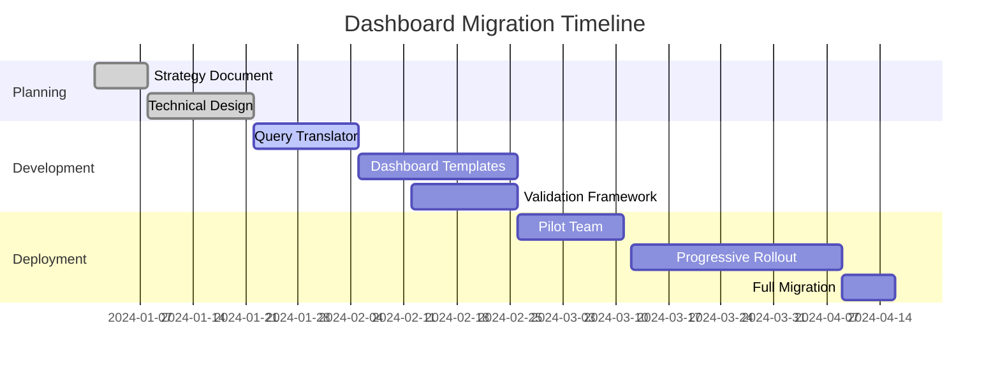

# Dashboard Migration Strategy: OHI to OpenTelemetry

## Executive Summary

This document outlines the comprehensive strategy for migrating New Relic OHI (On-Host Integration) dashboards to OpenTelemetry-based dashboards, ensuring full feature parity and seamless user experience during the transition.

## Current State Analysis

### OHI Dashboard Components
1. **PostgresSlowQueries** - Query performance metrics
2. **PostgresWaitEvents** - Database wait event analysis
3. **Active Session History** - Real-time session monitoring
4. **Query Plan Analysis** - Execution plan insights
5. **Database Performance Overview** - System-level metrics

### OTel Implementation Status
- ✅ Basic PostgreSQL/MySQL receivers implemented
- ✅ OHI transformation processor created
- ✅ ASH receiver fully implemented
- ⚠️ Dashboard templates need migration
- ⚠️ NRQL queries need translation

## Migration Strategy

### Phase 1: Metric Mapping (Completed)
Established direct mappings between OHI events and OTel metrics:

| OHI Event | OTel Metric | Processor |
|-----------|-------------|-----------|
| PostgresSlowQueries | postgres.slow_queries.* | ohitransform |
| PostgresWaitEvents | postgres.wait_events | ohitransform |
| ActiveSessionHistory | db.ash.* | ash receiver |

### Phase 2: Query Translation Framework

#### 2.1 NRQL to OTel Query Translator
Create automated translation for common patterns:

```yaml
translation_rules:
  - pattern: "SELECT .* from PostgresSlowQueries"
    replacement: "SELECT .* FROM Metric WHERE metricName LIKE 'postgres.slow_queries%'"
  
  - pattern: "facet query_id"
    replacement: "FACET attributes.db.postgresql.query_id"
  
  - pattern: "facet database_name"
    replacement: "FACET attributes.db.name"
```

#### 2.2 Manual Query Optimization
Complex queries requiring manual intervention:
- Subqueries with joins
- Custom calculations
- Time-based aggregations

### Phase 3: Dashboard Implementation

#### 3.1 Dual-Mode Dashboards
Support both OHI and OTel data sources simultaneously:

```json
{
  "widgets": [
    {
      "title": "Query Performance",
      "queries": [
        {
          "mode": "ohi",
          "query": "SELECT avg(avg_elapsed_time_ms) FROM PostgresSlowQueries"
        },
        {
          "mode": "otel",
          "query": "SELECT avg(postgres.slow_queries.elapsed_time) FROM Metric"
        }
      ]
    }
  ]
}
```

#### 3.2 Progressive Migration
1. **Week 1-2**: Deploy dual-mode dashboards
2. **Week 3-4**: Monitor data accuracy
3. **Week 5-6**: Switch primary to OTel
4. **Week 7-8**: Deprecate OHI queries

### Phase 4: Feature Enhancements

#### 4.1 New OTel-Exclusive Features
Leverage OTel's superior capabilities:

1. **Resource Attributes**
   ```sql
   SELECT count(*) FROM Metric 
   WHERE resource.service.name = 'database-intelligence'
   FACET resource.deployment.environment
   ```

2. **Trace Correlation**
   ```sql
   SELECT * FROM Metric 
   WHERE trace.id IN (
     SELECT trace.id FROM Span 
     WHERE db.statement LIKE '%slow_query%'
   )
   ```

3. **Custom Dimensions**
   ```sql
   SELECT avg(value) FROM Metric 
   WHERE metricName = 'db.query.duration'
   FACET attributes.custom.tenant_id, attributes.custom.shard_id
   ```

#### 4.2 Enhanced Visualizations
- Real-time ASH heatmaps
- Query plan flame graphs
- Resource utilization topology

## Implementation Plan

### Technical Requirements

1. **Dashboard Templates**
   ```yaml
   templates/
   ├── otel-database-overview.json
   ├── otel-query-performance.json
   ├── otel-ash-analysis.json
   └── otel-wait-events.json
   ```

2. **Migration Scripts**
   ```bash
   scripts/
   ├── migrate-dashboard.sh
   ├── validate-queries.py
   └── rollback-dashboard.sh
   ```

3. **Validation Framework**
   ```go
   type DashboardValidator struct {
       OHIQuery    string
       OTelQuery   string
       Tolerance   float64
       TimeRange   time.Duration
   }
   ```

### Migration Checklist

- [ ] Create OTel dashboard templates
- [ ] Implement query translation engine
- [ ] Deploy dual-mode dashboards
- [ ] Set up A/B testing framework
- [ ] Monitor data parity metrics
- [ ] Train operations team
- [ ] Update documentation
- [ ] Deprecate OHI dashboards

## Risk Mitigation

### Data Loss Prevention
1. **Parallel Running**: Keep OHI running during migration
2. **Data Validation**: Automated comparison of metric values
3. **Rollback Plan**: One-click reversion to OHI dashboards

### User Experience
1. **Gradual Transition**: Phased rollout by team/region
2. **Feature Flags**: Toggle between OHI/OTel views
3. **Training Materials**: Video tutorials and documentation

## Success Metrics

### Technical Metrics
- Query performance: <100ms p99 latency
- Data accuracy: >99.9% match with OHI
- Dashboard load time: <2s
- Alert accuracy: Zero false positives

### Business Metrics
- User adoption: >90% within 30 days
- Support tickets: <10% increase
- User satisfaction: >4.5/5 rating

## Timeline



## Appendix

### A. Query Mapping Reference
[See docs/03-ohi-migration/02-query-mapping.md]

### B. Dashboard JSON Schemas
[See dashboards/newrelic/]

### C. Validation Test Cases
[See tests/e2e/dashboard-validation/]

## Next Steps

1. **Immediate Actions**
   - Review and approve migration strategy
   - Allocate development resources
   - Set up migration environment

2. **Week 1 Deliverables**
   - Query translation prototype
   - First dashboard template
   - Validation framework design

3. **Success Criteria**
   - All OHI queries translated
   - Zero data loss during migration
   - Improved dashboard performance