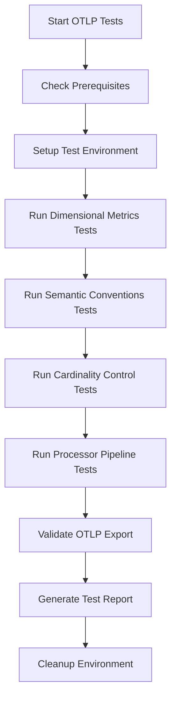

# OpenTelemetry Dimensional Metrics and OTLP Testing Guide

## Overview

This guide covers the comprehensive testing framework for OpenTelemetry (OTEL) dimensional metrics, OTLP format validation, and advanced OTEL-specific scenarios in the Database Intelligence project.

## 🎯 Testing Focus Areas

### 1. **Dimensional Metrics Validation**
- **Schema Compliance**: Validates dimensional attribute structure and consistency
- **Cardinality Control**: Tests high-cardinality prevention and explosion protection  
- **Attribute Integrity**: Ensures dimensional attributes follow OTEL semantic conventions

### 2. **OTLP Format Compliance**
- **Protocol Validation**: Tests OTLP/HTTP and OTLP/gRPC format compliance
- **Schema Validation**: Validates against official OTLP protobuf schema
- **Export Format**: Ensures proper OTLP ResourceMetrics structure

### 3. **Semantic Conventions Testing**
- **Database Conventions**: Tests compliance with OTEL database semantic conventions
- **Resource Attributes**: Validates required resource attributes presence
- **Metric Naming**: Ensures proper metric naming conventions

### 4. **Advanced Processor Testing**
- **PII Detection**: Validates PII sanitization in dimensional attributes
- **Cost Control**: Tests cardinality-based cost control mechanisms
- **Plan Extraction**: Validates query plan attribute extraction

## 🧪 Test Suites

### Core Test Files

#### 1. `otlp_compliance_test.go`
**Purpose**: Comprehensive OTLP compliance and dimensional metrics testing

**Test Cases**:
- `TestOTLPDimensionalSchema`: Validates dimensional attribute schema
- `TestCardinalityControl`: Tests cardinality explosion prevention
- `TestSemanticConventions`: Validates OTEL semantic conventions
- `TestMetricTypesFormat`: Tests metric type compliance
- `TestAdvancedProcessorPipeline`: Validates processor chain functionality

#### 2. `otlp_format_validation_test.go`
**Purpose**: OTLP format and protocol validation

**Test Cases**:
- `TestOTLPProtocolCompliance`: OTLP protocol format validation
- `TestExemplarsAndSpanLinks`: Exemplar and trace linking validation
- `TestResourceAttributes`: Resource attribute compliance
- `TestOTLPBatchProcessing`: Batch processing efficiency

#### 3. `nrdb_client_extensions.go`
**Purpose**: Extended NRDB validation capabilities

**New Methods**:
- `VerifyMetricWithDimensions()`: Dimensional attribute validation
- `GetMetricCardinality()`: Cardinality measurement
- `CheckAttributeExists()`: Attribute presence validation
- `SearchForPIIInMetrics()`: PII detection validation
- `GetCostControlMetrics()`: Cost control validation

## 🚀 Running OTLP Tests

### Quick Start

```bash
# Run all OTLP and dimensional metrics tests
./tests/e2e/run_otlp_tests.sh

# Run specific test categories
./tests/e2e/run_otlp_tests.sh dimensional
./tests/e2e/run_otlp_tests.sh semantic
./tests/e2e/run_otlp_tests.sh cardinality
./tests/e2e/run_otlp_tests.sh pipeline
```

### Prerequisites

1. **Environment Variables**:
```bash
# Required for OTLP testing
export NEW_RELIC_LICENSE_KEY="your_license_key"
export NEW_RELIC_ACCOUNT_ID="your_account_id"
export NEW_RELIC_API_KEY="your_api_key"
export NEW_RELIC_OTLP_ENDPOINT="https://otlp.nr-data.net:4318"

# Database configuration
export POSTGRES_HOST="localhost"
export POSTGRES_PORT="5432"
export POSTGRES_USER="postgres"
export POSTGRES_PASSWORD="postgres"
export POSTGRES_DB="postgres"
```

2. **Go Environment**:
```bash
go version  # 1.21 or later
```

3. **Database Access**:
```bash
# PostgreSQL must be accessible for testing
psql -h $POSTGRES_HOST -p $POSTGRES_PORT -U $POSTGRES_USER -d $POSTGRES_DB -c "SELECT 1"
```

### Test Execution Flow



## 📊 Test Scenarios

### 1. Dimensional Metrics Schema Testing

**Objective**: Validate dimensional attribute structure and compliance

**Test Data Generation**:
```sql
-- Create test schema with dimensional patterns
CREATE TABLE otlp_test_users (
    id SERIAL PRIMARY KEY,
    username VARCHAR(50),
    email VARCHAR(100),
    created_at TIMESTAMP DEFAULT NOW()
);

-- Generate operations with clear dimensional patterns
INSERT INTO otlp_test_users (username, email) VALUES ('test_user', 'test@example.com');
UPDATE otlp_test_users SET username = 'updated_user' WHERE id = 1;
SELECT * FROM otlp_test_users WHERE created_at > NOW() - INTERVAL '1 hour';
```

**Validation Points**:
- ✅ `db.system` = "postgresql"
- ✅ `db.operation` ∈ ["SELECT", "INSERT", "UPDATE", "DELETE"]
- ✅ `service.name` = "database-intelligence-collector"
- ✅ `environment` = "otlp-test"

### 2. Cardinality Control Testing

**Objective**: Prevent cardinality explosion and validate cost controls

**Test Approach**:
```go
// Generate high-cardinality workload
for i := 0; i < 500; i++ {
    query := fmt.Sprintf(
        "INSERT INTO otlp_test_users (username, email) VALUES ('user_%d', 'user_%d@example.com')", 
        i, i,
    )
    db.Exec(query)
}
```

**Validation**:
- Total cardinality < 2000 (cost control limit)
- High-cardinality dimensions properly sampled/dropped
- Cost control processor metrics generated

### 3. Semantic Conventions Testing

**Objective**: Ensure compliance with OTEL database semantic conventions

**Required Attributes** (per [OTEL spec](https://opentelemetry.io/docs/specs/semconv/database/)):
- `db.system`: Database system identifier
- `db.name`: Database name
- `db.operation`: Operation being executed
- `db.statement`: Database statement being executed
- `db.user`: Username for database access
- `server.address`: Database server address
- `server.port`: Database server port

**Resource Attributes**:
- `service.name`: Service identifier
- `service.version`: Service version
- `service.instance.id`: Service instance identifier
- `telemetry.sdk.name`: "opentelemetry"
- `telemetry.sdk.version`: SDK version
- `telemetry.sdk.language`: "go"

### 4. OTLP Format Validation

**Objective**: Ensure exported data follows OTLP protobuf specification

**OTLP Structure Validation**:
```json
{
  "resourceMetrics": [{
    "resource": {
      "attributes": [
        {"key": "service.name", "value": {"stringValue": "database-intelligence-collector"}},
        {"key": "telemetry.sdk.name", "value": {"stringValue": "opentelemetry"}}
      ]
    },
    "scopeMetrics": [{
      "metrics": [{
        "name": "postgresql.backends",
        "gauge": {
          "dataPoints": [{
            "timeUnixNano": "1234567890000000000",
            "value": 5,
            "attributes": [
              {"key": "db.system", "value": {"stringValue": "postgresql"}},
              {"key": "db.name", "value": {"stringValue": "testdb"}}
            ]
          }]
        }
      }]
    }]
  }]
}
```

## 🔍 Advanced Testing Features

### 1. PII Detection Validation

**Test Cases**:
```go
// Test PII patterns that should be sanitized
piiQueries := []string{
    "SELECT 'user@example.com' as email_test",      // Email
    "SELECT '123-45-6789' as ssn_test",             // SSN
    "SELECT '555-123-4567' as phone_test",          // Phone
    "SELECT '4111-1111-1111-1111' as cc_test",      // Credit Card
}
```

**Validation**: No PII patterns should appear in exported metrics

### 2. Exemplar and Trace Linking

**Objective**: Validate exemplars link metrics to traces properly

**Test Approach**:
```go
// Generate slow queries that should create exemplars
slowQueries := []string{
    "SELECT pg_sleep(0.5)",  // Slow query triggering exemplar
    "SELECT COUNT(*) FROM pg_stat_activity WHERE query LIKE '%SELECT%'",
}
```

**Validation**:
- Exemplars contain valid `traceId` and `spanId`
- Exemplars link to actual trace data
- High-value exemplars are properly sampled

### 3. Cost Control Metrics

**Objective**: Validate cost control processor effectiveness

**Metrics to Validate**:
```go
type CostControlMetric struct {
    EstimatedCost  float64  // Cost estimate per million data points
    MetricCount    int      // Number of metrics processed
    CardinalityMax int      // Maximum allowed cardinality
    AlertsRaised   int      // Number of cost alerts
}
```

## 📈 Performance Testing

### High-Volume Dimensional Metrics

**Test Configuration**:
```yaml
processors:
  costcontrol:
    max_cardinality: 1000
    cost_per_million_data_points: 0.25
    alert_threshold: 100
    
  batch:
    send_batch_size: 512
    send_batch_max_size: 1024
    timeout: 10s
```

**Test Scenarios**:
1. **High Throughput**: 1000+ metrics/second with multiple dimensions
2. **High Cardinality**: 10,000+ unique dimension combinations
3. **Large Batches**: 1000+ metrics per batch
4. **Sustained Load**: 30+ minutes continuous generation

### Performance Validation

**Key Metrics**:
- Batch processing latency < 1000ms
- Memory usage stable under load
- CPU usage < 80% during peak load
- No metric drops due to cardinality limits

## 🎛️ Configuration Examples

### OTLP-Optimized Collector Config

```yaml
receivers:
  postgresql:
    endpoint: ${POSTGRES_HOST}:${POSTGRES_PORT}
    collection_interval: 30s
    
processors:
  resource:
    attributes:
      - key: service.name
        value: database-intelligence-collector
        action: upsert
      - key: telemetry.sdk.name
        value: opentelemetry
        action: upsert
        
  verification:
    enabled: true
    pii_detection:
      enabled: true
      categories: ["email", "phone", "ssn", "credit_card"]
    semantic_conventions:
      enforce: true
      
  costcontrol:
    enabled: true
    max_cardinality: 1000
    cardinality_explosion_prevention: true
    
  batch:
    timeout: 10s
    send_batch_size: 512

exporters:
  otlp/newrelic:
    endpoint: ${NEW_RELIC_OTLP_ENDPOINT}
    headers:
      api-key: ${NEW_RELIC_LICENSE_KEY}
    compression: gzip
    retry_on_failure:
      enabled: true

service:
  pipelines:
    metrics:
      receivers: [postgresql]
      processors: [resource, verification, costcontrol, batch]
      exporters: [otlp/newrelic]
```

## 📋 Test Reports

### Generated Artifacts

After running tests, the following artifacts are generated:

```
tests/e2e/reports/
├── otlp_test_report_20250704_143022.md     # Comprehensive test report
├── TestOTLPCompliance_20250704_143022.log  # OTLP compliance test logs
├── semantic_conventions_20250704_143022.log # Semantic conventions logs
├── cardinality_20250704_143022.log         # Cardinality control logs
├── processor_pipeline_20250704_143022.log  # Processor pipeline logs
└── otlp_export_20250704_143022.json       # Sample OTLP export data
```

### Report Contents

Each test report includes:

1. **Test Environment**: Configuration and setup details
2. **Test Results**: Pass/fail status for each test category
3. **Validation Results**: Dimensional attributes, cardinality, semantic conventions
4. **Performance Metrics**: Latency, throughput, resource usage
5. **Issues Found**: Any compliance or performance issues
6. **Recommendations**: Optimization suggestions

## 🔧 Troubleshooting

### Common Issues

1. **High Cardinality Warnings**:
   ```
   Solution: Adjust costcontrol processor max_cardinality setting
   ```

2. **PII Detection Failures**:
   ```
   Solution: Review verification processor PII categories configuration
   ```

3. **OTLP Export Errors**:
   ```
   Solution: Verify New Relic OTLP endpoint and API key configuration
   ```

4. **Semantic Convention Violations**:
   ```
   Solution: Ensure all required database attributes are configured in receivers
   ```

### Debug Commands

```bash
# Check collector metrics
curl -s http://localhost:8888/metrics | grep otelcol_

# Validate OTLP export format
jq '.[0].resourceMetrics[0].scopeMetrics[0].metrics[0]' otlp_export.json

# Check dimensional attribute coverage
curl -s "https://api.newrelic.com/graphql" \
  -H "API-Key: $NEW_RELIC_API_KEY" \
  -d '{"query": "{ actor { account(id: '${NEW_RELIC_ACCOUNT_ID}') { nrql(query: \"SELECT uniques(keys()) FROM Metric WHERE metricName LIKE 'postgresql%' SINCE 1 hour ago\") { results } } } }"}'
```

## 🚀 Next Steps

1. **Extend Database Coverage**: Add MySQL, Oracle, SQL Server OTLP testing
2. **Add Performance Benchmarks**: Comprehensive performance regression testing  
3. **Cloud Provider Testing**: Test with AWS RDS, Azure SQL, GCP Cloud SQL
4. **Long-term Stability**: 24+ hour sustained load testing
5. **Integration Testing**: Test with multiple OTLP backends

This comprehensive OTLP testing framework ensures your database intelligence solution meets the highest standards for OpenTelemetry compliance, dimensional metrics handling, and production readiness.
