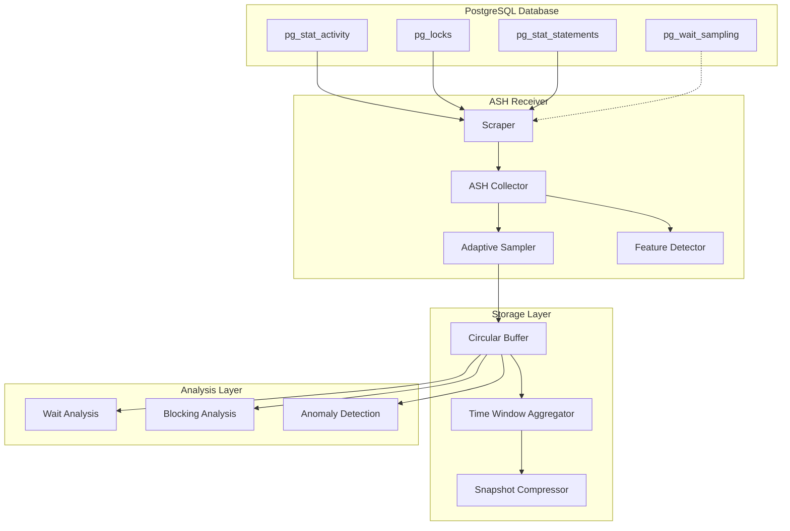

# Active Session History (ASH) Implementation

## Overview

The ASH implementation provides Oracle-like Active Session History capabilities for PostgreSQL, enabling detailed performance analysis through high-frequency session sampling.

## Architecture



## Core Components

### 1. ASH Scraper

The scraper is the main entry point for data collection:

```go
type ashScraper struct {
    config    *Config
    db        *sql.DB
    collector *ASHCollector
    logger    *zap.Logger
}
```

**Responsibilities**:
- Database connection management
- Periodic snapshot collection
- Metric generation
- Error handling

**Key Methods**:
- `start()`: Initialize database connection and collector
- `scrape()`: Collect snapshot and convert to metrics
- `shutdown()`: Clean up resources

### 2. ASH Collector

The collector executes queries and manages data collection:

```go
type ASHCollector struct {
    db           *sql.DB
    storage      *ASHStorage
    sampler      *AdaptiveSampler
    featureCache *FeatureCache
}
```

**Collection Query**:
```sql
WITH active_sessions AS (
    SELECT ... FROM pg_stat_activity
    WHERE backend_type = 'client backend'
),
blocking_info AS (
    SELECT ... FROM pg_locks
    WHERE NOT granted
)
SELECT ... FROM active_sessions
LEFT JOIN blocking_info ON ...
```

### 3. Adaptive Sampler

Intelligent sampling to manage overhead:

```go
type AdaptiveSampler struct {
    config      SamplingConfig
    loadMetrics *LoadMetrics
}
```

**Sampling Algorithm**:
1. Always sample critical sessions (blocked, long-running)
2. Adjust rate based on session count
3. Apply session-specific multipliers
4. Maintain statistical significance

### 4. Storage System

#### Circular Buffer

Efficient in-memory storage:

```go
type CircularBuffer struct {
    snapshots []*SessionSnapshot
    capacity  int
    head      int
    tail      int
}
```

**Features**:
- O(1) insertion
- Automatic old data eviction
- Time-based queries
- Thread-safe operations

#### Time Window Aggregator

Multi-resolution data aggregation:

```go
type TimeWindowAggregator struct {
    windows map[time.Duration]*AggregatedWindow
}
```

**Aggregation Levels**:
- 1 minute: Full detail
- 5 minutes: Summarized
- 15 minutes: Trends
- 1 hour: Overview

### 5. Feature Detection

Automatic capability detection:

```go
type FeatureCache struct {
    extensions map[string]bool
    lastCheck  time.Time
}
```

**Detected Features**:
- `pg_stat_statements`: Query identification
- `pg_wait_sampling`: Enhanced wait events
- PostgreSQL version capabilities

## Data Model

### Session Snapshot

```go
type SessionSnapshot struct {
    Timestamp       time.Time
    PID             int
    Username        string
    ApplicationName string
    ClientAddr      string
    BackendStart    time.Time
    QueryStart      *time.Time
    State           string
    WaitEventType   *string
    WaitEvent       *string
    QueryID         *string
    Query           string
    BlockingPID     *int
    LockType        *string
    BackendType     string
}
```

### Aggregated Window

```go
type AggregatedWindow struct {
    Window       time.Duration
    StartTime    time.Time
    EndTime      time.Time
    SessionCount map[string]int      // By state
    WaitEvents   map[string]int      // By event
    QueryStats   map[string]*QuerySummary
    WaitStats    map[string]*WaitSummary
    TopQueries   []QuerySummary
    TopWaits     []WaitSummary
}
```

## Sampling Strategy

### Load-Based Adaptation

```
Session Count | Sample Rate
-------------|------------
< 50         | 100%
50-500       | Configured rate
> 500        | Reduced (10-90%)
```

### Priority Sampling

Always sample:
1. Blocked sessions
2. Blocking sessions
3. Long-running queries (> threshold)
4. Critical wait events
5. System processes

### Statistical Guarantees

- Maintain minimum sample size for validity
- Ensure representation of all session types
- Preserve anomaly detection capability

## Wait Event Processing

### Event Categorization

```yaml
Lock Waits (Concurrency):
  - Lock:relation
  - Lock:tuple
  - Lock:transactionid
  
I/O Waits (Storage):
  - IO:DataFileRead
  - IO:DataFileWrite
  - IO:WALWrite
  
CPU Waits (Compute):
  - CPU intensive operations
  
Network Waits (Client):
  - Client:ClientRead
  - Client:ClientWrite
```

### Analysis Pipeline

1. **Collection**: Raw wait events from pg_stat_activity
2. **Categorization**: Map to logical categories
3. **Aggregation**: Summarize by window
4. **Alerting**: Trigger on thresholds

## Blocking Analysis

### Detection Algorithm

```sql
-- Simplified blocking detection
WITH blocking_info AS (
  SELECT 
    blocked.pid AS blocked_pid,
    blocking.pid AS blocking_pid,
    blocked_locks.locktype
  FROM pg_locks blocked_locks
  JOIN pg_locks blocking_locks ON ...
  WHERE NOT blocked_locks.granted
)
```

### Chain Analysis

1. Identify direct blocks
2. Build blocking chains
3. Detect circular dependencies
4. Calculate chain depth

## Performance Metrics

### Collection Overhead

| Component | CPU Usage | Memory Usage | Network |
|-----------|-----------|--------------|---------|
| Scraper   | < 0.1%    | ~1MB         | Minimal |
| Collector | < 0.5%    | ~10MB        | 1 query/sec |
| Storage   | < 0.1%    | ~50MB/hour   | None |
| Analysis  | < 0.2%    | ~5MB         | None |

### Optimization Techniques

1. **Query Optimization**:
   - Single query for all data
   - Minimal joins
   - Index usage

2. **Memory Management**:
   - Fixed-size buffers
   - Automatic cleanup
   - Compression option

3. **CPU Efficiency**:
   - Batch processing
   - Compiled patterns
   - Lazy evaluation

## Integration Patterns

### With OpenTelemetry Pipeline

```yaml
receivers:
  ash:
    collection_interval: 1s

processors:
  waitanalysis:
    enabled: true
  
  anomalydetector:
    enabled: true

exporters:
  prometheus:
    endpoint: 0.0.0.0:8889

service:
  pipelines:
    metrics:
      receivers: [ash]
      processors: [waitanalysis, anomalydetector]
      exporters: [prometheus]
```

### With Monitoring Systems

#### Prometheus Integration

```yaml
# Prometheus scrape config
scrape_configs:
  - job_name: 'ash_metrics'
    static_configs:
      - targets: ['localhost:8889']
    scrape_interval: 10s
```

#### Grafana Dashboards

Key panels:
1. Session state distribution
2. Wait event heatmap
3. Blocking chain graph
4. Query performance trends

## Security Model

### Connection Security

- SSL/TLS support
- Connection pooling
- Credential management
- Read-only access

### Data Protection

- No query parameter logging
- Optional query obfuscation
- Metric-only export
- Access control

## Troubleshooting

### Common Issues

1. **High Memory Usage**
   - Reduce buffer size
   - Enable compression
   - Lower sample rate

2. **Missing Sessions**
   - Check permissions
   - Verify query filters
   - Review sampling config

3. **Performance Impact**
   - Increase collection interval
   - Reduce sample rate
   - Optimize queries

### Diagnostic Tools

```sql
-- Check ASH query performance
EXPLAIN (ANALYZE, BUFFERS) 
WITH active_sessions AS (...) 
SELECT ...;

-- Verify permissions
SELECT has_table_privilege('monitoring_user', 'pg_stat_activity', 'SELECT');
SELECT has_table_privilege('monitoring_user', 'pg_locks', 'SELECT');
```

## Best Practices

### 1. Deployment

- Start with default configuration
- Monitor collector metrics
- Adjust sampling based on load
- Enable feature detection

### 2. Resource Planning

- **Memory**: 50-100MB per hour of data
- **CPU**: < 1% overhead typical
- **Storage**: Optional external storage
- **Network**: Minimal impact

### 3. Monitoring Strategy

- Use multiple aggregation windows
- Set appropriate alert thresholds
- Correlate with other metrics
- Regular baseline updates

## Future Enhancements

### Planned Features

1. **Machine Learning**:
   - Anomaly detection models
   - Workload classification
   - Predictive analysis

2. **Enhanced Storage**:
   - External storage backends
   - Long-term retention
   - Distributed collection

3. **Advanced Analysis**:
   - Root cause analysis
   - Impact assessment
   - Recommendation engine

### Extension Points

1. **Custom Samplers**: Implement workload-specific sampling
2. **Analysis Plugins**: Add custom wait event analyzers
3. **Export Formats**: Support additional output formats
4. **Integration APIs**: REST/gRPC interfaces