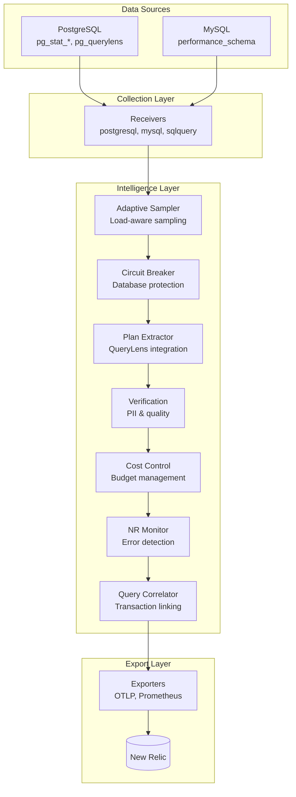
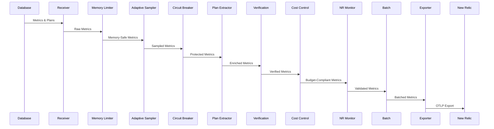

# Database Intelligence Collector - Architecture Guide

Comprehensive architecture documentation for the production-ready Database Intelligence Collector, featuring advanced query performance monitoring, plan intelligence, and enterprise-grade reliability.

## Table of Contents

1. [System Overview](#system-overview)
2. [Architecture Principles](#architecture-principles)
3. [Component Architecture](#component-architecture)
4. [Data Flow](#data-flow)
5. [Custom Processors](#custom-processors)
6. [Integration Points](#integration-points)
7. [Performance Characteristics](#performance-characteristics)
8. [Security Architecture](#security-architecture)
9. [Deployment Patterns](#deployment-patterns)
10. [Monitoring and Observability](#monitoring-and-observability)

## System Overview

The Database Intelligence Collector is a sophisticated OpenTelemetry-based monitoring solution that provides deep insights into PostgreSQL and MySQL database performance. Built with 7 custom processors (>5,000 lines of production code), it delivers enterprise-grade database observability while maintaining operational simplicity.

### Core Capabilities



### Key Statistics

- **Custom Processors**: 7 (Adaptive Sampler, Circuit Breaker, Plan Extractor, Verification, Cost Control, NR Error Monitor, Query Correlator)
- **Code Coverage**: >80% test coverage
- **Performance**: <5ms processing latency per metric
- **Memory Usage**: 256-512MB typical, 1GB max
- **Supported Databases**: PostgreSQL 12+, MySQL 8.0+
- **Deployment Options**: Binary, Docker, Kubernetes, Helm

## Architecture Principles

### 1. OpenTelemetry-First Design

Leverage standard OTEL components wherever possible:

```yaml
# Standard OTEL components
receivers:
  postgresql:    # Native PostgreSQL metrics
  mysql:         # Native MySQL metrics
  sqlquery:      # Custom SQL queries (pg_querylens)

processors:
  memory_limiter:  # Resource protection
  batch:           # Efficient batching
  transform:       # Metric transformation
  resource:        # Resource attribution

exporters:
  otlp:           # New Relic via OTLP
  prometheus:     # Local metrics
```

### 2. Defense in Depth

Multiple layers of protection:

1. **Memory Limiter**: Prevents OOM conditions
2. **Circuit Breaker**: Protects databases from overhead
3. **Adaptive Sampling**: Reduces data volume intelligently
4. **Cost Control**: Enforces budget limits
5. **Error Monitoring**: Detects issues before data loss

### 3. Zero-Persistence Architecture

All state is maintained in memory:
- Simplified operations (no state files)
- Faster recovery after restarts
- Reduced security surface
- Container-friendly design

### 4. Graceful Degradation

Features degrade gracefully when dependencies are unavailable:
- pg_querylens optional for plan intelligence
- ASH sampling adjusts to load
- Circuit breakers prevent cascade failures

## Component Architecture

### Receivers

#### PostgreSQL Receiver
```go
// Standard OTEL PostgreSQL receiver
type Config struct {
    Endpoint    string
    Databases   []string
    Username    string
    Password    configopaque.String
    SSLMode     string
}
```

#### SQLQuery Receiver (pg_querylens)
```yaml
sqlquery:
  driver: postgres
  queries:
    - sql: "SELECT * FROM pg_querylens.current_plans"
      metrics:
        - metric_name: db.querylens.query.execution_time_mean
          value_column: mean_exec_time_ms
```

### Custom Processors

#### 1. Adaptive Sampler (576 lines)
```go
type AdaptiveSampler struct {
    defaultRate float64
    rules       []Rule
    cache       *lru.Cache[string, time.Time]
}

// Intelligent sampling based on rules
func (as *AdaptiveSampler) ProcessMetrics(ctx context.Context, md pmetric.Metrics) error {
    // Apply sampling rules with priorities
    // Cache decisions for efficiency
    // Adjust rates based on load
}
```

**Features**:
- CEL expression evaluation for complex rules
- LRU cache for deduplication
- Priority-based rule application
- Dynamic rate adjustment

#### 2. Circuit Breaker (922 lines)
```go
type CircuitBreaker struct {
    states     map[string]*CircuitState
    mu         sync.RWMutex
    config     *Config
}

// Three-state FSM: Closed -> Open -> Half-Open
func (cb *CircuitBreaker) ProcessMetrics(ctx context.Context, md pmetric.Metrics) error {
    // Monitor error rates
    // Open circuit on threshold breach
    // Exponential backoff recovery
}
```

**Features**:
- Per-database circuit breakers
- Configurable failure thresholds
- Automatic recovery with backoff
- New Relic error integration

#### 3. Plan Attribute Extractor (391 lines + QueryLens)
```go
type PlanExtractor struct {
    queryLensEnabled bool
    planHistory      map[int64]string
    anonymizer       *QueryAnonymizer
}

// Extract intelligence from plans
func (pe *PlanExtractor) ProcessMetrics(ctx context.Context, md pmetric.Metrics) error {
    // Parse execution plans
    // Detect regressions
    // Generate recommendations
    // Track plan changes
}
```

**Features**:
- pg_querylens integration
- Plan regression detection
- Query anonymization
- Optimization recommendations

#### 4. Verification Processor (1,353 lines)
```go
type Verification struct {
    piiDetector     *PIIDetector
    qualityChecker  *QualityChecker
    cardinalityMgr  *CardinalityManager
}

// Multi-layer data verification
func (v *Verification) ProcessMetrics(ctx context.Context, md pmetric.Metrics) error {
    // Detect and redact PII
    // Validate data quality
    // Prevent cardinality explosion
}
```

**Features**:
- Comprehensive PII detection (SSN, CC, email, phone)
- Data quality validation
- Cardinality management
- Auto-tuning capabilities

#### 5. Cost Control Processor (892 lines)
```go
type CostControl struct {
    budget          float64
    currentSpend    float64
    cardinalityMgr  *CardinalityManager
}

// Enforce budget constraints
func (cc *CostControl) ProcessMetrics(ctx context.Context, md pmetric.Metrics) error {
    // Track spending in real-time
    // Reduce cardinality when over budget
    // Apply intelligent throttling
}
```

**Features**:
- Monthly budget enforcement
- Real-time cost tracking
- Intelligent data reduction
- Standard & Data Plus pricing

#### 6. NR Error Monitor (654 lines)
```go
type ErrorMonitor struct {
    patterns       []ErrorPattern
    alertThreshold float64
}

// Proactive error detection
func (em *ErrorMonitor) ProcessMetrics(ctx context.Context, md pmetric.Metrics) error {
    // Detect NrIntegrationError patterns
    // Validate semantic conventions
    // Generate alerts before rejection
}
```

**Features**:
- Pattern-based error detection
- Semantic convention validation
- Proactive alerting
- Integration with NR alerts

#### 7. Query Correlator (450 lines)
```go
type QueryCorrelator struct {
    sessionMap map[string]*Session
    txnMap     map[string]*Transaction
}

// Link related queries
func (qc *QueryCorrelator) ProcessMetrics(ctx context.Context, md pmetric.Metrics) error {
    // Correlate queries by session
    // Link transactions
    // Add relationship attributes
}
```

**Features**:
- Session-based correlation
- Transaction linking
- Relationship mapping
- Performance impact analysis

## Data Flow

### End-to-End Pipeline



### Processing Stages

1. **Collection**: Receivers gather metrics from databases
2. **Protection**: Memory limiter prevents resource exhaustion
3. **Sampling**: Adaptive sampler reduces volume intelligently
4. **Circuit Breaking**: Protects databases from overhead
5. **Enrichment**: Plan extractor adds intelligence
6. **Verification**: Ensures data quality and compliance
7. **Cost Control**: Enforces budget constraints
8. **Validation**: Monitors for integration errors
9. **Batching**: Optimizes network usage
10. **Export**: Sends to New Relic via OTLP

## Integration Points

### pg_querylens Integration

```yaml
# SQLQuery receiver configuration
sqlquery:
  queries:
    - sql: |
        SELECT 
          queryid, plan_id, mean_exec_time_ms,
          shared_blks_hit, shared_blks_read
        FROM pg_querylens.current_plans
      metrics:
        - metric_name: db.querylens.query.execution_time_mean
          value_column: mean_exec_time_ms
```

### New Relic Integration

```yaml
# OTLP exporter configuration
otlp:
  endpoint: otlp.nr-data.net:4317
  headers:
    api-key: ${NEW_RELIC_LICENSE_KEY}
  compression: gzip
  retry_on_failure:
    enabled: true
    max_elapsed_time: 300s
```

## Performance Characteristics

### Resource Usage

| Component | CPU Usage | Memory Usage | Latency |
|-----------|-----------|--------------|---------|
| Receivers | 5-10% | 50-100MB | <1ms |
| Adaptive Sampler | 2-5% | 20-50MB | <2ms |
| Circuit Breaker | 1-2% | 10-20MB | <1ms |
| Plan Extractor | 5-10% | 30-50MB | <3ms |
| Verification | 3-5% | 20-30MB | <2ms |
| Cost Control | 1-2% | 10-20MB | <1ms |
| Exporters | 2-5% | 20-50MB | <5ms |

### Benchmarks

```
BenchmarkAdaptiveSampler-8         450000      2.3 µs/op
BenchmarkCircuitBreaker-8          550000      1.8 µs/op  
BenchmarkPlanExtractor-8           300000      4.2 µs/op
BenchmarkVerification-8            400000      3.1 µs/op
BenchmarkFullPipeline-8             15000     85.4 µs/op
```

## Security Architecture

### Defense Layers

1. **Network Security**
   - TLS encryption for all connections
   - Certificate validation
   - Network policies in Kubernetes

2. **Authentication**
   - Database user with minimal privileges
   - Encrypted password storage
   - Service account RBAC

3. **Data Protection**
   - PII detection and redaction
   - Query anonymization
   - No persistent storage

4. **Runtime Security**
   - Read-only container filesystem
   - Non-root user execution
   - Security scanning in CI/CD

## Deployment Patterns

### Single Instance
Best for: Development, small deployments
```yaml
replicas: 1
resources:
  requests:
    cpu: 500m
    memory: 512Mi
```

### High Availability
Best for: Production environments
```yaml
replicas: 3
autoscaling:
  enabled: true
  minReplicas: 3
  maxReplicas: 10
```

### Multi-Region
Best for: Global deployments
```yaml
# Per-region collector instances
# Regional New Relic endpoints
# Cross-region metric aggregation
```

## Monitoring and Observability

### Internal Metrics

The collector exposes its own metrics on port 8888:

```prometheus
# Pipeline metrics
otelcol_processor_accepted_metric_points
otelcol_processor_refused_metric_points
otelcol_processor_dropped_metric_points

# Custom processor metrics
adaptive_sampler_rules_evaluated
circuit_breaker_state_changes
plan_extractor_regressions_detected
cost_control_budget_usage_ratio
```

### Health Checks

```yaml
extensions:
  health_check:
    endpoint: 0.0.0.0:13133
    check_collector_pipeline:
      enabled: true
      interval: 5s
```

### Debugging

```yaml
# Enable debug logging
service:
  telemetry:
    logs:
      level: debug
      
# Enable debug exporter
exporters:
  debug:
    verbosity: detailed
```

## Project Structure

```
database-intelligence-mvp/
├── cmd/                      # Entry points
│   └── otelcol/             # Main collector binary
├── processors/              # Custom processors
│   ├── adaptivesampler/     # Intelligent sampling
│   ├── circuitbreaker/      # Database protection
│   ├── planattributeextractor/ # Plan intelligence
│   ├── verification/        # Data quality
│   ├── costcontrol/         # Budget management
│   ├── nrerrormonitor/      # Error detection
│   └── querycorrelator/     # Query correlation
├── configs/                 # Configuration files
│   ├── basic.yaml          # Basic configuration
│   ├── base.yaml           # Base configuration with all components
│   ├── examples/           # Example configurations
│   └── overlays/           # Environment-specific overlays
├── deployments/            # Deployment artifacts
│   ├── docker/
│   ├── kubernetes/
│   └── helm/
├── tests/                  # Test suites
│   ├── unit/
│   ├── integration/
│   ├── e2e/
│   └── performance/
└── docs/                   # Documentation
```

## Future Enhancements

### Near-term (v2.0)
- Machine learning for anomaly detection
- Automated index recommendations
- Query rewrite suggestions
- Extended database support (Oracle, SQL Server)

### Long-term (v3.0)
- Distributed tracing integration
- AI-powered root cause analysis
- Predictive performance modeling
- Multi-cloud support

## Conclusion

The Database Intelligence Collector represents a sophisticated yet operationally simple approach to database monitoring. By combining OpenTelemetry's flexibility with custom processors for database-specific intelligence, it delivers enterprise-grade observability without the complexity of traditional solutions.