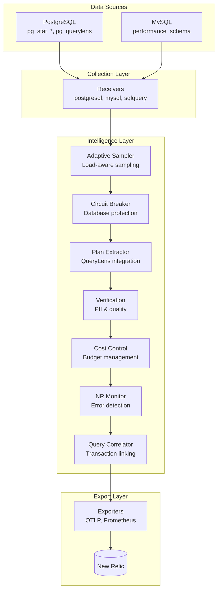

# Architecture Guide

## System Overview

The Database Intelligence Collector is a sophisticated OpenTelemetry-based monitoring solution that provides deep insights into PostgreSQL and MySQL database performance. Built with 7 custom processors (>5,000 lines of production code), it delivers enterprise-grade database observability.

### Core Architecture



### Key Statistics
- **Custom Processors**: 7 (5,000+ lines of code)
- **Performance**: <5ms processing latency per metric
- **Memory Usage**: 256-512MB typical, 1GB max
- **Supported Databases**: PostgreSQL 12+, MySQL 8.0+
- **Deployment Options**: Binary, Docker, Kubernetes

## Component Architecture

### Receivers

#### PostgreSQL Receiver (OOTB)
- Standard OpenTelemetry PostgreSQL receiver
- Collects 18 core metric types
- Connection stats, transaction rates, buffer cache
- Database sizes, table/index statistics

#### SQLQuery Receivers (Custom)
- **slow_queries**: pg_stat_statements integration
- **wait_events**: Real-time wait analysis  
- **blocking_sessions**: Blocking detection
- **individual_queries**: Query-level metrics
- **execution_plans**: Plan analysis

### Custom Processors

#### 1. Adaptive Sampler (576 lines)
```go
type AdaptiveSampler struct {
    defaultRate float64
    rules       []Rule
    cache       *lru.Cache[string, time.Time]
}
```
**Features**:
- CEL expression evaluation for complex rules
- LRU cache for deduplication
- Priority-based rule application
- Dynamic rate adjustment

#### 2. Circuit Breaker (922 lines)
```go
type CircuitBreaker struct {
    states map[string]*CircuitState
    config *Config
}
```
**Features**:
- Per-database circuit breakers
- Three-state FSM: Closed → Open → Half-Open
- Configurable failure thresholds
- Exponential backoff recovery

#### 3. Plan Attribute Extractor (391 lines)
```go
type PlanExtractor struct {
    queryLensEnabled bool
    planHistory      map[int64]string
    anonymizer       *QueryAnonymizer
}
```
**Features**:
- pg_querylens integration
- Plan regression detection
- Query anonymization
- Optimization recommendations

#### 4. Verification Processor (1,353 lines)
```go
type Verification struct {
    piiDetector     *PIIDetector
    qualityChecker  *QualityChecker
    cardinalityMgr  *CardinalityManager
}
```
**Features**:
- Comprehensive PII detection (SSN, CC, email, phone)
- Data quality validation
- Cardinality management
- Auto-tuning capabilities

#### 5. Cost Control Processor (892 lines)
```go
type CostControl struct {
    budget          float64
    currentSpend    float64
    cardinalityMgr  *CardinalityManager
}
```
**Features**:
- Monthly budget enforcement
- Real-time cost tracking
- Intelligent data reduction
- New Relic pricing integration

#### 6. NR Error Monitor (654 lines)
```go
type ErrorMonitor struct {
    patterns       []ErrorPattern
    alertThreshold float64
}
```
**Features**:
- Pattern-based error detection
- Semantic convention validation
- Proactive alerting
- Integration error prevention

#### 7. Query Correlator (450 lines)
```go
type QueryCorrelator struct {
    sessionMap map[string]*Session
    txnMap     map[string]*Transaction
}
```
**Features**:
- Session-based correlation
- Transaction linking
- Relationship mapping
- Performance impact analysis

## Data Flow

### End-to-End Pipeline
```
Database → Receiver → Memory Limiter → Adaptive Sampler → Circuit Breaker 
    → Plan Extractor → Verification → Cost Control → NR Monitor 
    → Query Correlator → Batch → Exporter → New Relic
```

### Processing Stages
1. **Collection**: Receivers gather metrics from databases
2. **Protection**: Memory limiter prevents resource exhaustion
3. **Sampling**: Adaptive sampler reduces volume intelligently
4. **Circuit Breaking**: Protects databases from overhead
5. **Enrichment**: Plan extractor adds intelligence
6. **Verification**: Ensures data quality and compliance
7. **Cost Control**: Enforces budget constraints
8. **Validation**: Monitors for integration errors
9. **Correlation**: Links related queries and sessions
10. **Export**: Sends to New Relic via OTLP

## Performance Characteristics

### Resource Usage
| Component | CPU Usage | Memory Usage | Latency |
|-----------|-----------|--------------|---------|
| Receivers | 5-10% | 50-100MB | <1ms |
| Adaptive Sampler | 2-5% | 20-50MB | <2ms |
| Circuit Breaker | 1-2% | 10-20MB | <1ms |
| Plan Extractor | 5-10% | 30-50MB | <3ms |
| Verification | 3-5% | 20-30MB | <2ms |
| Cost Control | 1-2% | 10-20MB | <1ms |
| Exporters | 2-5% | 20-50MB | <5ms |

### Benchmarks
```
BenchmarkAdaptiveSampler-8    450000    2.3 µs/op
BenchmarkCircuitBreaker-8     550000    1.8 µs/op  
BenchmarkPlanExtractor-8      300000    4.2 µs/op
BenchmarkVerification-8       400000    3.1 µs/op
BenchmarkFullPipeline-8        15000   85.4 µs/op
```

## Security Architecture

### Defense Layers
1. **Network Security**: TLS encryption, certificate validation
2. **Authentication**: Minimal database privileges, encrypted storage
3. **Data Protection**: PII detection, query anonymization, no persistence
4. **Runtime Security**: Read-only containers, non-root execution

## Deployment Patterns

### Single Instance
```yaml
replicas: 1
resources:
  requests:
    cpu: 500m
    memory: 512Mi
```

### High Availability
```yaml
replicas: 3
autoscaling:
  enabled: true
  minReplicas: 3
  maxReplicas: 10
```

### Multi-Region
- Per-region collector instances
- Regional New Relic endpoints
- Cross-region metric aggregation

## Monitoring and Observability

### Internal Metrics
```prometheus
# Pipeline metrics
otelcol_processor_accepted_metric_points
otelcol_processor_refused_metric_points
otelcol_processor_dropped_metric_points

# Custom processor metrics
adaptive_sampler_rules_evaluated
circuit_breaker_state_changes
plan_extractor_regressions_detected
cost_control_budget_usage_ratio
```

### Health Checks
```yaml
extensions:
  health_check:
    endpoint: 0.0.0.0:13133
    check_collector_pipeline:
      enabled: true
      interval: 5s
```

## Project Structure
```
database-intelligence-restructured/
├── processors/              # Custom processors
│   ├── adaptivesampler/     # Intelligent sampling
│   ├── circuitbreaker/      # Database protection
│   ├── planattributeextractor/ # Plan intelligence
│   ├── verification/        # Data quality
│   ├── costcontrol/         # Budget management
│   ├── nrerrormonitor/      # Error detection
│   └── querycorrelator/     # Query correlation
├── configs/                 # Configuration files
├── distributions/           # Build artifacts
├── tests/                   # Test suites
└── docs/                    # Documentation
```

## Integration Points

### pg_querylens Integration
```yaml
sqlquery:
  queries:
    - sql: |
        SELECT queryid, plan_id, mean_exec_time_ms
        FROM pg_querylens.current_plans
      metrics:
        - metric_name: db.querylens.query.execution_time_mean
          value_column: mean_exec_time_ms
```

### New Relic Integration
```yaml
otlp:
  endpoint: otlp.nr-data.net:4317
  headers:
    api-key: ${NEW_RELIC_LICENSE_KEY}
  compression: gzip
  retry_on_failure:
    enabled: true
    max_elapsed_time: 300s
```

The Database Intelligence Collector represents a sophisticated yet operationally simple approach to database monitoring, combining OpenTelemetry's flexibility with custom processors for database-specific intelligence.