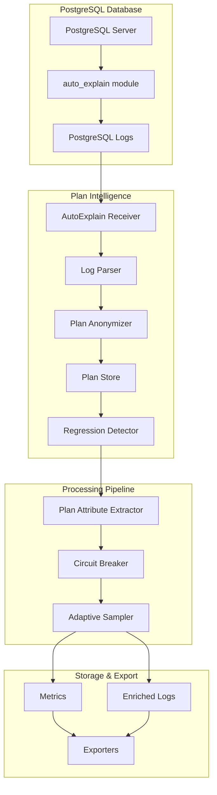

# Plan Intelligence Architecture

## Overview

Plan Intelligence provides comprehensive execution plan collection, analysis, and regression detection for PostgreSQL databases. It combines safe log-based collection with sophisticated analysis capabilities.

## Architecture Components



## Core Components

### 1. AutoExplain Receiver

The AutoExplain receiver is the entry point for plan collection:

**Responsibilities**:
- Monitor PostgreSQL log files
- Parse auto_explain output
- Handle log rotation
- Extract execution plans

**Key Features**:
- Supports JSON, CSV, and text log formats
- Non-blocking file monitoring with fsnotify
- Graceful log rotation handling
- Configurable collection thresholds

### 2. Log Parser

Parses various auto_explain log formats:

**Supported Formats**:
- **JSON**: Full plan structure with nested nodes
- **CSV**: Tabular format with plan text
- **Text**: Traditional PostgreSQL log format

**Parsing Strategy**:
```go
type LogParser struct {
    format       string
    objectMapper *PlanObjectMapper
    patterns     map[string]*regexp.Regexp
}
```

### 3. Plan Store

Manages plan history and versioning:

**Storage Design**:
```go
type PlanStore struct {
    plans      map[string]*PlanHistory  // QueryID -> History
    lruCache   *LRUCache               // Memory management
    retention  time.Duration           // TTL for plans
}

type PlanHistory struct {
    QueryID    string
    Plans      []StoredPlan  // Ordered by timestamp
    Statistics PlanStatistics
}
```

**Features**:
- LRU eviction for memory efficiency
- Plan versioning and history
- Statistical tracking
- TTL-based cleanup

### 4. Plan Anonymizer

Protects sensitive data in execution plans:

**Anonymization Layers**:

1. **Pattern Detection**:
   - Email addresses
   - Social Security Numbers
   - Credit card numbers
   - Phone numbers
   - IP addresses
   - API keys

2. **Context-Aware Anonymization**:
   ```go
   func (pa *PlanAnonymizer) anonymizeFilter(filter string) string {
       // Preserve structure while removing values
       // "email = 'user@example.com'" -> "email = '<EMAIL_REDACTED>'"
   }
   ```

3. **Structural Preservation**:
   - Maintains plan tree structure
   - Preserves cost estimates
   - Keeps statistical information

### 5. Regression Detector

Identifies performance degradations:

**Detection Methods**:

1. **Statistical Analysis**:
   ```go
   func (rd *RegressionDetector) detectRegression(old, new PlanMetrics) bool {
       // Welch's t-test for statistical significance
       t := calculateTStatistic(old, new)
       return t > rd.config.ConfidenceLevel
   }
   ```

2. **Cost-Based Analysis**:
   - Compares plan costs
   - Weights by node type
   - Considers resource usage

3. **Structure Analysis**:
   - Detects plan shape changes
   - Identifies index usage changes
   - Tracks join method changes

## Data Flow

### 1. Plan Collection Flow

```
PostgreSQL Query Execution
    ↓
auto_explain logs plan (if duration > threshold)
    ↓
Log entry written to postgresql.log
    ↓
AutoExplain Receiver detects new entry
    ↓
Log Parser extracts plan
    ↓
Plan Anonymizer removes PII
    ↓
Plan Store saves with version
    ↓
Metrics generated
```

### 2. Regression Detection Flow

```
New Plan Stored
    ↓
Retrieve Plan History for QueryID
    ↓
Compare with Previous Plans
    ↓
Statistical Significance Test
    ↓
Structure Comparison
    ↓
Generate Regression Score
    ↓
Trigger Alert if Threshold Exceeded
```

## Configuration Schema

### Receiver Configuration

```yaml
receivers:
  autoexplain:
    log_path: /var/log/postgresql/postgresql.log
    log_format: json
    
    plan_collection:
      enabled: true
      min_duration: 100ms
      max_plans_per_query: 10
      retention_duration: 24h
      
      regression_detection:
        enabled: true
        performance_degradation_threshold: 0.2
        cost_increase_threshold: 0.5
        min_executions: 10
        statistical_confidence: 0.95
```

### Processor Configuration

```yaml
processors:
  planattributeextractor:
    enabled: true
    safe_mode: true
    
    anonymization:
      enabled: true
      sensitive_patterns: [email, ssn, credit_card]
    
    plan_analysis:
      enabled: true
      detect_issues: true
      generate_recommendations: true
```

## Security Considerations

### 1. Data Protection

- **PII Removal**: Automatic detection and redaction
- **Configurable Patterns**: Customizable sensitive data patterns
- **Hash-Based Tracking**: Uses hashes for plan comparison

### 2. Access Control

- **Read-Only Access**: No database modifications
- **File Permissions**: Requires log file read access
- **Connection Security**: Supports SSL/TLS

### 3. Resource Limits

- **Memory Bounds**: LRU cache with configurable size
- **CPU Throttling**: Configurable parsing rate
- **Storage Limits**: TTL-based cleanup

## Performance Optimization

### 1. Memory Management

```go
type LRUCache struct {
    capacity int
    items    map[string]*list.Element
    lru      *list.List
}
```

- Fixed-size cache
- O(1) access time
- Automatic eviction

### 2. Parsing Optimization

- **Streaming Parser**: Processes logs incrementally
- **Compiled Patterns**: Pre-compiled regex
- **Parallel Processing**: Concurrent plan analysis

### 3. Storage Efficiency

- **Plan Deduplication**: Stores unique plans once
- **Compression**: Optional plan compression
- **Selective Storage**: Configurable filters

## Integration Points

### 1. With ASH Receiver

```yaml
pipelines:
  metrics/unified:
    receivers: [autoexplain, ash]
    processors: [planattributeextractor, waitanalysis]
    exporters: [otlp]
```

Correlates plans with session activity.

### 2. With Circuit Breaker

```yaml
processors:
  circuitbreaker:
    error_patterns:
      - pattern: "auto_explain.*not loaded"
        action: disable_plan_collection
```

Protects against configuration issues.

### 3. With Adaptive Sampler

```yaml
processors:
  adaptivesampler:
    rules:
      - name: plan_regressions
        conditions:
          - attribute: event_type
            value: plan_regression
        sample_rate: 1.0  # Always collect regressions
```

Ensures critical events are captured.

## Monitoring & Observability

### 1. Receiver Metrics

- `autoexplain_plans_collected_total` - Total plans collected
- `autoexplain_parse_errors_total` - Parsing failures
- `autoexplain_regression_detected_total` - Regressions found

### 2. Performance Metrics

- `autoexplain_parse_duration_seconds` - Parse time histogram
- `autoexplain_memory_usage_bytes` - Memory consumption
- `autoexplain_plan_store_size` - Number of stored plans

### 3. Health Indicators

- Log file accessibility
- Parser success rate
- Memory pressure
- Regression detection rate

## Troubleshooting Guide

### Common Issues

1. **No Plans Collected**
   - Verify auto_explain is enabled
   - Check log_min_duration setting
   - Ensure log file permissions

2. **High Memory Usage**
   - Reduce max_plans_per_query
   - Decrease retention_duration
   - Enable plan compression

3. **Parse Errors**
   - Verify log_format matches actual format
   - Check for log corruption
   - Review custom patterns

### Debug Tools

1. **Test Parser**:
   ```bash
   otelcol validate --config=config.yaml
   otelcol --config=config.yaml --log-level=debug
   ```

2. **Plan Analysis**:
   ```sql
   -- Check auto_explain settings
   SHOW auto_explain.log_min_duration;
   SHOW auto_explain.log_format;
   ```

3. **Log Verification**:
   ```bash
   # Check log format
   tail -f /var/log/postgresql/postgresql.log | grep "auto_explain"
   ```

## Future Enhancements

### 1. Machine Learning Integration
- Anomaly detection models
- Plan recommendation engine
- Cost prediction

### 2. Enhanced Analysis
- Cross-query plan correlation
- Workload pattern detection
- Resource usage prediction

### 3. Extended Storage
- External plan repository
- Long-term trend analysis
- Plan comparison UI