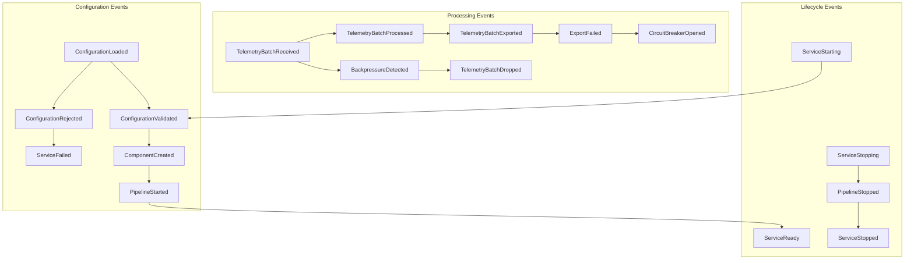
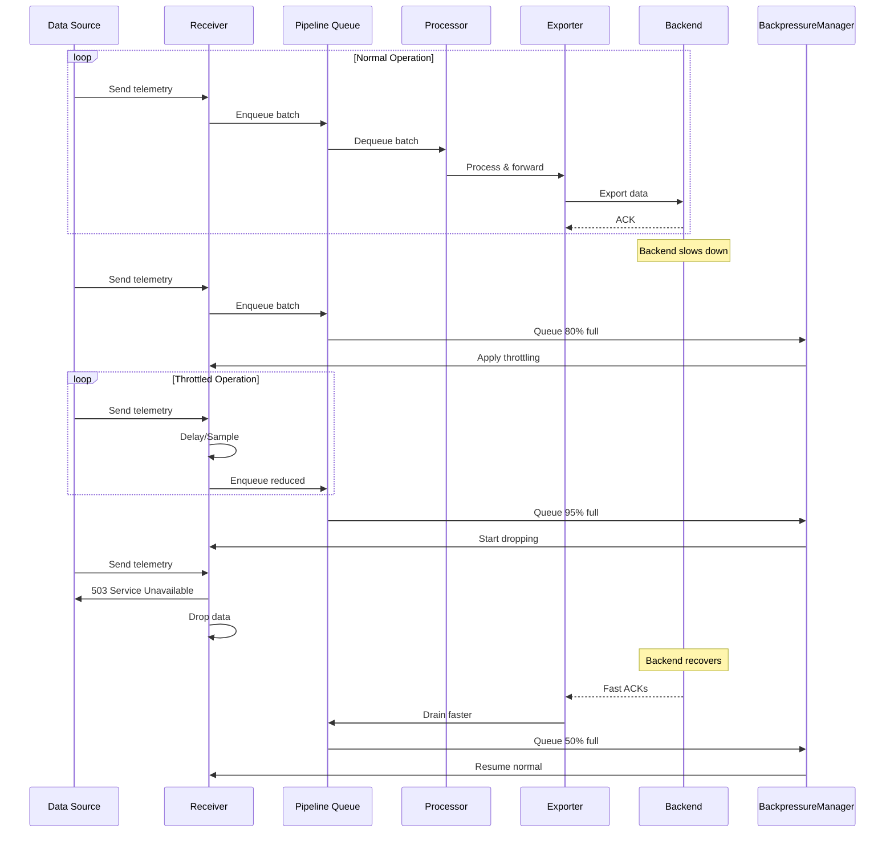
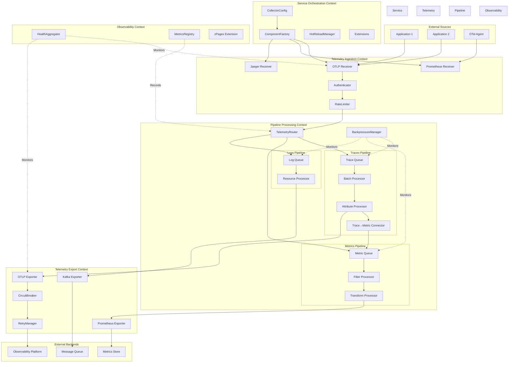
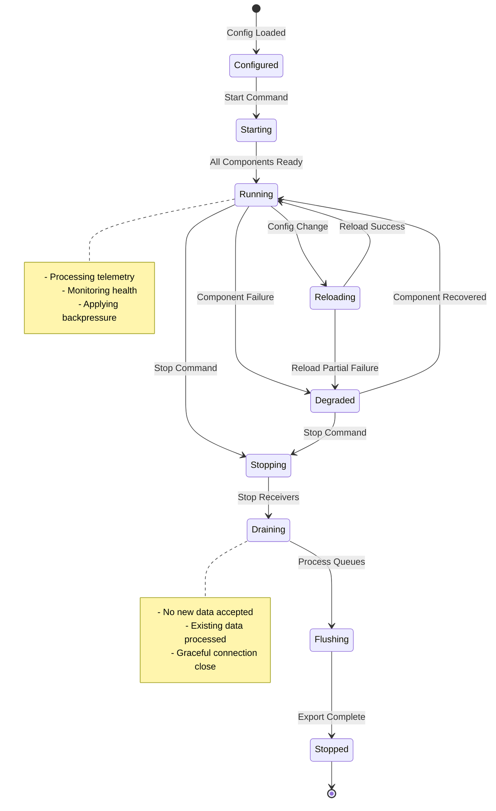

# OpenTelemetry Collector Domain-Driven Design: Enhanced Reference Architecture

## Executive Summary

The OpenTelemetry Collector is modeled as a sophisticated telemetry processing system with five primary bounded contexts:

1.  **Service Orchestration Context**: Manages service lifecycle, configuration, and component instantiation.
2.  **Pipeline Processing Context**: Orchestrates data flow through receiver-processor-exporter chains.
3.  **Telemetry Ingestion Context**: Handles protocol-specific data reception and translation.
4.  **Telemetry Export Context**: Manages reliable data transmission to backends.
5.  **Observability & Control Context**: Monitors the Collector's own health and performance.

This model emphasizes configuration validation, explicit modeling of connectors, and formal representation of data flow through domain events.

## Strengthened Core Model & Ubiquitous Language

### Enhanced Ubiquitous Language Glossary

| Term | Context | Definition | Invariants |
|---|---|---|---|
| **CollectorConfig** | Service Orchestration | Validated configuration for entire service | Must be internally consistent; No orphaned components |
| **Pipeline** | Pipeline Processing | Complete data flow path from receivers to exporters | Type consistency throughout chain; No cycles |
| **Receiver** | Telemetry Ingestion | Ingestion point translating external formats to pdata | Must have valid endpoint; Protocol-specific validation |
| **Processor** | Pipeline Processing | Stateless transformer of telemetry data | Input/output types must match pipeline |
| **Exporter** | Telemetry Export | Persists telemetry to external systems | Must handle backpressure; Retry on failure |
| **Connector** | Pipeline Processing | Bridges pipelines, acts as exporter and receiver | Type conversion must be valid |
| **ComponentId** | All Contexts | Unique identifier for components | Non-empty string; Valid characters only |
| **PipelineId** | Pipeline Processing | Composite key (DataType, Name) | Valid data type; Unique within service |
| **pdata** | All Contexts | Internal telemetry data representation | Immutable after creation |
| **TelemetryBatch** | Pipeline Processing | Collection of telemetry items | Size limits enforced |
| **ConfigProvider** | Service Orchestration | Loads raw configuration | Must provide valid syntax |
| **ComponentFactory** | Service Orchestration | Creates components from configs | Must validate before creation |
| **HealthChecker** | Observability & Control | Monitors component health | Must check all critical components |
| **RateLimiter** | Telemetry Ingestion | Controls ingestion rate | Token bucket invariants |
| **BackpressureManager** | Pipeline Processing | Handles pipeline congestion | Must prevent OOM |
| **TelemetryRouter** | Pipeline Processing | Routes data to appropriate pipelines | Must respect data types |
| **FeatureGate** | Service Orchestration | Feature flag configuration | Must have default value |
| **Extension** | Service Orchestration | Service-wide capabilities (auth, health) | Lifecycle tied to service |

### Detailed Aggregate Invariants

#### CollectorConfig Aggregate Invariants

1.  **Structural Integrity**: All referenced components must be defined; no component can be used without definition; pipeline components must exist in their respective sections.
2.  **Type Safety**: Receiver output types must match pipeline input types; processor chain types must be compatible; connector conversions must be supported.
3.  **Graph Constraints**: No circular dependencies between pipelines via connectors; each pipeline must have at least one receiver/connector input; each pipeline must have at least one exporter/connector output.
4.  **Resource Constraints**: Memory limits must be positive; queue sizes must be within bounds; timeout values must be reasonable.

#### Pipeline Aggregate Invariants

1.  **Data Type Consistency**: All components must handle the pipeline's data type; type conversions only allowed through connectors.
2.  **Processing Order**: Processors execute in defined sequence; no processor can be skipped; failed processing stops the pipeline.
3.  **Lifecycle Constraints**: Start receivers before processors; stop exporters before processors; drain queues on shutdown.
4.  **Throughput Invariants**: Input rate ≤ Processing rate (or backpressure); output rate ≤ Export capacity; queue depth ≤ Maximum configured.

#### Receiver Aggregate Invariants

1.  **Protocol Compliance**: Must implement protocol correctly; must validate incoming data; must handle protocol errors gracefully.
2.  **Resource Management**: Connection limits enforced; memory usage bounded; graceful degradation under load.
3.  **Data Translation**: Must preserve semantic meaning; must not lose required fields; must handle unknown fields appropriately.

## Expanded Domain Concepts

### A. Advanced Configuration Domain

*   **ConfigurationValidator**: Validates raw configuration for structural integrity, type compatibility, graph constraints, resource limits, and feature gates.
*   **ConfigMerger**: Handles configuration composition from multiple sources, implements precedence rules, and validates merged results.
*   **HotReloadManager**: Manages dynamic configuration changes, validates new configurations, and applies deltas to running components.

### B. Telemetry Routing & Fanout

*   **TelemetryRouter**: Routes telemetry batches to appropriate pipelines based on configurable rules (e.g., attribute-based routing).
*   **FanoutManager**: Manages one-to-many data distribution, handles partial failures, and tracks acknowledgments.

### C. Backpressure & Flow Control

*   **BackpressureStrategy**: Defines how to handle pipeline congestion (e.g., reject, throttle, sample).
*   **QueueManager**: Manages bounded queues for telemetry batches, ensuring capacity limits and recording dropped data.

### D. Observability & Control Plane

*   **HealthAggregator**: Computes overall service health based on the health status of individual components.
*   **MetricsRegistry**: Records and exposes internal collector metrics (e.g., processed batches, pipeline latency).

### E. Extension System

*   **Extension**: Provides service-wide capabilities (e.g., authentication, health checks) with a defined lifecycle.

## Domain Events & Event Storming

### Core Domain Events

1.  **Configuration Events**: `ConfigurationLoaded`, `ConfigurationValidated`, `ConfigurationRejected`, `ConfigurationReloaded`, `ComponentCreated`, `ComponentFailed`.
2.  **Pipeline Events**: `PipelineStarted`, `PipelineStopped`, `TelemetryBatchReceived`, `TelemetryBatchProcessed`, `TelemetryBatchExported`, `TelemetryBatchDropped`.
3.  **Operational Events**: `BackpressureDetected`, `RateLimitExceeded`, `ExportFailed`, `CircuitBreakerOpened`, `HealthCheckFailed`.
4.  **Lifecycle Events**: `ServiceStarting`, `ServiceReady`, `ServiceStopping`, `ServiceStopped`.

### Event Flow Diagram

### Event Storming Workshop Results

## Tactical Patterns Deep Dive

*   **Chain of Responsibility for Processors**: Processors are chained, with each processing a batch and passing it to the next, allowing for modular and extensible data transformation.
*   **Strategy Pattern for Export Retry**: Defines retry policies (e.g., exponential backoff) for exporters to handle transient failures gracefully.
*   **Builder Pattern for Pipeline Construction**: Provides a fluent API for constructing complex telemetry pipelines with various components and configurations.
*   **Observer Pattern for Health Monitoring**: Components can subscribe to health changes of other components, enabling reactive monitoring and alerting.

## Advanced Visualization

### Complete System Architecture

### Pipeline State Machine

### Data Flow Sequence with Backpressure

## Anti-Patterns & Pitfalls

*   **Configuration Monolith**: Avoid a single, massive configuration object. Instead, use modular configurations with component-specific validation.
*   **Synchronous Pipeline Processing**: Avoid blocking calls throughout the pipeline. Implement asynchronous processing with queues to prevent head-of-line blocking and cascading failures.
*   **Unbounded Queues**: Avoid infinite queue sizes. Use bounded queues with explicit backpressure handling to prevent memory exhaustion and hide systemic issues.
*   **Tight Coupling to Wire Formats**: Avoid using protocol-specific types throughout the pipeline. Use a protocol-agnostic internal representation (pdata) for flexibility.
*   **Missing Circuit Breakers**: Implement circuit breakers with fallback strategies to prevent resource exhaustion and cascading failures.
*   **Global State Management**: Avoid shared mutable state across components. Use component-local state with explicit messaging for better scalability and testability.
*   **Ignored Connector Semantics**: Explicitly model connectors with type conversion to ensure type safety and optimize data flow.
*   **All-or-Nothing Processing**: Implement item-level error handling with partial success to improve reliability and error isolation.

## Testing Strategies

*   **Configuration Testing**: Validate configuration for structural integrity, type compatibility, and graph constraints.
*   **Pipeline Testing**: Integration testing with test doubles to verify backpressure handling and data flow.
*   **Component Testing**: Property-based testing for individual processors to ensure correct behavior.
*   **Resilience Testing**: Chaos testing to verify recovery from temporary failures and handle network disruptions.
*   **Performance Testing**: Load testing with metrics to ensure SLA adherence under various workloads.

## Performance & Scalability Patterns

*   **Zero-Copy Data Handling**: Minimize data copying by passing references through the pipeline, with actual copies only at the export stage if necessary.
*   **Parallel Pipeline Processing**: Partition telemetry batches for parallel processing across multiple workers to improve throughput.
*   **Adaptive Resource Management**: Dynamically adjust worker counts, queue sizes, and batching based on real-time CPU, memory, and throughput metrics.

## Conclusion

This enhanced OpenTelemetry Collector domain model provides:

1.  **Complete Domain Coverage**: All major concepts from configuration to runtime are modeled.
2.  **Strong Invariant Protection**: Aggregates enforce critical business rules.
3.  **Scalability First**: Asynchronous processing, backpressure, and resource management are core.
4.  **Operational Excellence**: Health monitoring, metrics, and control plane are first-class.
5.  **Extension Points**: Clear patterns for adding new components and behaviors.
6.  **Testing Strategy**: Comprehensive approach from unit to chaos testing.

The model serves as a definitive reference for understanding the Collector's architecture and implementing production-grade telemetry pipeline systems.
