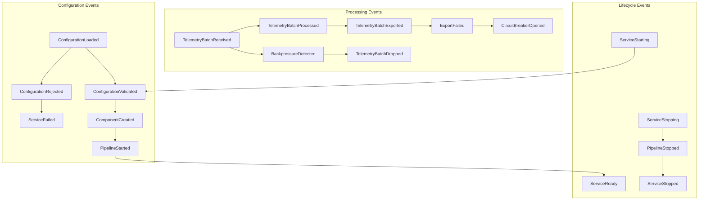
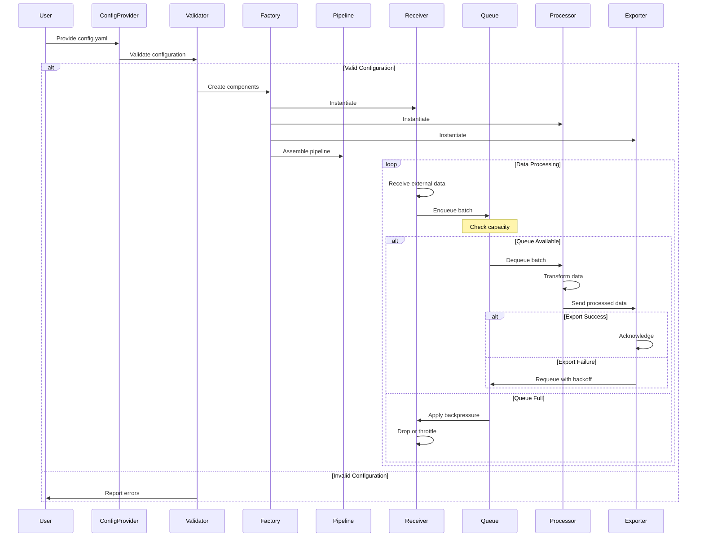
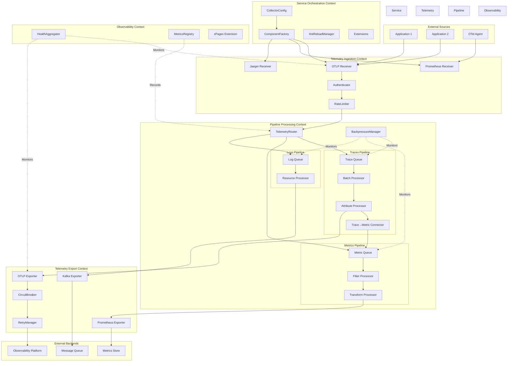
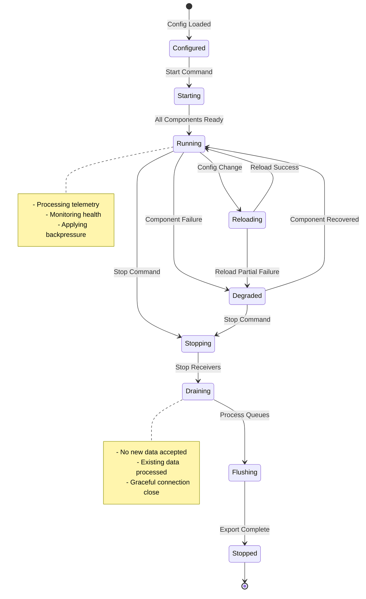
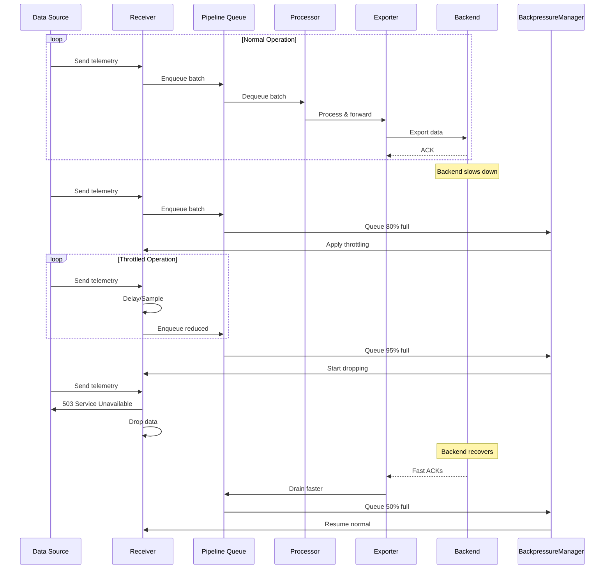

# OpenTelemetry Collector Domain-Driven Design: Enhanced Reference Architecture

## Table of Contents
1. [Executive Summary](#executive-summary)
2. [Strengthened Core Model & Ubiquitous Language](#strengthened-core-model--ubiquitous-language)
3. [Expanded Domain Concepts](#expanded-domain-concepts)
4. [Domain Events & Event Storming](#domain-events--event-storming)
5. [Tactical Patterns Deep Dive](#tactical-patterns-deep-dive)
6. [Advanced Visualization](#advanced-visualization)
7. [Anti-Patterns & Pitfalls](#anti-patterns--pitfalls)
8. [Testing Strategies](#testing-strategies)
9. [Reference Implementation Examples](#reference-implementation-examples)
10. [Performance & Scalability Patterns](#performance--scalability-patterns)

## Executive Summary

The OpenTelemetry Collector is modeled as a sophisticated telemetry processing system with five primary bounded contexts:

1. **Service Orchestration Context**: Manages service lifecycle, configuration, and component instantiation
2. **Pipeline Processing Context**: Orchestrates data flow through receiver-processor-exporter chains
3. **Telemetry Ingestion Context**: Handles protocol-specific data reception and translation
4. **Telemetry Export Context**: Manages reliable data transmission to backends
5. **Observability & Control Context**: Monitors the Collector's own health and performance

The model emphasizes configuration validation as a first-class domain, explicit modeling of connectors, and formal representation of data flow through domain events.

## Strengthened Core Model & Ubiquitous Language

### Enhanced Ubiquitous Language Glossary

| Term | DDD Stereotype | Context | Definition | Invariants |
|------|----------------|---------|------------|------------|
| **CollectorConfig** | Aggregate Root | Service Orchestration | Validated configuration for entire service | Must be internally consistent; No orphaned components |
| **Pipeline** | Aggregate Root | Pipeline Processing | Complete data flow path from receivers to exporters | Type consistency throughout chain; No cycles |
| **Receiver** | Aggregate Root | Telemetry Ingestion | Ingestion point translating external formats to pdata | Must have valid endpoint; Protocol-specific validation |
| **Processor** | Domain Service | Pipeline Processing | Stateless transformer of telemetry data | Input/output types must match pipeline |
| **Exporter** | Repository | Telemetry Export | Persists telemetry to external systems | Must handle backpressure; Retry on failure |
| **Connector** | Aggregate Root | Pipeline Processing | Bridges pipelines, acts as exporter and receiver | Type conversion must be valid |
| **ComponentId** | Value Object | All Contexts | Unique identifier for components | Non-empty string; Valid characters only |
| **PipelineId** | Value Object | Pipeline Processing | Composite key (DataType, Name) | Valid data type; Unique within service |
| **pdata** | Value Object | All Contexts | Internal telemetry data representation | Immutable after creation |
| **TelemetryBatch** | Value Object | Pipeline Processing | Collection of telemetry items | Size limits enforced |
| **ConfigProvider** | Domain Service | Service Orchestration | Loads raw configuration | Must provide valid syntax |
| **ComponentFactory** | Factory | Service Orchestration | Creates components from configs | Must validate before creation |
| **HealthChecker** | Domain Service | Observability & Control | Monitors component health | Must check all critical components |
| **RateLimiter** | Domain Service | Telemetry Ingestion | Controls ingestion rate | Token bucket invariants |
| **BackpressureManager** | Domain Service | Pipeline Processing | Handles pipeline congestion | Must prevent OOM |
| **TelemetryRouter** | Domain Service | Pipeline Processing | Routes data to appropriate pipelines | Must respect data types |
| **FeatureGate** | Value Object | Service Orchestration | Feature flag configuration | Must have default value |
| **Extension** | Aggregate Root | Service Orchestration | Service-wide capabilities (auth, health) | Lifecycle tied to service |

### Detailed Aggregate Invariants

#### CollectorConfig Aggregate Invariants

1. **Structural Integrity**
   - All referenced components must be defined
   - No component can be used without definition
   - Pipeline components must exist in their respective sections

2. **Type Safety**
   - Receiver output types must match pipeline input types
   - Processor chain types must be compatible
   - Connector conversions must be supported

3. **Graph Constraints**
   - No circular dependencies between pipelines via connectors
   - Each pipeline must have at least one receiver/connector input
   - Each pipeline must have at least one exporter/connector output

4. **Resource Constraints**
   - Memory limits must be positive
   - Queue sizes must be within bounds
   - Timeout values must be reasonable

```typescript
class CollectorConfig {
    private validateNoCycles(): void {
        const graph = this.buildPipelineGraph()
        if (graph.hasCycle()) {
            throw new CircularDependencyError()
        }
    }
    
    private validateTypeCompatibility(): void {
        for (const pipeline of this.pipelines.values()) {
            this.validatePipelineTypes(pipeline)
        }
    }
}
```

#### Pipeline Aggregate Invariants

1. **Data Type Consistency**
   - All components must handle the pipeline's data type
   - Type conversions only allowed through connectors

2. **Processing Order**
   - Processors execute in defined sequence
   - No processor can be skipped
   - Failed processing stops the pipeline

3. **Lifecycle Constraints**
   - Start receivers before processors
   - Stop exporters before processors
   - Drain queues on shutdown

4. **Throughput Invariants**
   - Input rate ≤ Processing rate (or backpressure)
   - Output rate ≤ Export capacity
   - Queue depth ≤ Maximum configured

#### Receiver Aggregate Invariants

1. **Protocol Compliance**
   - Must implement protocol correctly
   - Must validate incoming data
   - Must handle protocol errors gracefully

2. **Resource Management**
   - Connection limits enforced
   - Memory usage bounded
   - Graceful degradation under load

3. **Data Translation**
   - Must preserve semantic meaning
   - Must not lose required fields
   - Must handle unknown fields appropriately

## Expanded Domain Concepts

### A. Advanced Configuration Domain

**ConfigurationValidator** (Domain Service)
```typescript
interface ConfigurationValidator {
    validate(config: RawConfig): ValidationResult
}

class CompositeValidator implements ConfigurationValidator {
    private validators: ConfigurationValidator[] = [
        new StructuralValidator(),
        new TypeCompatibilityValidator(),
        new GraphValidator(),
        new ResourceLimitValidator(),
        new FeatureGateValidator()
    ]
    
    validate(config: RawConfig): ValidationResult {
        return this.validators.reduce((result, validator) => 
            result.combine(validator.validate(config)),
            ValidationResult.success()
        )
    }
}
```

**ConfigMerger** (Domain Service)
- Handles configuration composition from multiple sources
- Implements precedence rules
- Validates merged result

**HotReloadManager** (Domain Service)
```typescript
class HotReloadManager {
    private currentConfig: CollectorConfig
    private configWatcher: ConfigWatcher
    
    async handleConfigChange(newConfig: RawConfig): Promise<void> {
        const validation = await this.validator.validate(newConfig)
        if (!validation.isValid()) {
            this.emitEvent(new ConfigRejectedEvent(validation.errors))
            return
        }
        
        const delta = this.computeDelta(this.currentConfig, newConfig)
        await this.applyDelta(delta)
    }
}
```

### B. Telemetry Routing & Fanout

**TelemetryRouter** (Domain Service)
```typescript
interface TelemetryRouter {
    route(batch: TelemetryBatch, source: ComponentId): RoutingDecision[]
}

class AttributeBasedRouter implements TelemetryRouter {
    constructor(private rules: RoutingRule[]) {}
    
    route(batch: TelemetryBatch, source: ComponentId): RoutingDecision[] {
        const decisions: RoutingDecision[] = []
        
        for (const item of batch.items) {
            for (const rule of this.rules) {
                if (rule.matches(item.attributes)) {
                    decisions.push(new RoutingDecision(
                        item,
                        rule.targetPipeline
                    ))
                }
            }
        }
        
        return decisions
    }
}
```

**FanoutManager** (Domain Service)
- Manages one-to-many data distribution
- Handles partial failures
- Tracks acknowledgments

### C. Backpressure & Flow Control

**BackpressureStrategy** (Strategy Pattern)
```typescript
interface BackpressureStrategy {
    handleBackpressure(pipeline: Pipeline, pending: number): BackpressureAction
}

class AdaptiveBackpressure implements BackpressureStrategy {
    handleBackpressure(pipeline: Pipeline, pending: number): BackpressureAction {
        const utilization = pending / pipeline.maxQueueSize
        
        if (utilization > 0.9) {
            return BackpressureAction.REJECT
        } else if (utilization > 0.8) {
            return BackpressureAction.THROTTLE
        } else if (utilization > 0.6) {
            return BackpressureAction.SAMPLE
        }
        
        return BackpressureAction.ACCEPT
    }
}
```

**QueueManager** (Aggregate)
```typescript
class QueueManager {
    private queues: Map<PipelineId, BoundedQueue<TelemetryBatch>>
    private metrics: QueueMetrics
    
    enqueue(pipelineId: PipelineId, batch: TelemetryBatch): EnqueueResult {
        const queue = this.queues.get(pipelineId)
        
        if (queue.size() >= queue.capacity()) {
            this.metrics.recordDropped(batch.size())
            return EnqueueResult.DROPPED
        }
        
        queue.offer(batch)
        this.metrics.recordEnqueued(batch.size())
        return EnqueueResult.SUCCESS
    }
}
```

### D. Observability & Control Plane

**HealthAggregator** (Aggregate)
```typescript
class HealthAggregator {
    private componentHealth: Map<ComponentId, HealthStatus>
    
    computeOverallHealth(): ServiceHealth {
        const criticalComponents = this.identifyCriticalComponents()
        
        for (const component of criticalComponents) {
            const health = this.componentHealth.get(component.id)
            if (health?.status === Status.UNHEALTHY) {
                return ServiceHealth.DEGRADED
            }
        }
        
        return ServiceHealth.HEALTHY
    }
}
```

**MetricsRegistry** (Repository)
```typescript
class MetricsRegistry {
    private counters: Map<string, Counter>
    private histograms: Map<string, Histogram>
    private gauges: Map<string, Gauge>
    
    recordBatchProcessed(pipeline: PipelineId, size: number, duration: Duration) {
        this.counters.get(`pipeline.processed.${pipeline}`)?.add(size)
        this.histograms.get(`pipeline.latency.${pipeline}`)?.record(duration)
    }
}
```

### E. Extension System

**Extension** (Aggregate Root)
```typescript
abstract class Extension {
    protected extensionId: ComponentId
    protected config: ExtensionConfig
    protected state: ExtensionState
    
    abstract start(host: ExtensionHost): Promise<void>
    abstract shutdown(): Promise<void>
}

class AuthenticationExtension extends Extension {
    private authenticator: Authenticator
    
    async start(host: ExtensionHost): Promise<void> {
        this.authenticator = this.createAuthenticator(this.config)
        host.registerAuthenticator(this.authenticator)
    }
}
```

## Domain Events & Event Storming

### Core Domain Events

1. **Configuration Events**
   - `ConfigurationLoaded`: Initial config loaded successfully
   - `ConfigurationValidated`: Config passed all validations
   - `ConfigurationRejected`: Config failed validation
   - `ConfigurationReloaded`: Hot reload completed
   - `ComponentCreated`: Factory created component
   - `ComponentFailed`: Component creation failed

2. **Pipeline Events**
   - `PipelineStarted`: Pipeline begins processing
   - `PipelineStopped`: Pipeline halts processing
   - `TelemetryBatchReceived`: Data ingested by receiver
   - `TelemetryBatchProcessed`: Processing completed
   - `TelemetryBatchExported`: Export successful
   - `TelemetryBatchDropped`: Data dropped due to error/limits

3. **Operational Events**
   - `BackpressureDetected`: Queue reaching capacity
   - `RateLimitExceeded`: Ingestion rate too high
   - `ExportFailed`: Backend unavailable
   - `CircuitBreakerOpened`: Too many failures
   - `HealthCheckFailed`: Component unhealthy

4. **Lifecycle Events**
   - `ServiceStarting`: Collector beginning startup
   - `ServiceReady`: All components initialized
   - `ServiceStopping`: Graceful shutdown initiated
   - `ServiceStopped`: Shutdown complete

### Event Flow Diagram



### Event Storming Workshop Results



## Tactical Patterns Deep Dive

### Chain of Responsibility for Processors

```typescript
abstract class ProcessorChain {
    protected next?: ProcessorChain
    
    setNext(processor: ProcessorChain): ProcessorChain {
        this.next = processor
        return processor
    }
    
    async process(batch: TelemetryBatch): Promise<ProcessResult> {
        const result = await this.doProcess(batch)
        
        if (result.isSuccess() && this.next) {
            return this.next.process(result.batch)
        }
        
        return result
    }
    
    protected abstract doProcess(batch: TelemetryBatch): Promise<ProcessResult>
}

class AttributeProcessor extends ProcessorChain {
    constructor(
        private actions: AttributeAction[],
        private includes: Matcher[],
        private excludes: Matcher[]
    ) {
        super()
    }
    
    protected async doProcess(batch: TelemetryBatch): Promise<ProcessResult> {
        const processed = batch.map(item => {
            if (this.shouldProcess(item)) {
                return this.applyActions(item)
            }
            return item
        })
        
        return ProcessResult.success(processed)
    }
}
```

### Strategy Pattern for Export Retry

```typescript
interface RetryStrategy {
    shouldRetry(attempt: number, error: ExportError): boolean
    nextDelay(attempt: number): Duration
}

class ExponentialBackoffStrategy implements RetryStrategy {
    constructor(
        private maxAttempts: number,
        private initialDelay: Duration,
        private maxDelay: Duration,
        private multiplier: number
    ) {}
    
    shouldRetry(attempt: number, error: ExportError): boolean {
        if (attempt >= this.maxAttempts) return false
        if (!error.isRetryable()) return false
        return true
    }
    
    nextDelay(attempt: number): Duration {
        const exponentialDelay = this.initialDelay.multipliedBy(
            Math.pow(this.multiplier, attempt - 1)
        )
        
        const jitteredDelay = exponentialDelay.multipliedBy(
            0.5 + Math.random() * 0.5
        )
        
        return Duration.min(jitteredDelay, this.maxDelay)
    }
}
```

### Builder Pattern for Pipeline Construction

```typescript
class PipelineBuilder {
    private receivers: Receiver[] = []
    private processors: Processor[] = []
    private exporters: Exporter[] = []
    private connectors: Connector[] = []
    private errorHandler?: ErrorHandler
    private queueSize: number = 1000
    
    withReceiver(receiver: Receiver): PipelineBuilder {
        this.receivers.push(receiver)
        return this
    }
    
    withProcessor(processor: Processor): PipelineBuilder {
        this.processors.push(processor)
        return this
    }
    
    withExporter(exporter: Exporter): PipelineBuilder {
        this.exporters.push(exporter)
        return this
    }
    
    withQueueSize(size: number): PipelineBuilder {
        this.queueSize = size
        return this
    }
    
    withErrorHandler(handler: ErrorHandler): PipelineBuilder {
        this.errorHandler = handler
        return this
    }
    
    build(): Pipeline {
        this.validate()
        
        const queue = new BoundedQueue<TelemetryBatch>(this.queueSize)
        const chain = this.buildProcessorChain()
        
        return new Pipeline(
            this.receivers,
            chain,
            this.exporters,
            queue,
            this.errorHandler ?? new DefaultErrorHandler()
        )
    }
    
    private validate(): void {
        if (this.receivers.length === 0) {
            throw new Error("Pipeline must have at least one receiver")
        }
        if (this.exporters.length === 0 && this.connectors.length === 0) {
            throw new Error("Pipeline must have at least one output")
        }
    }
}
```

### Observer Pattern for Health Monitoring

```typescript
interface HealthObserver {
    onHealthChange(component: ComponentId, oldHealth: Health, newHealth: Health): void
}

class HealthMonitor {
    private observers: HealthObserver[] = []
    private healthStates: Map<ComponentId, Health> = new Map()
    
    subscribe(observer: HealthObserver): void {
        this.observers.push(observer)
    }
    
    updateHealth(component: ComponentId, health: Health): void {
        const oldHealth = this.healthStates.get(component) ?? Health.UNKNOWN
        this.healthStates.set(component, health)
        
        if (oldHealth !== health) {
            this.notifyObservers(component, oldHealth, health)
        }
    }
    
    private notifyObservers(component: ComponentId, oldHealth: Health, newHealth: Health): void {
        for (const observer of this.observers) {
            observer.onHealthChange(component, oldHealth, newHealth)
        }
    }
}

class AlertingHealthObserver implements HealthObserver {
    onHealthChange(component: ComponentId, oldHealth: Health, newHealth: Health): void {
        if (newHealth === Health.UNHEALTHY && oldHealth !== Health.UNHEALTHY) {
            this.alertManager.sendAlert({
                severity: Severity.HIGH,
                component: component.toString(),
                message: `Component ${component} became unhealthy`
            })
        }
    }
}
```

## Advanced Visualization

### Complete System Architecture



### Pipeline State Machine



### Data Flow Sequence with Backpressure



## Anti-Patterns & Pitfalls

### 1. Configuration Monolith
**Anti-pattern**: Single massive configuration object with all settings

**Problems**:
- Hard to validate
- Difficult to hot-reload partially
- Couples unrelated components

**Correct Pattern**: Modular configuration with component-specific validation
```typescript
class ModularConfig {
    private receiverConfigs: Map<ComponentId, ReceiverConfig>
    private processorConfigs: Map<ComponentId, ProcessorConfig>
    private exporterConfigs: Map<ComponentId, ExporterConfig>
    
    validateComponent(id: ComponentId): ValidationResult {
        // Component-specific validation
    }
}
```

### 2. Synchronous Pipeline Processing
**Anti-pattern**: Blocking calls through entire pipeline

**Problems**:
- Head-of-line blocking
- Poor resource utilization
- Cascading failures

**Correct Pattern**: Asynchronous processing with queues
```typescript
class AsyncPipeline {
    async process(batch: TelemetryBatch): Promise<void> {
        await this.inputQueue.enqueue(batch)
        // Processing happens asynchronously
    }
}
```

### 3. Unbounded Queues
**Anti-pattern**: Infinite queue sizes to "never lose data"

**Problems**:
- Memory exhaustion
- Increased latency
- Hides systemic issues

**Correct Pattern**: Bounded queues with explicit backpressure handling

### 4. Tight Coupling to Wire Formats
**Anti-pattern**: Using protocol-specific types throughout pipeline

**Problems**:
- Difficult to add new protocols
- Leaky abstractions
- Complex testing

**Correct Pattern**: Protocol-agnostic internal representation (pdata)

### 5. Missing Circuit Breakers
**Anti-pattern**: Infinite retries to "ensure delivery"

**Problems**:
- Resource exhaustion
- Cascading failures
- Poor failure isolation

**Correct Pattern**: Circuit breakers with fallback strategies

### 6. Global State Management
**Anti-pattern**: Shared mutable state across components

**Problems**:
- Race conditions
- Difficult testing
- Poor scalability

**Correct Pattern**: Component-local state with explicit messaging

### 7. Ignored Connector Semantics
**Anti-pattern**: Treating connectors as simple pass-through

**Problems**:
- Lost type safety
- Missed optimization opportunities
- Semantic errors

**Correct Pattern**: Explicit connector modeling with type conversion

### 8. All-or-Nothing Processing
**Anti-pattern**: Failing entire batch on single item error

**Problems**:
- Reduced reliability
- Poor error isolation
- Data loss

**Correct Pattern**: Item-level error handling with partial success

## Testing Strategies

### 1. Configuration Testing

**Validation Testing**:
```typescript
describe('CollectorConfig', () => {
    it('should detect circular dependencies', () => {
        const config = `
            connectors:
              traces_to_metrics:
                type: traces_to_metrics
            pipelines:
              traces:
                exporters: [traces_to_metrics]
              metrics:
                receivers: [traces_to_metrics]
                exporters: [metrics_to_traces]  # Creates cycle
        `
        
        expect(() => CollectorConfig.parse(config))
            .toThrow(CircularDependencyError)
    })
    
    it('should validate type compatibility', () => {
        const config = `
            pipelines:
              traces:
                processors: [metrics_filter]  # Wrong type
        `
        
        expect(() => CollectorConfig.parse(config))
            .toThrow(TypeMismatchError)
    })
})
```

### 2. Pipeline Testing

**Integration Testing with Test Doubles**:
```typescript
describe('Pipeline', () => {
    it('should handle backpressure gracefully', async () => {
        const slowExporter = new MockExporter({ delay: 100 })
        const pipeline = new PipelineBuilder()
            .withReceiver(new MockReceiver())
            .withProcessor(new PassthroughProcessor())
            .withExporter(slowExporter)
            .withQueueSize(10)
            .build()
        
        // Send 20 items rapidly
        const results = await Promise.all(
            range(20).map(i => pipeline.ingest(createBatch(i)))
        )
        
        const accepted = results.filter(r => r === IngestResult.ACCEPTED)
        const rejected = results.filter(r => r === IngestResult.REJECTED)
        
        expect(accepted.length).toBeGreaterThan(0)
        expect(rejected.length).toBeGreaterThan(0)
    })
})
```

### 3. Component Testing

**Property-Based Testing for Processors**:
```typescript
describe('AttributeProcessor', () => {
    property('should preserve non-matching attributes',
        fc.record({
            attributes: fc.dictionary(fc.string(), fc.anything()),
            pattern: fc.string()
        }),
        ({ attributes, pattern }) => {
            const processor = new AttributeProcessor({
                actions: [{ key: pattern, action: 'delete' }]
            })
            
            const input = createBatchWithAttributes(attributes)
            const output = processor.process(input)
            
            for (const [key, value] of Object.entries(attributes)) {
                if (!key.includes(pattern)) {
                    expect(output.attributes[key]).toEqual(value)
                }
            }
        }
    )
})
```

### 4. Resilience Testing

**Chaos Testing**:
```typescript
describe('Exporter Resilience', () => {
    it('should recover from temporary failures', async () => {
        const chaosExporter = new ChaosExporter({
            baseExporter: new MockExporter(),
            failureRate: 0.5,
            failureDuration: 100
        })
        
        const pipeline = new PipelineBuilder()
            .withExporter(chaosExporter)
            .withRetryPolicy(new ExponentialBackoffStrategy())
            .build()
        
        const results = await Promise.all(
            range(100).map(() => pipeline.export(createBatch()))
        )
        
        const successRate = results.filter(r => r.isSuccess()).length / 100
        expect(successRate).toBeGreaterThan(0.8)
    })
})
```

### 5. Performance Testing

**Load Testing with Metrics**:
```typescript
describe('Pipeline Performance', () => {
    it('should maintain SLA under load', async () => {
        const metrics = new TestMetricsRegistry()
        const pipeline = new PipelineBuilder()
            .withMetrics(metrics)
            .build()
        
        const start = Date.now()
        const batchCount = 10000
        
        await Promise.all(
            range(batchCount).map(() => 
                pipeline.ingest(createBatch(100)) // 100 items per batch
            )
        )
        
        const duration = Date.now() - start
        const throughput = (batchCount * 100) / (duration / 1000)
        
        expect(throughput).toBeGreaterThan(50000) // 50k items/sec
        expect(metrics.getPercentile('pipeline.latency', 0.99))
            .toBeLessThan(100) // 99th percentile < 100ms
    })
})
```

## Reference Implementation Examples

### 1. Advanced Connector Implementation

```typescript
class TracesToMetricsConnector implements Connector {
    private metricsAggregator: MetricsAggregator
    private config: TracesToMetricsConfig
    
    constructor(config: TracesToMetricsConfig) {
        this.config = config
        this.metricsAggregator = new MetricsAggregator(config.dimensions)
    }
    
    // Exporter interface (input from traces pipeline)
    async export(traces: ptrace.Traces): ExportResult {
        try {
            const metrics = this.convertTracesToMetrics(traces)
            
            // Receiver interface (output to metrics pipeline)
            const consumeResult = await this.nextConsumer.consumeMetrics(metrics)
            
            return consumeResult.toExportResult()
        } catch (error) {
            return ExportResult.failure(error, true)
        }
    }
    
    private convertTracesToMetrics(traces: ptrace.Traces): pmetric.Metrics {
        const metrics = pmetric.NewMetrics()
        
        for (const resourceSpan of traces.resourceSpans) {
            const resourceMetrics = metrics.resourceMetrics.appendEmpty()
            resourceSpan.resource.copyTo(resourceMetrics.resource)
            
            for (const scopeSpan of resourceSpan.scopeSpans) {
                const scopeMetrics = resourceMetrics.scopeMetrics.appendEmpty()
                scopeSpan.scope.copyTo(scopeMetrics.scope)
                
                for (const span of scopeSpan.spans) {
                    this.extractMetricsFromSpan(span, scopeMetrics)
                }
            }
        }
        
        return metrics
    }
    
    private extractMetricsFromSpan(
        span: ptrace.Span, 
        scopeMetrics: pmetric.ScopeMetrics
    ): void {
        // Call count metric
        const callCount = scopeMetrics.metrics.appendEmpty()
        callCount.setName(`${this.config.prefix}.calls`)
        callCount.setUnit("1")
        
        const sum = callCount.setEmptySum()
        sum.setAggregationTemporality(AggregationTemporality.DELTA)
        sum.setIsMonotonic(true)
        
        const dataPoint = sum.dataPoints.appendEmpty()
        dataPoint.setIntValue(1)
        dataPoint.setTimestamp(span.endTime)
        
        // Add configured dimensions
        for (const dim of this.config.dimensions) {
            const value = span.attributes.get(dim)
            if (value) {
                dataPoint.attributes.putStr(dim, value.toString())
            }
        }
        
        // Duration histogram
        const duration = scopeMetrics.metrics.appendEmpty()
        duration.setName(`${this.config.prefix}.duration`)
        duration.setUnit("ms")
        
        const histogram = duration.setEmptyHistogram()
        histogram.setAggregationTemporality(AggregationTemporality.DELTA)
        
        const histDataPoint = histogram.dataPoints.appendEmpty()
        const durationMs = (span.endTime - span.startTime) / 1_000_000
        histDataPoint.setSum(durationMs)
        histDataPoint.setCount(1)
        histDataPoint.setTimestamp(span.endTime)
        
        // Copy dimensions
        dataPoint.attributes.copyTo(histDataPoint.attributes)
    }
}
```

### 2. Intelligent Load Balancing Exporter

```typescript
class LoadBalancingExporter implements Exporter {
    private backends: ExporterBackend[]
    private healthChecker: HealthChecker
    private loadBalancer: LoadBalancer
    private circuitBreakers: Map<string, CircuitBreaker>
    
    async export(batch: TelemetryBatch): Promise<ExportResult> {
        const healthyBackends = await this.getHealthyBackends()
        
        if (healthyBackends.length === 0) {
            return ExportResult.failure(
                new Error("No healthy backends available"),
                true // retryable
            )
        }
        
        const backend = this.loadBalancer.selectBackend(
            healthyBackends,
            batch
        )
        
        const circuitBreaker = this.circuitBreakers.get(backend.id)
        
        if (!circuitBreaker.allowRequest()) {
            // Try another backend
            return this.exportWithFallback(batch, healthyBackends, backend)
        }
        
        try {
            const result = await backend.export(batch)
            circuitBreaker.recordSuccess()
            this.updateBackendMetrics(backend, result)
            return result
            
        } catch (error) {
            circuitBreaker.recordFailure()
            return this.exportWithFallback(batch, healthyBackends, backend)
        }
    }
    
    private async exportWithFallback(
        batch: TelemetryBatch,
        backends: ExporterBackend[],
        failedBackend: ExporterBackend
    ): Promise<ExportResult> {
        const remainingBackends = backends.filter(b => b.id !== failedBackend.id)
        
        for (const backend of remainingBackends) {
            const cb = this.circuitBreakers.get(backend.id)
            if (!cb.allowRequest()) continue
            
            try {
                const result = await backend.export(batch)
                cb.recordSuccess()
                return result
            } catch (error) {
                cb.recordFailure()
            }
        }
        
        return ExportResult.failure(
            new Error("All backends failed"),
            true
        )
    }
}

class WeightedRoundRobinBalancer implements LoadBalancer {
    private currentWeights: Map<string, number> = new Map()
    private effectiveWeights: Map<string, number> = new Map()
    
    selectBackend(
        backends: ExporterBackend[],
        batch: TelemetryBatch
    ): ExporterBackend {
        let totalWeight = 0
        let selected: ExporterBackend | null = null
        let maxWeight = 0
        
        for (const backend of backends) {
            const weight = backend.weight
            const currentWeight = this.currentWeights.get(backend.id) ?? 0
            const effectiveWeight = this.effectiveWeights.get(backend.id) ?? weight
            
            const newWeight = currentWeight + effectiveWeight
            this.currentWeights.set(backend.id, newWeight)
            
            totalWeight += effectiveWeight
            
            if (newWeight > maxWeight) {
                maxWeight = newWeight
                selected = backend
            }
        }
        
        if (selected) {
            const currentWeight = this.currentWeights.get(selected.id)!
            this.currentWeights.set(selected.id, currentWeight - totalWeight)
        }
        
        return selected!
    }
}
```

### 3. Smart Batching Processor

```typescript
class SmartBatchingProcessor implements Processor {
    private batches: Map<string, Batch> = new Map()
    private timer: Timer
    private config: SmartBatchingConfig
    
    constructor(config: SmartBatchingConfig) {
        this.config = config
        this.timer = new Timer(this.flushOldBatches.bind(this))
    }
    
    async process(item: TelemetryItem): Promise<void> {
        const batchKey = this.computeBatchKey(item)
        let batch = this.batches.get(batchKey)
        
        if (!batch) {
            batch = new Batch(batchKey)
            this.batches.set(batchKey, batch)
        }
        
        batch.add(item)
        
        if (this.shouldFlushBatch(batch)) {
            await this.flushBatch(batch)
        }
    }
    
    private computeBatchKey(item: TelemetryItem): string {
        // Group by configurable attributes
        const keyParts: string[] = []
        
        for (const attr of this.config.groupByAttributes) {
            const value = item.attributes.get(attr) ?? 'undefined'
            keyParts.push(`${attr}:${value}`)
        }
        
        return keyParts.join('|')
    }
    
    private shouldFlushBatch(batch: Batch): boolean {
        // Size-based flushing
        if (batch.size() >= this.config.maxBatchSize) {
            return true
        }
        
        // Time-based flushing
        const age = Date.now() - batch.createdAt
        if (age >= this.config.maxBatchAge) {
            return true
        }
        
        // Memory-based flushing
        if (batch.estimatedMemory() >= this.config.maxBatchMemory) {
            return true
        }
        
        return false
    }
    
    private async flushBatch(batch: Batch): Promise<void> {
        this.batches.delete(batch.key)
        
        const telemetryBatch = batch.toTelemetryBatch()
        await this.nextConsumer.consume(telemetryBatch)
        
        this.recordMetrics(batch)
    }
    
    private async flushOldBatches(): Promise<void> {
        const now = Date.now()
        const batchesToFlush: Batch[] = []
        
        for (const batch of this.batches.values()) {
            const age = now - batch.createdAt
            if (age >= this.config.maxBatchAge) {
                batchesToFlush.push(batch)
            }
        }
        
        await Promise.all(
            batchesToFlush.map(batch => this.flushBatch(batch))
        )
    }
}
```

## Performance & Scalability Patterns

### 1. Zero-Copy Data Handling

```typescript
class ZeroCopyPipeline {
    private sharedMemoryPool: SharedMemoryPool
    
    async ingest(data: Buffer): Promise<void> {
        // Allocate from shared pool
        const segment = await this.sharedMemoryPool.allocate(data.length)
        
        // Copy data once into shared memory
        segment.write(data)
        
        // Pass reference through pipeline
        const reference = new DataReference(segment)
        await this.processReference(reference)
    }
    
    private async processReference(ref: DataReference): Promise<void> {
        // Processors work with views, not copies
        const view = ref.createView()
        
        for (const processor of this.processors) {
            await processor.processView(view)
        }
        
        // Only exporter creates final copy if needed
        await this.exporter.exportReference(ref)
        
        // Release shared memory
        ref.release()
    }
}
```

### 2. Parallel Pipeline Processing

```typescript
class ParallelPipeline {
    private workerPool: WorkerPool
    private partitioner: Partitioner
    
    async process(batch: TelemetryBatch): Promise<void> {
        // Partition batch for parallel processing
        const partitions = this.partitioner.partition(
            batch,
            this.workerPool.size
        )
        
        // Process partitions in parallel
        const results = await Promise.all(
            partitions.map((partition, index) =>
                this.workerPool.submit(index, partition)
            )
        )
        
        // Merge results if needed
        const merged = this.mergeResults(results)
        await this.export(merged)
    }
}

class HashPartitioner implements Partitioner {
    partition(batch: TelemetryBatch, partitionCount: number): TelemetryBatch[] {
        const partitions: TelemetryBatch[] = Array(partitionCount)
            .fill(null)
            .map(() => new TelemetryBatch())
        
        for (const item of batch.items) {
            const hash = this.hashAttributes(item.attributes)
            const partition = hash % partitionCount
            partitions[partition].add(item)
        }
        
        return partitions
    }
}
```

### 3. Adaptive Resource Management

```typescript
class AdaptiveResourceManager {
    private cpuMonitor: CpuMonitor
    private memoryMonitor: MemoryMonitor
    private throughputMonitor: ThroughputMonitor
    
    async adjustResources(pipeline: Pipeline): Promise<void> {
        const metrics = {
            cpu: await this.cpuMonitor.getUtilization(),
            memory: await this.memoryMonitor.getUtilization(),
            throughput: await this.throughputMonitor.getThroughput()
        }
        
        // Adjust worker count based on CPU
        if (metrics.cpu < 0.5 && pipeline.workerCount > 1) {
            pipeline.decreaseWorkers()
        } else if (metrics.cpu > 0.8) {
            pipeline.increaseWorkers()
        }
        
        // Adjust queue sizes based on memory
        if (metrics.memory > 0.8) {
            pipeline.decreaseQueueSize()
        } else if (metrics.memory < 0.5) {
            pipeline.increaseQueueSize()
        }
        
        // Adjust batching based on throughput
        if (metrics.throughput < pipeline.targetThroughput * 0.8) {
            pipeline.decreaseBatchSize()
        } else {
            pipeline.increaseBatchSize()
        }
    }
}
```

## Conclusion

This enhanced OpenTelemetry Collector domain model provides:

1. **Complete Domain Coverage**: All major concepts from configuration to runtime are modeled
2. **Strong Invariant Protection**: Aggregates enforce critical business rules
3. **Scalability First**: Asynchronous processing, backpressure, and resource management are core
4. **Operational Excellence**: Health monitoring, metrics, and control plane are first-class
5. **Extension Points**: Clear patterns for adding new components and behaviors
6. **Testing Strategy**: Comprehensive approach from unit to chaos testing

The model serves as a definitive reference for understanding the Collector's architecture and implementing production-grade telemetry pipeline systems.