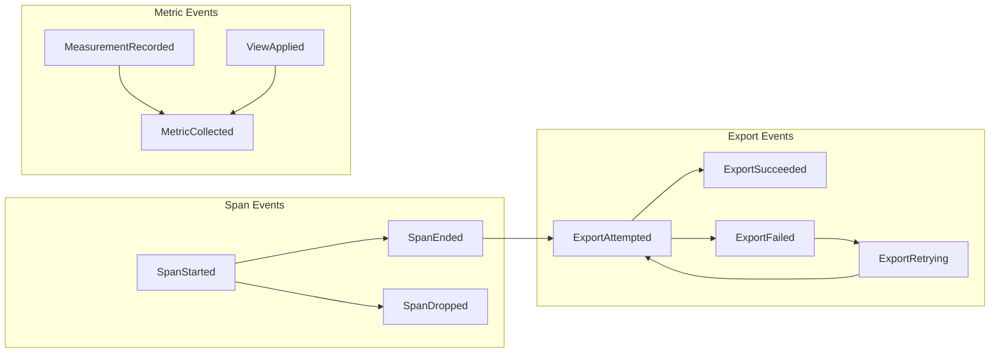
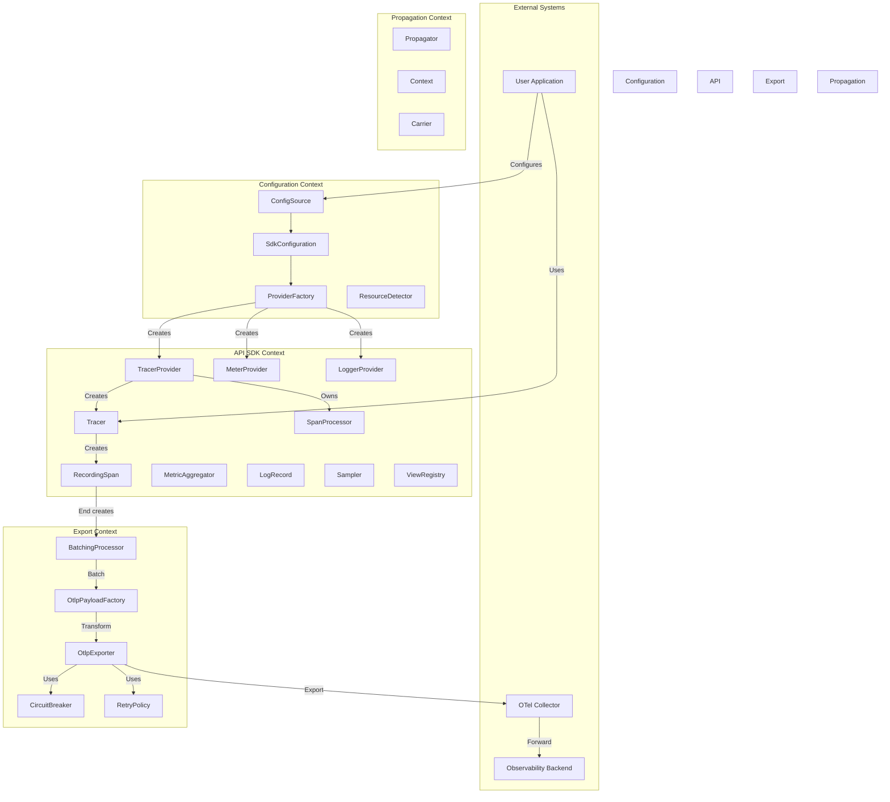
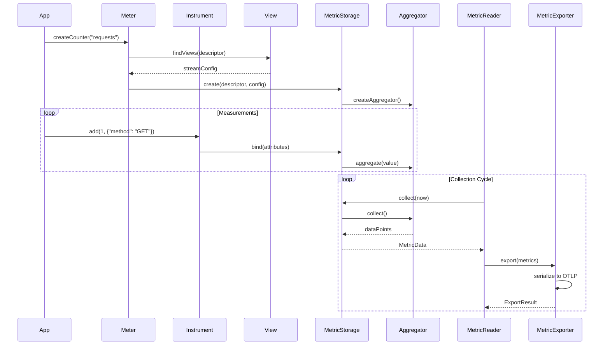
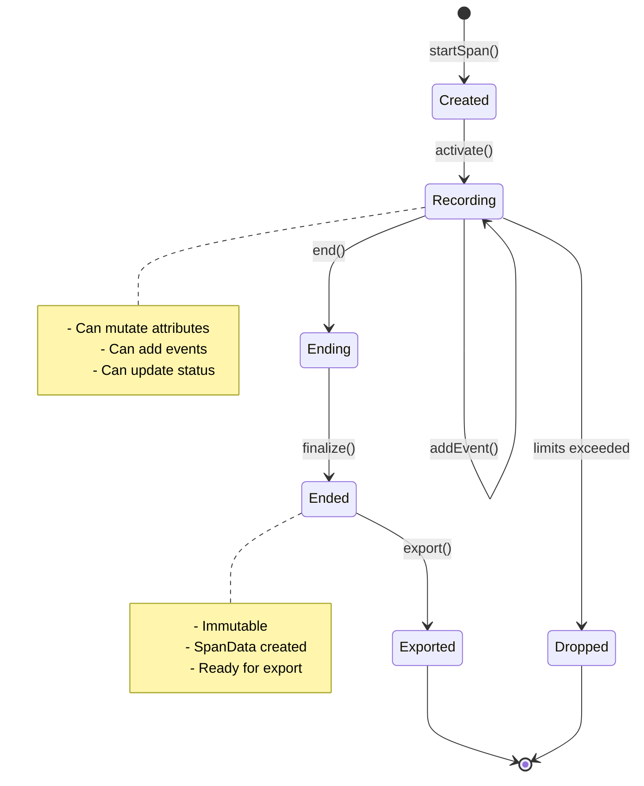

# OpenTelemetry Domain-Driven Design: Enhanced Reference Architecture

## Table of Contents
1. [Executive Summary](#executive-summary)
2. [Strengthened Core Model & Ubiquitous Language](#strengthened-core-model--ubiquitous-language)
3. [Expanded Domain Concepts](#expanded-domain-concepts)
4. [Domain Events & Event Storming](#domain-events--event-storming)
5. [Tactical Patterns Deep Dive](#tactical-patterns-deep-dive)
6. [Advanced Visualization](#advanced-visualization)
7. [Anti-Patterns & Pitfalls](#anti-patterns--pitfalls)
8. [Testing Strategies from DDD Perspective](#testing-strategies-from-ddd-perspective)
9. [Reference Implementation Examples](#reference-implementation-examples)

## Executive Summary

This reference architecture models OpenTelemetry using Domain-Driven Design principles. It identifies four primary bounded contexts:

1. **Telemetry Configuration Context**: Manages SDK bootstrapping and lifecycle
2. **Telemetry API & SDK Context**: Core telemetry creation and management
3. **Telemetry Export Context**: Handles serialization and transmission
4. **Telemetry Pipeline Context** (Collector): Processes and routes telemetry data

The model emphasizes aggregate boundaries that protect critical invariants, explicit modeling of asynchronous behavior, and clear anti-corruption layers between contexts.

## Strengthened Core Model & Ubiquitous Language

### Enhanced Ubiquitous Language Glossary

| Term | DDD Stereotype | Context | Definition | Invariants |
|------|----------------|---------|------------|------------|
| **TracerProvider** | Aggregate Root / Factory | Configuration | Long-lived object configured with Resource and SpanProcessors; factory for Tracers | Must have valid Resource; Cannot create Tracers after shutdown |
| **Tracer** | Factory | API & SDK | Handle scoped to InstrumentationScope for creating RecordingSpans | Stateless; Thread-safe |
| **RecordingSpan** | Aggregate Root | API & SDK | Live, stateful representation of a single operation | See detailed invariants below |
| **SpanData** | Value Object | API & SDK, Export | Immutable snapshot of completed RecordingSpan | Immutable after creation |
| **SpanContext** | Value Object | API & SDK | Immutable span identity (TraceId, SpanId, TraceFlags, TraceState) | All IDs must be valid; Cannot be modified |
| **Resource** | Value Object | Configuration | Immutable metadata about the telemetry-producing entity | Schema URL must be consistent across attributes |
| **InstrumentationScope** | Value Object | API & SDK | Identity of the instrumentation library | Name required; Version optional |
| **MetricAggregator** | Aggregate Root | API & SDK | Stateful accumulator for metric measurements | Type-specific invariants (see below) |
| **MetricData** | Value Object | API & SDK, Export | Immutable snapshot of metric stream with DataPoints | Time intervals must not overlap |
| **LogRecord** | Aggregate Root | API & SDK | Mutable representation of a log entry | Severity level transitions must be valid |
| **LogData** | Value Object | API & SDK, Export | Immutable snapshot of completed LogRecord | Timestamp must be set |
| **Sampler** | Domain Service (Strategy) | API & SDK | Decides whether to record a span | Decision must be deterministic for same input |
| **SpanProcessor** | Domain Service | API & SDK | Processes span lifecycle events | Must handle concurrent calls safely |
| **OtlpPayloadFactory** | Domain Service (ACL) | Export | Translates domain objects to OTLP wire format | Must preserve semantic meaning |
| **RetryPolicy** | Domain Service (Strategy) | Export | Handles export failures with backoff | Must respect max attempts and timeout |
| **ExportResult** | Value Object | Export | Export attempt outcome with retry guidance | Success XOR Failure with reason |
| **ResourceDetector** | Domain Service | Configuration | Discovers environment-specific Resource attributes | Must merge attributes correctly |
| **ViewRegistry** | Repository | API & SDK | Stores metric view configurations | Views must not conflict |
| **ExemplarReservoir** | Domain Service | API & SDK | Samples exemplars for metrics | Must maintain fixed capacity |

### Deepened Aggregate Invariants

#### RecordingSpan Aggregate Invariants

1. **Identity Invariants**
   - SpanContext (TraceId, SpanId) is immutable upon creation
   - TraceId must be 16 bytes (128 bits), non-zero
   - SpanId must be 8 bytes (64 bits), non-zero
   - Parent SpanContext, if present, must share the same TraceId

2. **State Transition Invariants**
   - Status transitions: UNSET → {OK, ERROR}, no reverse transitions
   - Once ended, span becomes immutable (no setAttribute, addEvent, etc.)
   - EndTime must be ≥ StartTime when set
   - Recording state transitions: RECORDING → ENDED (one-way)

3. **Capacity Invariants**
   - Total attributes ≤ SpanLimits.maxAttributeCount
   - Total events ≤ SpanLimits.maxEventCount  
   - Total links ≤ SpanLimits.maxLinkCount
   - Attribute value length ≤ SpanLimits.maxAttributeValueLength
   - Dropped counts must be tracked when limits exceeded

4. **Semantic Invariants**
   - Exception events must have required attributes (type, message, stacktrace)
   - Status ERROR requires description when set
   - Attribute keys must be non-empty strings
   - Attribute values must be of allowed types (string, number, boolean, array)

#### MetricAggregator Aggregate Invariants

1. **Sum Aggregator**
   - Monotonic sums must never decrease
   - Delta sums reset to zero after collection
   - Cumulative sums maintain running total
   - Overflow handling must be consistent

2. **Gauge Aggregator**  
   - Only latest value is retained
   - Timestamp of last measurement must be tracked
   - No aggregation across measurements

3. **Histogram Aggregator**
   - Bucket boundaries must be sorted and unique
   - Count must equal sum of bucket counts
   - Sum must be consistent with recorded values
   - Min/Max must bound all recorded values

4. **Exponential Histogram Aggregator**
   - Scale must be within valid range (-10 to 20)
   - Bucket indices must be contiguous
   - Zero bucket must be handled specially
   - Scale reduction must preserve all values

#### LogRecord Aggregate Invariants

1. **Temporal Invariants**
   - Timestamp must be set before emission
   - ObservedTimestamp ≥ Timestamp (if both present)

2. **Severity Invariants**
   - Severity levels must follow standard ordering
   - SeverityText must align with SeverityNumber

3. **Context Invariants**
   - If SpanContext present, must be valid
   - TraceId/SpanId correlation must be consistent

## Expanded Domain Concepts

### A. Resource Management Subdomain

**ResourceBuilder** (Builder Pattern)
- Accumulates Resource attributes during detection
- Merges Resources following precedence rules
- Validates schema URL compatibility

**ResourceDetector** (Domain Service)
```
interface ResourceDetector {
    detect(timeout: Duration): Resource
    getPriority(): number
}
```

Standard Detectors:
- `ProcessResourceDetector`: PID, executable name, command line
- `HostResourceDetector`: Hostname, host ID, OS type
- `ContainerResourceDetector`: Container ID, image name
- `CloudResourceDetector`: Cloud provider, region, instance ID

**ResourceMerger** (Domain Service)
- Implements OpenTelemetry Resource merge semantics
- Later Resources take precedence
- Schema URL conflicts result in errors

### B. Advanced Batching & Buffering

**BatchingStrategy** (Strategy Pattern)
```
interface BatchingStrategy {
    shouldFlush(buffer: Buffer<T>, lastFlush: Instant): boolean
    onItemAdded(buffer: Buffer<T>): void
}
```

Implementations:
- `SizeBatchingStrategy`: Flush when buffer reaches size
- `TimeBatchingStrategy`: Flush after duration
- `CompositeBatchingStrategy`: Combines multiple strategies
- `AdaptiveBatchingStrategy`: Adjusts based on throughput

**CircuitBreaker** (Resilience Pattern)
```
class ExporterCircuitBreaker {
    state: CLOSED | OPEN | HALF_OPEN
    failureCount: number
    lastFailureTime: Instant
    
    onSuccess(): void
    onFailure(): void
    allowRequest(): boolean
}
```

### C. Metric Views & Aggregation Control

**View** (Specification Pattern)
```
class View {
    instrumentSelector: InstrumentSelector
    streamConfiguration: StreamConfiguration
    
    matches(instrument: Instrument): boolean
    configure(stream: MetricStream): MetricStream
}
```

**ViewRegistry** (Repository)
- Stores ordered list of Views
- First matching View wins
- Default View if no matches

**AggregationTemporality** (Value Object)
- DELTA: Report changes since last collection
- CUMULATIVE: Report running total
- Must be consistent per metric stream

### D. Propagation Context

**Propagator** (Strategy Pattern)
```
interface TextMapPropagator {
    inject(context: Context, carrier: TextMap): void
    extract(carrier: TextMap): Context
    fields(): string[]
}
```

Standard Propagators:
- `W3CTraceContextPropagator`
- `W3CBaggagePropagator`
- `B3Propagator`
- `JaegerPropagator`

**CompositePropagator** (Composite Pattern)
- Combines multiple propagators
- Extraction: First valid wins
- Injection: All propagators inject

### E. Exemplar Management

**Exemplar** (Value Object)
```
class Exemplar {
    filteredAttributes: Attributes
    timestamp: Instant
    spanContext?: SpanContext
    value: number
}
```

**ExemplarReservoir** (Domain Service)
```
interface ExemplarReservoir {
    offer(measurement: Measurement, attributes: Attributes, context: Context): void
    collect(pointAttributes: Attributes): Exemplar[]
}
```

Implementations:
- `SimpleFixedSizeReservoir`: Random sampling
- `AlignedHistogramReservoir`: One per histogram bucket
- `FixedSizeReservoir`: Circular buffer

## Domain Events & Event Storming

### Core Domain Events

1. **Span Lifecycle Events**
   - `SpanStarted`: {spanContext, parentContext, attributes, startTime}
   - `SpanEnded`: {spanContext, endTime, status}
   - `SpanDropped`: {spanContext, reason}

2. **Metric Events**
   - `MeasurementRecorded`: {instrument, value, attributes, context}
   - `MetricCollected`: {metricData, temporality}
   - `ViewApplied`: {instrument, view, resultingStream}

3. **Export Events**
   - `ExportAttempted`: {dataType, itemCount, destination}
   - `ExportSucceeded`: {dataType, itemCount, duration}
   - `ExportFailed`: {dataType, error, retryable}
   - `ExportRetrying`: {attempt, delay}

4. **Configuration Events**
   - `ProviderCreated`: {providerType, configuration}
   - `ProviderShutdown`: {providerType, graceful}
   - `ProcessorRegistered`: {processorType, processorId}

### Event Flow Diagram



## Tactical Patterns Deep Dive

### Specification Pattern for Sampling

```typescript
interface SamplingSpecification {
    isSatisfiedBy(spanContext: SpanContext, attributes: Attributes): boolean
    and(other: SamplingSpecification): SamplingSpecification
    or(other: SamplingSpecification): SamplingSpecification
    not(): SamplingSpecification
}

class TraceIdRatioSpecification implements SamplingSpecification {
    constructor(private ratio: number) {}
    
    isSatisfiedBy(context: SpanContext): boolean {
        return context.traceId.hash() < this.ratio * MAX_HASH
    }
}

class AttributeSpecification implements SamplingSpecification {
    constructor(private key: string, private predicate: (value: any) => boolean) {}
    
    isSatisfiedBy(context: SpanContext, attributes: Attributes): boolean {
        return this.predicate(attributes.get(this.key))
    }
}
```

### Policy Pattern for Export Behavior

```typescript
interface ExportPolicy {
    preExport(items: ReadonlyArray<T>): ReadonlyArray<T>
    onSuccess(result: SuccessResult): void
    onFailure(result: FailureResult): ExportDecision
}

class ThrottlingPolicy implements ExportPolicy {
    private tokenBucket: TokenBucket
    
    preExport(items: ReadonlyArray<T>): ReadonlyArray<T> {
        const tokens = this.tokenBucket.tryConsume(items.length)
        return items.slice(0, tokens)
    }
}

class CircuitBreakerPolicy implements ExportPolicy {
    onFailure(result: FailureResult): ExportDecision {
        this.circuitBreaker.recordFailure()
        if (this.circuitBreaker.isOpen()) {
            return ExportDecision.DROP
        }
        return ExportDecision.RETRY
    }
}
```

### Repository Pattern for Metric State

```typescript
interface MetricStorageRegistry {
    register(descriptor: InstrumentDescriptor, storage: MetricStorage): void
    find(descriptor: InstrumentDescriptor): MetricStorage | null
    findAll(): Collection<MetricStorage>
    removeAll(): void
}

class SynchronousMetricStorage implements MetricStorage {
    private aggregatorMap: Map<Attributes, Aggregator>
    
    bind(attributes: Attributes): WriteableMetricStorage {
        return this.aggregatorMap.computeIfAbsent(
            attributes, 
            () => this.aggregatorFactory.create()
        )
    }
    
    collect(collector: CollectionCollector, 
           collectionTime: Instant): MetricData {
        // Collect from all aggregators
    }
}
```

## Advanced Visualization

### Complete Context Map with Integration Patterns



### Detailed Metric Collection Sequence



### State Machine: Span Lifecycle



## Anti-Patterns & Pitfalls

### 1. Anemic Domain Model
**Anti-pattern**: SpanData with only getters/setters, all logic in SpanProcessor

**Correct Pattern**: RecordingSpan aggregate encapsulates span lifecycle rules

### 2. Leaky Abstractions
**Anti-pattern**: OTLP protobuf types used directly in SDK core

**Correct Pattern**: ACL (OtlpPayloadFactory) translates at boundary

### 3. Missing Aggregate Boundaries
**Anti-pattern**: Direct manipulation of span attributes from multiple threads

**Correct Pattern**: RecordingSpan synchronizes all mutations

### 4. Ignored Bounded Contexts
**Anti-pattern**: Single model trying to serve both SDK and Collector needs

**Correct Pattern**: Separate models with explicit translation

### 5. Primitive Obsession
**Anti-pattern**: Using raw strings for SpanId, TraceId

**Correct Pattern**: Value objects with validation and behavior

### 6. Service Locator
**Anti-pattern**: Global registry for accessing TracerProvider

**Correct Pattern**: Explicit dependency injection

### 7. Chatty Interfaces
**Anti-pattern**: Individual network calls per span

**Correct Pattern**: Batch processing with configurable strategies

### 8. Race Conditions
**Anti-pattern**: Concurrent collect() and record() without synchronization

**Correct Pattern**: Aggregator handles concurrent access internally

## Testing Strategies from DDD Perspective

### 1. Unit Testing Aggregates

Test invariant protection:
```typescript
describe('RecordingSpan', () => {
    it('should reject mutations after end', () => {
        const span = new RecordingSpan(context)
        span.end()
        
        expect(() => span.setAttribute('key', 'value'))
            .toThrow(SpanAlreadyEndedException)
    })
    
    it('should enforce attribute limits', () => {
        const limits = new SpanLimits({ maxAttributeCount: 2 })
        const span = new RecordingSpan(context, limits)
        
        span.setAttribute('a', 1)
        span.setAttribute('b', 2)
        span.setAttribute('c', 3) // Should be dropped
        
        expect(span.toSpanData().droppedAttributesCount).toBe(1)
    })
})
```

### 2. Testing Domain Services

Use test doubles for strategies:
```typescript
describe('BatchingSpanProcessor', () => {
    it('should respect batching strategy', () => {
        const strategy = new MockBatchingStrategy()
        const exporter = new MockExporter()
        const processor = new BatchingSpanProcessor(exporter, strategy)
        
        processor.onEnd(spanData1)
        expect(exporter.exported).toHaveLength(0)
        
        strategy.triggerFlush()
        expect(exporter.exported).toHaveLength(1)
    })
})
```

### 3. Integration Testing Across Contexts

Test ACL translations:
```typescript
describe('OtlpPayloadFactory', () => {
    it('should preserve span semantics in translation', () => {
        const spanData = createTestSpanData()
        const factory = new OtlpPayloadFactory()
        
        const otlpSpan = factory.toOtlpSpan(spanData)
        
        expect(otlpSpan.traceId).toEqual(spanData.spanContext.traceId.toBytes())
        expect(otlpSpan.attributes).toEqual(
            expectedOtlpAttributes(spanData.attributes)
        )
    })
})
```

### 4. Property-Based Testing

Test invariants with generated data:
```typescript
describe('MetricAggregator Properties', () => {
    property('monotonic sum never decreases', 
        fc.array(fc.nat()), 
        (values) => {
            const agg = new SumAggregator(true) // monotonic
            let lastSum = 0
            
            for (const value of values) {
                agg.aggregate(value)
                const current = agg.collect().value
                expect(current).toBeGreaterThanOrEqual(lastSum)
                lastSum = current
            }
        }
    )
})
```

## Reference Implementation Examples

### 1. Implementing a Custom Sampler

```typescript
class RateLimitingSampler implements Sampler {
    private readonly tokenBucket: TokenBucket
    
    constructor(
        private readonly delegate: Sampler,
        private readonly rateLimit: number
    ) {
        this.tokenBucket = new TokenBucket(rateLimit)
    }
    
    shouldSample(context: Context, 
                 traceId: TraceId,
                 name: string,
                 spanKind: SpanKind,
                 attributes: Attributes,
                 links: Link[]): SamplingResult {
        
        // First, check delegate sampler
        const delegateResult = this.delegate.shouldSample(
            context, traceId, name, spanKind, attributes, links
        )
        
        if (delegateResult.decision !== SamplingDecision.RECORD_AND_SAMPLE) {
            return delegateResult
        }
        
        // Then apply rate limiting
        if (!this.tokenBucket.tryConsume(1)) {
            return new SamplingResult(
                SamplingDecision.DROP,
                delegateResult.attributes,
                delegateResult.traceState
            )
        }
        
        return delegateResult
    }
}
```

### 2. Implementing Adaptive Batching

```typescript
class AdaptiveBatchingStrategy implements BatchingStrategy {
    private throughputMonitor = new ThroughputMonitor()
    private currentBatchSize = this.minBatchSize
    
    constructor(
        private minBatchSize: number,
        private maxBatchSize: number,
        private targetLatency: Duration
    ) {}
    
    shouldFlush(buffer: Buffer<SpanData>, lastFlush: Instant): boolean {
        const timeSinceFlush = Duration.between(lastFlush, Instant.now())
        
        // Always flush if we hit max time
        if (timeSinceFlush.compareTo(this.targetLatency) > 0) {
            return true
        }
        
        // Flush if we hit current batch size
        return buffer.size() >= this.currentBatchSize
    }
    
    onExportComplete(result: ExportResult, exportDuration: Duration) {
        this.throughputMonitor.record(result.itemCount, exportDuration)
        
        // Adjust batch size based on throughput
        const throughput = this.throughputMonitor.getCurrentThroughput()
        const targetThroughput = this.calculateTargetThroughput()
        
        if (throughput < targetThroughput * 0.8) {
            // Decrease batch size to reduce latency
            this.currentBatchSize = Math.max(
                this.minBatchSize,
                Math.floor(this.currentBatchSize * 0.9)
            )
        } else if (throughput > targetThroughput * 1.2) {
            // Increase batch size to improve efficiency
            this.currentBatchSize = Math.min(
                this.maxBatchSize,
                Math.floor(this.currentBatchSize * 1.1)
            )
        }
    }
}
```

### 3. Implementing Exemplar Selection

```typescript
class LatencyBasedExemplarReservoir implements ExemplarReservoir {
    private readonly buckets: Map<number, Exemplar[]>
    
    constructor(
        private readonly bucketBoundaries: number[],
        private readonly exemplarsPerBucket: number
    ) {
        this.buckets = new Map(
            bucketBoundaries.map(b => [b, []])
        )
    }
    
    offer(measurement: Measurement, 
          attributes: Attributes, 
          context: Context): void {
        
        const value = measurement.value
        const bucketIndex = this.findBucket(value)
        const bucket = this.buckets.get(this.bucketBoundaries[bucketIndex])!
        
        const exemplar = new Exemplar(
            this.filterAttributes(attributes),
            Instant.now(),
            Span.fromContext(context)?.spanContext,
            value
        )
        
        // Reservoir sampling within bucket
        if (bucket.length < this.exemplarsPerBucket) {
            bucket.push(exemplar)
        } else {
            const index = Math.floor(Math.random() * (bucket.length + 1))
            if (index < this.exemplarsPerBucket) {
                bucket[index] = exemplar
            }
        }
    }
    
    collect(pointAttributes: Attributes): Exemplar[] {
        const result: Exemplar[] = []
        
        for (const bucket of this.buckets.values()) {
            result.push(...bucket)
            bucket.length = 0 // Clear after collection
        }
        
        return result
    }
    
    private findBucket(value: number): number {
        for (let i = 0; i < this.bucketBoundaries.length; i++) {
            if (value <= this.bucketBoundaries[i]) {
                return i
            }
        }
        return this.bucketBoundaries.length - 1
    }
}
```

## Conclusion

This enhanced model provides a comprehensive DDD view of OpenTelemetry that:

1. **Preserves Domain Integrity**: Aggregates enforce all critical invariants
2. **Enables Evolution**: Bounded contexts can evolve independently  
3. **Supports Scale**: Asynchronous patterns and batching are first-class
4. **Maintains Clarity**: Ubiquitous language is used consistently
5. **Facilitates Testing**: Clear boundaries enable focused testing
6. **Prevents Common Pitfalls**: Anti-patterns are explicitly identified

The model serves as both a learning tool for understanding OpenTelemetry's architecture and a reference for implementing OpenTelemetry SDKs in any language while maintaining domain integrity.