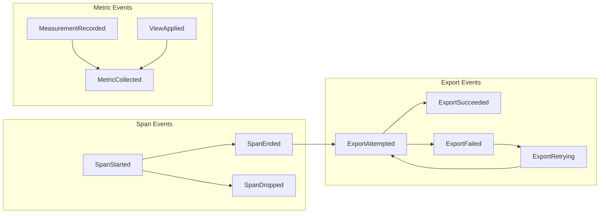
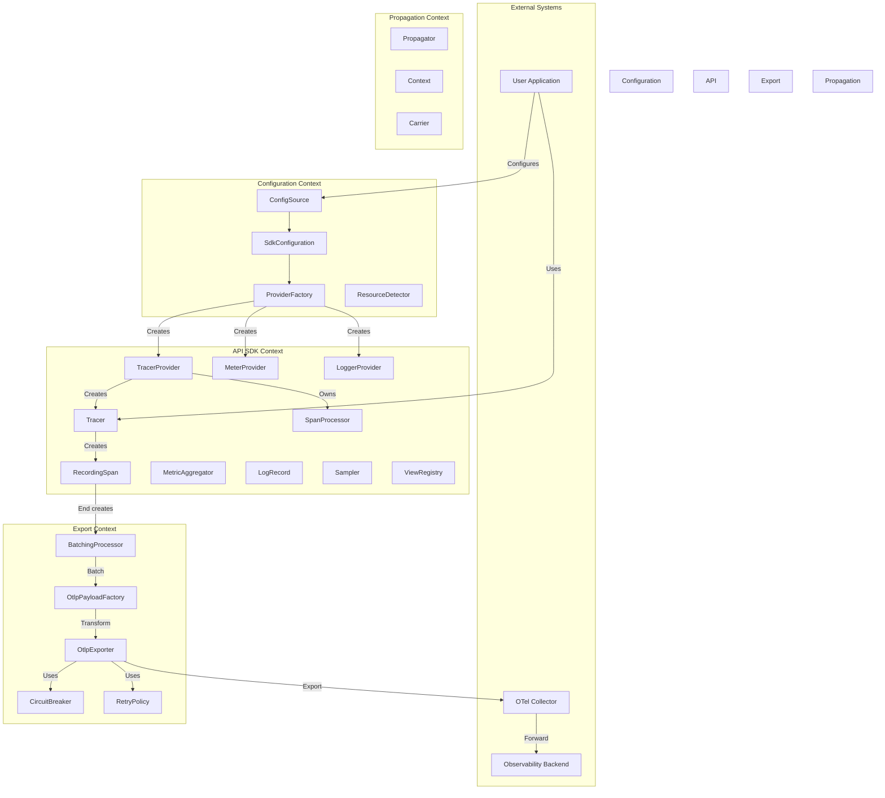
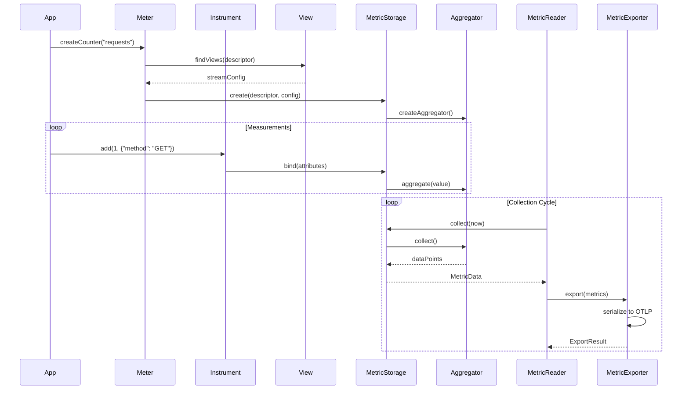
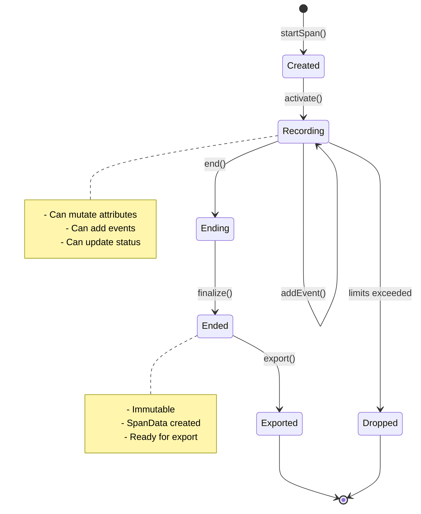

# OpenTelemetry Domain-Driven Design: Enhanced Reference Architecture

## Executive Summary

This reference architecture models OpenTelemetry using Domain-Driven Design principles. It identifies four primary bounded contexts:

1.  **Telemetry Configuration Context**: Manages SDK bootstrapping and lifecycle.
2.  **Telemetry API & SDK Context**: Core telemetry creation and management.
3.  **Telemetry Export Context**: Handles serialization and transmission.
4.  **Telemetry Pipeline Context** (Collector): Processes and routes telemetry data.

This model emphasizes aggregate boundaries that protect critical invariants, explicit modeling of asynchronous behavior, and clear anti-corruption layers between contexts.

## Strengthened Core Model & Ubiquitous Language

### Enhanced Ubiquitous Language Glossary

| Term | DDD Stereotype | Context | Definition | Invariants |
|---|---|---|---|---|
| **TracerProvider** | Aggregate Root / Factory | Configuration | Long-lived object configured with Resource and SpanProcessors; factory for Tracers | Must have valid Resource; Cannot create Tracers after shutdown |
| **Tracer** | Factory | API & SDK | Handle scoped to InstrumentationScope for creating RecordingSpans | Stateless; Thread-safe |
| **RecordingSpan** | Aggregate Root | API & SDK | Live, stateful representation of a single operation | See detailed invariants below |
| **SpanData** | Value Object | API & SDK, Export | Immutable snapshot of completed RecordingSpan | Immutable after creation |
| **SpanContext** | Value Object | API & SDK | Immutable span identity (TraceId, SpanId, TraceFlags, TraceState) | All IDs must be valid; Cannot be modified |
| **Resource** | Value Object | Configuration | Immutable metadata about the telemetry-producing entity | Schema URL must be consistent across attributes |
| **InstrumentationScope** | Value Object | API & SDK | Identity of the instrumentation library | Name required; Version optional |
| **MetricAggregator** | Aggregate Root | API & SDK | Stateful accumulator for metric measurements | Type-specific invariants (see below) |
| **MetricData** | Value Object | API & SDK, Export | Immutable snapshot of metric stream with DataPoints | Time intervals must not overlap |
| **LogRecord** | Aggregate Root | API & SDK | Mutable representation of a log entry | Severity level transitions must be valid |
| **LogData** | Value Object | API & SDK, Export | Immutable snapshot of completed LogRecord | Timestamp must be set |
| **Sampler** | Domain Service (Strategy) | API & SDK | Decides whether to record a span | Decision must be deterministic for same input |
| **SpanProcessor** | Domain Service | API & SDK | Processes span lifecycle events | Must handle concurrent calls safely |
| **OtlpPayloadFactory** | Domain Service (ACL) | Export | Translates domain objects to OTLP wire format | Must preserve semantic meaning |
| **RetryPolicy** | Domain Service (Strategy) | Export | Handles export failures with backoff | Must respect max attempts and timeout |
| **ExportResult** | Value Object | Export | Export attempt outcome with retry guidance | Success XOR Failure with reason |
| **ResourceDetector** | Domain Service | Configuration | Discovers environment-specific Resource attributes | Must merge attributes correctly |
| **ViewRegistry** | Repository | API & SDK | Stores metric view configurations | Views must not conflict |
| **ExemplarReservoir** | Domain Service | API & SDK | Samples exemplars for metrics | Must maintain fixed capacity |

### Deepened Aggregate Invariants

#### RecordingSpan Aggregate Invariants

1.  **Identity Invariants**: SpanContext (TraceId, SpanId) is immutable upon creation; TraceId must be 16 bytes (128 bits), non-zero; SpanId must be 8 bytes (64 bits), non-zero; Parent SpanContext, if present, must share the same TraceId.
2.  **State Transition Invariants**: Status transitions: UNSET → {OK, ERROR}, no reverse transitions; once ended, span becomes immutable; EndTime must be ≥ StartTime when set; recording state transitions: RECORDING → ENDED (one-way).
3.  **Capacity Invariants**: Total attributes ≤ SpanLimits.maxAttributeCount; total events ≤ SpanLimits.maxEventCount; total links ≤ SpanLimits.maxLinkCount; attribute value length ≤ SpanLimits.maxAttributeValueLength; dropped counts must be tracked when limits exceeded.
4.  **Semantic Invariants**: Exception events must have required attributes (type, message, stacktrace); Status ERROR requires description when set; attribute keys must be non-empty strings; attribute values must be of allowed types (string, number, boolean, array).

#### MetricAggregator Aggregate Invariants

1.  **Sum Aggregator**: Monotonic sums must never decrease; delta sums reset to zero after collection; cumulative sums maintain running total; overflow handling must be consistent.
2.  **Gauge Aggregator**: Only latest value is retained; timestamp of last measurement must be tracked; no aggregation across measurements.
3.  **Histogram Aggregator**: Bucket boundaries must be sorted and unique; count must equal sum of bucket counts; sum must be consistent with recorded values.
4.  **Exponential Histogram Aggregator**: Scale must be within valid range (-10 to 20); bucket indices must be contiguous; zero bucket must be handled specially.

#### LogRecord Aggregate Invariants

1.  **Temporal Invariants**: Timestamp must be set before emission; ObservedTimestamp ≥ Timestamp (if both present).
2.  **Severity Invariants**: Severity levels must follow standard ordering; SeverityText must align with SeverityNumber.
3.  **Context Invariants**: If SpanContext present, must be valid; TraceId/SpanId correlation must be consistent.

## Expanded Domain Concepts

### A. Resource Management Subdomain

*   **ResourceBuilder**: Accumulates Resource attributes during detection, merges Resources following precedence rules, and validates schema URL compatibility.
*   **ResourceDetector**: Detects environment-specific Resource attributes (e.g., process, host, container, cloud) and merges them correctly.
*   **ResourceMerger**: Implements OpenTelemetry Resource merge semantics, where later Resources take precedence and schema URL conflicts result in errors.

### B. Advanced Batching & Buffering

*   **BatchingStrategy**: Defines how to flush telemetry buffers (e.g., by size, time, or a composite of strategies).
*   **CircuitBreaker**: Implements resilience patterns for exporters to handle backend failures.

### C. Metric Views & Aggregation Control

*   **View**: Specifies how instruments are selected and how their data streams are configured for aggregation.
*   **ViewRegistry**: Stores ordered lists of Views, applying the first matching View and a default if no matches.
*   **AggregationTemporality**: Defines how metric data points are aggregated over time (DELTA or CUMULATIVE).

### D. Propagation Context

*   **Propagator**: Injects and extracts context (e.g., Trace Context, Baggage) into/from carriers (e.g., HTTP headers).
*   **CompositePropagator**: Combines multiple propagators for flexible context propagation.

### E. Exemplar Management

*   **Exemplar**: A data point that captures a specific measurement along with its associated trace context and attributes.
*   **ExemplarReservoir**: Samples exemplars for metrics, with various implementations for different sampling strategies.

## Domain Events & Event Storming

### Core Domain Events

1.  **Span Lifecycle Events**: `SpanStarted`, `SpanEnded`, `SpanDropped`.
2.  **Metric Events**: `MeasurementRecorded`, `MetricCollected`, `ViewApplied`.
3.  **Export Events**: `ExportAttempted`, `ExportSucceeded`, `ExportFailed`, `ExportRetrying`.
4.  **Configuration Events**: `ProviderCreated`, `ProviderShutdown`, `ProcessorRegistered`.

### Event Flow Diagram

## Tactical Patterns Deep Dive

*   **Specification Pattern for Sampling**: Defines criteria for sampling decisions based on span context and attributes.
*   **Policy Pattern for Export Behavior**: Encapsulates rules for pre-export processing, success handling, and failure responses (e.g., throttling, circuit breaking).
*   **Repository Pattern for Metric State**: Manages the storage and retrieval of metric data, ensuring consistency and proper aggregation.

## Advanced Visualization

### Complete Context Map with Integration Patterns

### Detailed Metric Collection Sequence

### State Machine: Span Lifecycle

## Anti-Patterns & Pitfalls

*   **Anemic Domain Model**: Avoid `SpanData` with only getters/setters; `RecordingSpan` should encapsulate span lifecycle rules.
*   **Leaky Abstractions**: Avoid using OTLP protobuf types directly in SDK core; use an ACL (OtlpPayloadFactory) to translate at the boundary.
*   **Missing Aggregate Boundaries**: Avoid direct manipulation of span attributes from multiple threads; `RecordingSpan` should synchronize all mutations.
*   **Ignored Bounded Contexts**: Use separate models with explicit translation for SDK and Collector needs.
*   **Primitive Obsession**: Avoid raw strings for `SpanId`, `TraceId`; use value objects with validation and behavior.
*   **Service Locator**: Avoid global registry for accessing `TracerProvider`; use explicit dependency injection.
*   **Chatty Interfaces**: Avoid individual network calls per span; use batch processing with configurable strategies.
*   **Race Conditions**: Ensure `Aggregator` handles concurrent `collect()` and `record()` calls internally with proper synchronization.

## Testing Strategies from DDD Perspective

*   **Unit Testing Aggregates**: Test invariant protection (e.g., `RecordingSpan` rejecting mutations after end).
*   **Testing Domain Services**: Use test doubles for strategies (e.g., `BatchingSpanProcessor` respecting batching strategy).
*   **Integration Testing Across Contexts**: Test ACL translations (e.g., `OtlpPayloadFactory` preserving span semantics).
*   **Property-Based Testing**: Test invariants with generated data (e.g., monotonic sum never decreases).

## Conclusion

This enhanced model provides a comprehensive DDD view of OpenTelemetry that:

1.  **Preserves Domain Integrity**: Aggregates enforce all critical invariants.
2.  **Enables Evolution**: Bounded contexts can evolve independently.
3.  **Supports Scale**: Asynchronous patterns and batching are first-class.
4.  **Maintains Clarity**: Ubiquitous language is used consistently.
5.  **Facilitates Testing**: Clear boundaries enable focused testing.
6.  **Prevents Common Pitfalls**: Anti-patterns are explicitly identified.

The model serves as both a learning tool for understanding OpenTelemetry's architecture and a reference for implementing OpenTelemetry SDKs in any language while maintaining domain integrity.
