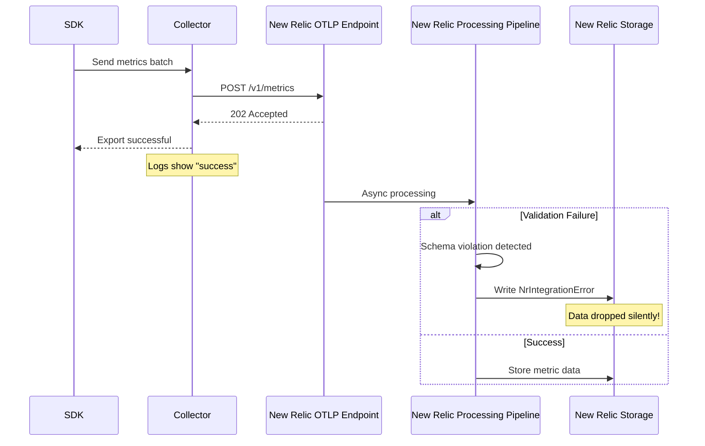

# OpenTelemetry with New Relic: The Ultimate Detailed Integration Guide

## Table of Contents
1. [Executive Summary](#executive-summary)
2. [Architecture Deep Dive](#architecture-deep-dive)
3. [Data Transformation Pipeline](#data-transformation-pipeline)
4. [NRDOT vs Vanilla OTEL: The Real Differences](#nrdot-vs-vanilla-otel-the-real-differences)
5. [Advanced Configuration Strategies](#advanced-configuration-strategies)
6. [Cardinality Management at Scale](#cardinality-management-at-scale)
7. [Performance Optimization](#performance-optimization)
8. [Troubleshooting Guide](#troubleshooting-guide)
9. [Entity Synthesis and Correlation](#entity-synthesis-and-correlation)
10. [Production Best Practices](#production-best-practices)
11. [Future-Proofing Your Implementation](#future-proofing-your-implementation)

## Executive Summary

OpenTelemetry (OTEL) integration with New Relic represents a paradigm shift in observability, but success requires understanding the nuanced interplay between OTEL's vendor-neutral design and New Relic's opinionated data model. This guide provides the definitive resource for implementing, optimizing, and troubleshooting OTEL with New Relic at enterprise scale.

### Key Insights
- **Asynchronous validation** means successful exports ≠ successful ingestion
- **NRDOT** provides critical guardrails but isn't a silver bullet
- **Cardinality management** is the #1 operational challenge at scale
- **Entity synthesis** requires precise attribute configuration
- **Performance optimization** involves careful protocol and batching choices

## Architecture Deep Dive

### The Three-Layer Model

Understanding OTEL with New Relic requires thinking in three distinct layers:

#### Layer 1: Data Generation (SDK/Instrumentation)
```yaml
# Critical SDK Configuration
OTEL_EXPORTER_OTLP_ENDPOINT: "https://otlp.nr-data.net"
OTEL_EXPORTER_OTLP_HEADERS: "api-key=YOUR_LICENSE_KEY"
OTEL_METRIC_EXPORT_INTERVAL: "60000"  # 60s - directly impacts DPM
OTEL_METRIC_EXPORT_TIMEOUT: "30000"   # 30s - must be < interval
OTEL_EXPORTER_OTLP_PROTOCOL: "http/protobuf"  # Recommended over grpc
```

**Key Decisions at This Layer:**
- **Temporality**: Delta vs Cumulative (Delta strongly preferred)
- **Histogram Type**: Exponential vs Explicit buckets
- **Resource Detection**: What metadata to auto-discover
- **Sampling Strategy**: Head-based vs Tail-based

#### Layer 2: Data Processing (Collector)
```yaml
# Collector Architecture for Scale
receivers:
  otlp:
    protocols:
      grpc:
        endpoint: 0.0.0.0:4317
        max_recv_msg_size_mib: 16  # Prevent large batch issues
      http:
        endpoint: 0.0.0.0:4318
        
processors:
  # CRITICAL: Order matters!
  memory_limiter:  # Must be first
    check_interval: 1s
    limit_percentage: 80
    spike_limit_percentage: 25
    
  batch:
    timeout: 30s
    send_batch_size: 8192
    send_batch_max_size: 10000  # New Relic's limit
    
  attributes:
    actions:
      - key: "internal.temporary"
        action: delete
      - key: "user.id"
        action: hash  # Cardinality management
        
  resource:
    attributes:
      - key: "service.name"
        value: "my-service"
        action: upsert
      - key: "deployment.environment"
        from_attribute: "env"
        action: insert
```

#### Layer 3: Data Ingestion (New Relic Backend)
- **Endpoint**: `https://otlp.nr-data.net:4318/v1/metrics` (US datacenter)
- **Async Processing**: 202 Accepted doesn't mean data is stored
- **Validation**: Happens post-acknowledgment
- **Entity Synthesis**: Occurs during processing

### The Silent Failure Problem



**Critical Implication**: You MUST monitor `NrIntegrationError` events:
```sql
-- NRQL query to monitor ingestion failures
SELECT count(*) 
FROM NrIntegrationError 
WHERE newRelicFeature = 'Metrics' 
FACET message 
SINCE 1 hour ago
```

## Data Transformation Pipeline

### The Flattening Process

OpenTelemetry's hierarchical data model gets transformed into New Relic's flat structure:

```javascript
// OTEL Structure
{
  "resource": {
    "attributes": {
      "service.name": "checkout-service",
      "service.version": "2.1.0",
      "host.name": "prod-host-1"
    }
  },
  "scopeMetrics": [{
    "scope": {
      "name": "com.example.metrics",
      "version": "1.0.0"
    },
    "metrics": [{
      "name": "http.server.duration",
      "unit": "ms",
      "histogram": {
        "dataPoints": [{
          "attributes": {
            "http.method": "POST",
            "http.status_code": 200
          },
          "count": 100,
          "sum": 5000
        }]
      }
    }]
  }]
}

// New Relic Structure (after flattening)
{
  "metricName": "http.server.duration",
  "attributes": {
    // Resource attributes copied to every data point
    "service.name": "checkout-service",
    "service.version": "2.1.0", 
    "host.name": "prod-host-1",
    // Scope becomes attributes
    "otel.scope.name": "com.example.metrics",
    "otel.scope.version": "1.0.0",
    // Original attributes
    "http.method": "POST",
    "http.status_code": 200
  },
  "value": {
    "count": 100,
    "sum": 5000
  }
}
```

**Impact on Cardinality**: Every resource attribute multiplies your cardinality by the number of unique metric streams!

### Data Type Mappings

| OTEL Type | New Relic Type | Critical Considerations |
|-----------|----------------|------------------------|
| **Gauge** | Gauge | Last value wins; no aggregation |
| **Sum (Delta)** | Count | Preferred; automatic rate calculation |
| **Sum (Cumulative)** | Gauge | Requires resets handling; avoid if possible |
| **Histogram** | Distribution | Percentile calculation server-side |
| **Exponential Histogram** | Distribution | Better accuracy; New Relic native |
| **Summary** | Multiple Gauges | Quantiles become separate metrics; high cardinality |

### Temporality Deep Dive

```yaml
# SDK Configuration for Delta (Recommended)
exporters:
  otlp:
    temporality_preference:
      # This is CRITICAL for New Relic
      counter: delta
      histogram: delta
      up_down_counter: cumulative  # Exception: gauges stay cumulative
```

**Why Delta is Critical**:
1. **No State Management**: Collector doesn't track previous values
2. **Accurate Rates**: New Relic calculates rates correctly
3. **Reset Handling**: No spike detection needed
4. **Lower Memory**: Collector uses less memory

## NRDOT vs Vanilla OTEL: The Real Differences

### NRDOT's Hidden Magic

The New Relic Distribution for OpenTelemetry (NRDOT) isn't just a pre-configured collector—it's an opinionated implementation that enforces New Relic best practices:

#### 1. Automatic Attribute Injection
```yaml
# NRDOT automatically adds (not configurable):
processors:
  k8sattributes:
    extract:
      metadata:
        - k8s.namespace.name
        - k8s.deployment.name
        - k8s.pod.name
        - k8s.pod.uid
        - k8s.node.name
        
  resourcedetection:
    detectors:
      - env
      - system
      - docker
      - ecs
      - ec2
      - gcp
      - azure
```

#### 2. Built-in Entity Correlation
```yaml
# NRDOT ensures these critical mappings:
resource_attributes:
  # For APM <-> Infrastructure correlation
  - host.id -> entityGuid matching
  - service.name -> APM service entity
  - container.id -> Container entity
  
  # For Kubernetes correlation  
  - k8s.cluster.name -> K8s cluster entity
  - k8s.namespace.name -> K8s namespace grouping
  - k8s.pod.uid -> K8s pod entity
```

#### 3. Opinionated Defaults
```yaml
# NRDOT's non-overridable defaults:
batch:
  timeout: 30s  # Optimized for New Relic
  send_batch_size: 1000  # Below NR limits
  
retry_on_failure:
  enabled: true
  initial_interval: 5s
  max_interval: 30s
  max_elapsed_time: 300s
```

### When to Use Each

#### Use NRDOT When:
- **Kubernetes Deployments**: Automatic k8s metadata is invaluable
- **Hybrid Infrastructure**: Mix of containers, VMs, cloud services
- **Team New to OTEL**: Guardrails prevent common mistakes
- **Standard Use Cases**: 80% of implementations

#### Use Vanilla OTEL When:
- **Multi-Vendor Strategy**: Sending to multiple backends
- **Custom Processing**: Need specific processors NRDOT doesn't support
- **Edge Cases**: Unique network or security requirements
- **Full Control**: Need to optimize every aspect

### The NRDOT Tax

NRDOT's conveniences come with costs:
1. **Less Flexibility**: Can't remove default processors
2. **Version Lag**: Updates trail vanilla OTEL by 2-4 weeks
3. **Resource Overhead**: ~10-15% more memory due to extra processors
4. **Debugging Complexity**: More layers to troubleshoot

## Advanced Configuration Strategies

### Multi-Pipeline Architecture for Scale

```yaml
# High-volume collector configuration
receivers:
  # Separate receivers for different data rates
  otlp/high_volume:
    protocols:
      grpc:
        endpoint: 0.0.0.0:4317
        
  otlp/low_volume:
    protocols:
      grpc:
        endpoint: 0.0.0.0:4318

processors:
  # Aggressive batching for high volume
  batch/high_volume:
    timeout: 10s
    send_batch_size: 8192
    
  # Relaxed batching for low volume  
  batch/low_volume:
    timeout: 60s
    send_batch_size: 100
    
  # Sampling for cost control
  probabilistic_sampler:
    sampling_percentage: 10  # Only keep 10%
    
  # Smart routing
  routing:
    from_attribute: "priority"
    table:
      - value: "high"
        exporters: ["otlp/priority"]
      - value: "low"
        exporters: ["otlp/standard"]
    default_exporters: ["otlp/standard"]

exporters:
  otlp/priority:
    endpoint: "https://otlp.nr-data.net"
    headers:
      api-key: "${NEW_RELIC_LICENSE_KEY}"
    sending_queue:
      enabled: true
      num_consumers: 10  # More workers
      queue_size: 5000
      
  otlp/standard:
    endpoint: "https://otlp.nr-data.net"
    headers:
      api-key: "${NEW_RELIC_LICENSE_KEY}"
    sending_queue:
      enabled: true
      num_consumers: 2
      queue_size: 1000

service:
  pipelines:
    metrics/high_volume:
      receivers: [otlp/high_volume]
      processors: [memory_limiter, batch/high_volume, attributes/drop_internal]
      exporters: [routing]
      
    metrics/low_volume:
      receivers: [otlp/low_volume]
      processors: [memory_limiter, batch/low_volume]
      exporters: [otlp/standard]
```

### Gateway Pattern for Enterprise Scale

```yaml
# Agent Collector (on each host)
receivers:
  hostmetrics:
    collection_interval: 10s
    scrapers:
      cpu: {}
      memory: {}
      disk: {}
      
processors:
  # Minimal processing on host
  batch:
    timeout: 5s
    
exporters:
  otlp:
    endpoint: "gateway-collector.internal:4317"
    compression: gzip
    
# Gateway Collector (centralized)
receivers:
  otlp:
    protocols:
      grpc:
        endpoint: 0.0.0.0:4317
        max_recv_msg_size_mib: 64
        
processors:
  # Heavy processing centralized
  groupbyattrs:
    keys:
      - service.name
      - deployment.environment
      
  metricstransform:
    transforms:
      - include: "system.cpu.usage"
        action: update
        new_name: "host.cpu.usage.percent"
        
  tail_sampling:
    policies:
      - name: errors-policy
        type: status_code
        status_code: {status_codes: [ERROR]}
        
exporters:
  otlp/newrelic:
    endpoint: "https://otlp.nr-data.net"
    retry_on_failure:
      enabled: true
      max_elapsed_time: 600s  # 10 minutes
```

## Cardinality Management at Scale

### The Cardinality Explosion Formula

```
Total Cardinality = 
  (# of metrics) × 
  (# of unique label combinations) × 
  (# of resource attributes)
```

### Real-World Example
```yaml
# Dangerous: Customer ID in attributes
metrics:
  - name: "api.request.count"
    attributes:
      - customer_id: "cust_123"  # 1M customers = 1M time series!
      - endpoint: "/api/v1/users"
      - method: "GET"
      
# Safe: Bucketed approach
metrics:
  - name: "api.request.count"
    attributes:
      - customer_tier: "premium"  # Only 3-5 tiers
      - endpoint: "/api/v1/users"
      - method: "GET"
```

### Advanced Cardinality Control

```yaml
processors:
  # Strategy 1: Drop high-cardinality attributes
  attributes/drop_dangerous:
    actions:
      - key: "user.id"
        action: delete
      - key: "session.id"
        action: delete
      - key: "request.id"
        action: delete
        
  # Strategy 2: Hash for preservation
  attributes/hash_ids:
    actions:
      - key: "user.id"
        action: hash
        
  # Strategy 3: Intelligent bucketing
  transform:
    error_mode: ignore
    metric_statements:
      - context: datapoint
        statements:
          # Bucket response times
          - set(attributes["response_time_bucket"], "fast") where attributes["response_time_ms"] < 100
          - set(attributes["response_time_bucket"], "normal") where attributes["response_time_ms"] < 1000
          - set(attributes["response_time_bucket"], "slow") where attributes["response_time_ms"] >= 1000
          - delete_key(attributes, "response_time_ms")
          
  # Strategy 4: Sampling high-cardinality metrics
  filter/sample_high_cardinality:
    metrics:
      include:
        match_type: regexp
        metric_names:
          - ".*\\.by_user\\..*"
    spans:
      include:
        match_type: probabilistic
        probabilistic:
          sampling_percentage: 1  # Only 1% of by-user metrics
```

### Monitoring Cardinality Impact

```sql
-- Find metrics approaching limits
SELECT uniqueCount(dimensions()) as cardinality,
       average(newrelic.timeslice.value) as avg_value
FROM Metric
WHERE metricName LIKE 'custom.%'
FACET metricName
SINCE 1 hour ago
HAVING cardinality > 1000

-- Identify cardinality drivers
SELECT uniqueCount(user.id) as unique_users,
       uniqueCount(endpoint) as unique_endpoints,
       uniqueCount(environment) as unique_envs
FROM Metric
WHERE metricName = 'api.request.count'
SINCE 1 hour ago

-- Monitor for limit warnings
SELECT count(*)
FROM NrIntegrationError
WHERE message LIKE '%cardinality%' 
   OR message LIKE '%unique time series%'
SINCE 1 day ago
TIMESERIES
```

## Performance Optimization

### Protocol Selection: HTTP vs gRPC

Despite gRPC's theoretical advantages, **HTTP is recommended** for New Relic:

```yaml
# Recommended HTTP configuration
exporters:
  otlp/http:
    endpoint: "https://otlp.nr-data.net:4318"
    protocol: "http/protobuf"  # Not JSON!
    compression: gzip
    timeout: 30s
    headers:
      api-key: "${NEW_RELIC_LICENSE_KEY}"
      
# Why HTTP wins in practice:
# 1. Better proxy/firewall compatibility
# 2. Simpler debugging (curl-able)
# 3. Stateless connections
# 4. New Relic's explicit recommendation
```

### Batching Optimization

```yaml
processors:
  batch:
    # The sweet spot for New Relic
    send_batch_size: 5000      # Target batch size
    send_batch_max_size: 8192  # Never exceed
    timeout: 30s               # Force send interval
    
    # Advanced: Different settings per signal
    metrics:
      timeout: 60s  # Less frequent for metrics
    traces:
      timeout: 5s   # More frequent for traces
    logs:
      timeout: 1s   # Near real-time for logs
```

### Memory Management

```yaml
# Prevent OOM under pressure
processors:
  memory_limiter:
    check_interval: 1s
    limit_percentage: 75      # Hard limit
    spike_limit_percentage: 20 # Headroom for spikes
    
exporters:
  otlp:
    sending_queue:
      enabled: true
      num_consumers: 5       # Parallel exports
      queue_size: 2000       # Buffer size
      storage: file_storage  # Persist to disk
      
extensions:
  file_storage:
    directory: /var/lib/otel/queue
    timeout: 10s
    compaction:
      on_start: true
      directory: /var/lib/otel/queue
      max_transaction_size: 65536
```

### Compression Analysis

```yaml
# Test different compression methods
exporters:
  otlp/gzip:
    compression: gzip  # ~70% reduction, moderate CPU
    
  otlp/zstd:
    compression: zstd  # ~80% reduction, higher CPU
    
  otlp/none:
    compression: none  # Baseline for comparison
    
# Monitor impact
processors:
  metrics:
    metrics:
      - name: otelcol_exporter_sent_metric_points
        action: insert
        attributes:
          - key: compression_type
            value: gzip
```

## Troubleshooting Guide

### The Debugging Toolchain

#### 1. Enable Debug Logging
```yaml
service:
  telemetry:
    logs:
      level: debug
      encoding: json
      output_paths: ["stdout", "/var/log/otel-collector.log"]
      
    metrics:
      level: detailed
      address: 0.0.0.0:8888  # Prometheus metrics
```

#### 2. Test Connectivity
```bash
# Test OTLP endpoint
curl -X POST https://otlp.nr-data.net:4318/v1/metrics \
  -H "Content-Type: application/x-protobuf" \
  -H "api-key: YOUR_LICENSE_KEY" \
  --data-binary @test_metrics.pb

# Expected: 200 OK or 202 Accepted
```

#### 3. Validate Export Success
```yaml
# Add metrics exporter for self-monitoring
exporters:
  prometheus:
    endpoint: "0.0.0.0:8889"
    
service:
  pipelines:
    # Self-monitoring pipeline
    metrics/internal:
      receivers: [prometheus]
      exporters: [otlp/newrelic]
```

### Common Issues and Solutions

#### Issue 1: Data Not Appearing
```sql
-- Step 1: Check for errors
SELECT count(*) 
FROM NrIntegrationError 
WHERE newRelicFeature = 'Metrics'
FACET message
SINCE 1 hour ago

-- Step 2: Verify data arrival
SELECT count(*)
FROM Metric
WHERE otel.scope.name IS NOT NULL
SINCE 10 minutes ago

-- Step 3: Check specific metric
SELECT *
FROM Metric
WHERE metricName = 'your.metric.name'
SINCE 10 minutes ago
LIMIT 10
```

#### Issue 2: High Cardinality Rejection
```yaml
# Fix: Implement cardinality reduction
processors:
  # Option 1: Drop attributes
  attributes:
    actions:
      - key: "user.email"
        action: delete
        
  # Option 2: Aggregate before sending
  metricsgroupbyattrs:
    keys:
      - service.name
      - http.method
      - http.status_code_class  # Not specific code
```

#### Issue 3: Entity Correlation Broken
```yaml
# Fix: Ensure required attributes
processors:
  resource:
    attributes:
      # For service correlation
      - key: service.name
        value: "my-service"
        action: upsert
        
      # For host correlation  
      - key: host.id
        from_attribute: host.name
        action: insert
        
      # For K8s correlation
      - key: k8s.cluster.name
        value: "${K8S_CLUSTER_NAME}"
        action: upsert
```

### Performance Troubleshooting

```yaml
# Enable detailed performance metrics
receivers:
  prometheus:
    config:
      scrape_configs:
        - job_name: 'otel-collector'
          scrape_interval: 10s
          static_configs:
            - targets: ['0.0.0.0:8888']
            
processors:
  batch:
    # Add metadata for debugging
    metadata_keys:
      - batch.size
      - batch.timeout_trigger
      
# Key metrics to monitor
# - otelcol_processor_batch_batch_send_size
# - otelcol_processor_batch_timeout_trigger_send
# - otelcol_exporter_queue_size
# - otelcol_exporter_send_failed_metric_points
```

## Entity Synthesis and Correlation

### The Entity Model

New Relic creates entities based on specific attribute patterns:

```yaml
# Service Entity Requirements
resource_attributes:
  service.name: "checkout-service"  # Required
  service.namespace: "production"    # Optional but recommended
  service.version: "2.1.0"          # Optional
  
# Host Entity Requirements  
resource_attributes:
  host.id: "i-1234567890abcdef0"   # Required for correlation
  host.name: "prod-web-01"         # Human-readable
  host.type: "ec2.instance"        # Optional
  
# Container Entity Requirements
resource_attributes:
  container.id: "abc123def456"     # Required
  container.name: "checkout"       # Optional
  container.image.name: "checkout:2.1.0"  # Recommended
  
# Kubernetes Entity Requirements
resource_attributes:
  k8s.cluster.name: "prod-us-east" # Required
  k8s.namespace.name: "default"    # Required
  k8s.pod.name: "checkout-5d7c8d9b5f-9xqvm"  # Required
  k8s.pod.uid: "12345-67890"      # Critical for correlation
  k8s.deployment.name: "checkout"  # Recommended
  k8s.node.name: "node-1"         # Recommended
```

### Advanced Entity Correlation

```yaml
# Multi-layer correlation example
processors:
  resource:
    attributes:
      # Layer 1: Service identity
      - key: service.name
        value: "checkout-service"
        action: upsert
        
      # Layer 2: Deployment context
      - key: deployment.environment
        value: "${DEPLOY_ENV}"
        action: upsert
        
      # Layer 3: Infrastructure binding
      - key: host.id
        from_attribute: "${HOST_ID}"
        action: insert
        
      # Layer 4: Custom tags for entity
      - key: tags.team
        value: "platform"
        action: insert
        
      # Layer 5: Cost allocation
      - key: tags.cost_center
        value: "engineering-001"
        action: insert
```

### Debugging Entity Synthesis

```sql
-- Find entities created from OTEL data
SELECT uniques(entityGuid), 
       latest(service.name),
       latest(host.id),
       latest(k8s.cluster.name)
FROM Metric
WHERE otel.scope.name IS NOT NULL
FACET entity.name
SINCE 1 hour ago

-- Verify entity relationships
FROM Relationship
SELECT sourceEntityGuid, 
       targetEntityGuid,
       relationshipType
WHERE sourceEntityGuid IN (
  SELECT entityGuid 
  FROM ServiceEntity 
  WHERE name = 'checkout-service'
)

-- Check for missing correlations
SELECT count(*)
FROM Metric
WHERE service.name IS NOT NULL 
  AND host.id IS NULL
  AND instrumentation.provider = 'opentelemetry'
FACET service.name
SINCE 1 hour ago
```

## Production Best Practices

### 1. Deployment Strategy

```yaml
# Production-grade collector deployment
apiVersion: apps/v1
kind: DaemonSet
metadata:
  name: otel-collector-agent
spec:
  template:
    spec:
      containers:
      - name: otel-collector
        image: otel/opentelemetry-collector-contrib:0.89.0
        resources:
          limits:
            memory: 512Mi
            cpu: 500m
          requests:
            memory: 256Mi
            cpu: 100m
        env:
        - name: GOMAXPROCS
          value: "2"  # Limit concurrency
        - name: GOMEMLIMIT
          value: "460MiB"  # 90% of container limit
        volumeMounts:
        - name: persistent-queue
          mountPath: /var/lib/otel
      volumes:
      - name: persistent-queue
        hostPath:
          path: /var/lib/otel
          type: DirectoryOrCreate
---
apiVersion: apps/v1
kind: Deployment
metadata:
  name: otel-collector-gateway
spec:
  replicas: 5  # Horizontal scaling
  template:
    spec:
      containers:
      - name: otel-collector
        resources:
          limits:
            memory: 4Gi
            cpu: 2000m
          requests:
            memory: 2Gi
            cpu: 1000m
```

### 2. High Availability Configuration

```yaml
# Gateway collector with HA
receivers:
  otlp:
    protocols:
      grpc:
        endpoint: 0.0.0.0:4317
        max_recv_msg_size_mib: 32
        max_concurrent_streams: 1000
        keepalive:
          server_parameters:
            max_connection_idle: 30s
            max_connection_age: 90s
            
processors:
  # Deduplication for HA sources
  groupbyattrs:
    keys:
      - service.name
      - trace.id
      - span.id
      
  # Load balancing across exporters
  loadbalancing:
    protocol:
      otlp:
        timeout: 30s
    resolver:
      dns:
        hostname: newrelic-endpoints.internal
        port: 4317
        
exporters:
  # Multiple endpoints for redundancy
  otlp/primary:
    endpoint: "https://otlp.nr-data.net:4318"
    headers:
      api-key: "${PRIMARY_LICENSE_KEY}"
      
  otlp/secondary:
    endpoint: "https://otlp.eu01.nr-data.net:4318"
    headers:
      api-key: "${SECONDARY_LICENSE_KEY}"
      
service:
  pipelines:
    metrics:
      receivers: [otlp]
      processors: [memory_limiter, groupbyattrs, batch]
      exporters: [loadbalancing]
```

### 3. Security Best Practices

```yaml
# Secure collector configuration
receivers:
  otlp:
    protocols:
      grpc:
        endpoint: 0.0.0.0:4317
        tls:
          cert_file: /etc/otel/certs/server.crt
          key_file: /etc/otel/certs/server.key
          client_ca_file: /etc/otel/certs/ca.crt
        auth:
          authenticator: bearer_token
          
extensions:
  bearer_token:
    token_source: file
    file: /etc/otel/tokens/valid_tokens.json
    
  health_check:
    endpoint: 0.0.0.0:13133
    path: "/health"
    tls:
      cert_file: /etc/otel/certs/health.crt
      key_file: /etc/otel/certs/health.key
      
processors:
  # Redact sensitive data
  redaction:
    blocked_values:
      - "\\b(?:\\d{4}[- ]?){3}\\d{4}\\b"  # Credit cards
      - "\\b[A-Za-z0-9._%+-]+@[A-Za-z0-9.-]+\\.[A-Z|a-z]{2,}\\b"  # Emails
    summary: "redacted"
```

### 4. Cost Optimization

```yaml
# Cost-aware configuration
processors:
  # Sample non-critical metrics
  probabilistic_sampler/cost:
    hash_seed: 22
    sampling_percentage: 10  # Keep only 10%
    attribute_source: record
    from_attribute: "sampling.priority"
    sampling_priority_attribute: "sampling.priority"
    
  # Drop expensive metrics
  filter/cost:
    metrics:
      exclude:
        match_type: regexp
        metric_names:
          - "system\\.network\\..*"  # High cardinality
          - "system\\.filesystem\\..*"  # Many mount points
          
  # Aggregate before sending
  metricstransform/cost:
    transforms:
      - include: "http.server.request.duration"
        action: update
        aggregation_type: exponential_histogram
        exponential_histogram:
          max_size: 160  # Reduce bucket count
          
  # Downsample high-frequency metrics
  cumulativetodelta/cost:
    include:
      match_type: regexp
      metrics: ".*\\.total$"
    exclude:
      match_type: strict
      metrics: ["critical.business.metric.total"]
```

### 5. Monitoring the Monitor

```yaml
# Self-observability pipeline
receivers:
  # Collector's own metrics
  prometheus/internal:
    config:
      scrape_configs:
        - job_name: 'otel-collector'
          scrape_interval: 30s
          static_configs:
            - targets: ['0.0.0.0:8888']
            
  # Collector's own logs
  filelog/internal:
    include: ["/var/log/otel-collector.log"]
    start_at: end
    
processors:
  # Add metadata to internal telemetry
  resource/internal:
    attributes:
      - key: service.name
        value: "otel-collector"
        action: insert
      - key: collector.role
        value: "${COLLECTOR_ROLE}"  # agent or gateway
        action: insert
        
  # Alert on critical metrics
  metricstransform/alerts:
    transforms:
      - include: "otelcol_exporter_send_failed_metric_points"
        action: insert
        new_name: "collector.export.failures"
        
exporters:
  # Send to same New Relic account
  otlp/internal:
    endpoint: "https://otlp.nr-data.net:4318"
    headers:
      api-key: "${NEW_RELIC_LICENSE_KEY}"
      
service:
  telemetry:
    metrics:
      level: detailed
      readers:
        - pull:
            exporter:
              prometheus:
                host: 0.0.0.0
                port: 8888
                
  pipelines:
    # Self-monitoring pipeline
    metrics/internal:
      receivers: [prometheus/internal]
      processors: [memory_limiter, resource/internal, batch]
      exporters: [otlp/internal]
      
    logs/internal:
      receivers: [filelog/internal]
      processors: [memory_limiter, resource/internal, batch]
      exporters: [otlp/internal]
```

## Future-Proofing Your Implementation

### Preparing for What's Next

#### 1. Exemplar Support (Coming Soon)
```yaml
# Prepare for exemplars
processors:
  # Reserve capacity for exemplars
  attributes:
    actions:
      - key: "trace.id"
        action: promote  # Make available for exemplar correlation
      - key: "span.id"
        action: promote
        
# SDK preparation
metrics:
  exemplar:
    enabled: true  # Will be ignored until supported
    sampler: trace_based  # Correlate with distributed tracing
```

#### 2. OTLP Profiles (Future)
```yaml
# Prepare configuration structure
receivers:
  otlp:
    protocols:
      grpc:
        endpoint: 0.0.0.0:4317
      http:
        endpoint: 0.0.0.0:4318
        
# Reserve pipeline names
service:
  pipelines:
    profiles:  # Future profiling data
      receivers: [otlp]
      processors: [batch]
      exporters: [otlp/newrelic]
```

#### 3. Semantic Convention Evolution
```yaml
processors:
  # Version-aware attribute handling
  schemaurl:
    schema_url: "https://opentelemetry.io/schemas/1.24.0"
    
  # Prepare for convention changes
  transform:
    error_mode: ignore
    metric_statements:
      - context: resource
        statements:
          # Map old to new conventions
          - set(attributes["service.namespace"], attributes["service.environment"]) 
            where attributes["service.environment"] != nil
```

### Migration Strategy

```yaml
# Dual-write for safe migration
exporters:
  # Current New Relic
  otlp/current:
    endpoint: "https://otlp.nr-data.net:4318"
    headers:
      api-key: "${CURRENT_LICENSE_KEY}"
      
  # Future configuration
  otlp/future:
    endpoint: "${FUTURE_ENDPOINT}"
    headers:
      api-key: "${FUTURE_LICENSE_KEY}"
    retry_on_failure:
      enabled: true
      max_elapsed_time: 0  # Infinite retry
      
service:
  pipelines:
    metrics:
      receivers: [otlp]
      processors: [batch]
      exporters: [otlp/current, otlp/future]
```

### Vendor Portability

```yaml
# Maintain vendor neutrality
processors:
  # Use standard processors only
  batch:
    timeout: 30s
    
  attributes:
    # Vendor-specific in separate processor
    include:
      match_type: strict
      services: ["critical-service"]
    actions:
      - key: "newrelic.account.id"
        value: "${NEW_RELIC_ACCOUNT_ID}"
        action: insert
        
  # Easy to remove vendor-specific parts
  routing:
    from_attribute: "destination"
    table:
      - value: "newrelic"
        exporters: ["otlp/newrelic"]
      - value: "other"
        exporters: ["otlp/generic"]
```

## Conclusion

Success with OpenTelemetry and New Relic requires understanding not just the happy path, but the complex interactions between SDK configuration, collector processing, and backend limitations. Key takeaways:

1. **Monitor NrIntegrationError** - Your only window into silent failures
2. **Choose NRDOT wisely** - Great for standard cases, limiting for complex ones
3. **Manage cardinality aggressively** - It's easier to add attributes than remove them
4. **Use HTTP over gRPC** - Despite conventional wisdom
5. **Plan for scale early** - Gateway patterns and sampling strategies
6. **Maintain vendor neutrality** - Even when using vendor-specific features

The future of observability is OpenTelemetry, but success requires careful navigation of its complexities. This guide provides the map.