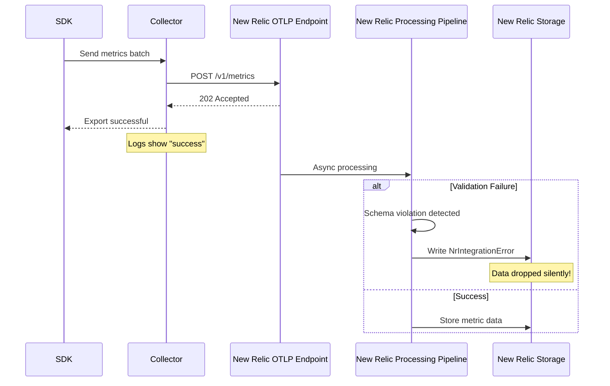

# OpenTelemetry with New Relic: The Ultimate Detailed Integration Guide

## Executive Summary

OpenTelemetry (OTEL) integration with New Relic represents a paradigm shift in observability. This guide provides the definitive resource for implementing, optimizing, and troubleshooting OTEL with New Relic at enterprise scale.

### Key Insights
*   **Asynchronous validation** means successful exports ≠ successful ingestion.
*   **NRDOT** provides critical guardrails but isn't a silver bullet.
*   **Cardinality management** is the #1 operational challenge at scale.
*   **Entity synthesis** requires precise attribute configuration.
*   **Performance optimization** involves careful protocol and batching choices.

## Architecture Deep Dive

### The Three-Layer Model

OTEL with New Relic operates in three distinct layers:

#### Layer 1: Data Generation (SDK/Instrumentation)

**Key Decisions:**
*   **Temporality**: Delta vs. Cumulative (Delta strongly preferred).
*   **Histogram Type**: Exponential vs. Explicit buckets.
*   **Resource Detection**: What metadata to auto-discover.
*   **Sampling Strategy**: Head-based vs. Tail-based.

#### Layer 2: Data Processing (Collector)

**Critical Considerations:**
*   **Order matters**: `memory_limiter` must be first.
*   **Batching**: Optimize `send_batch_size` and `timeout` for New Relic limits.
*   **Attributes**: Use `attributes` and `resource` processors for cardinality management and entity correlation.

#### Layer 3: Data Ingestion (New Relic Backend)

*   **Endpoint**: `https://otlp.nr-data.net:4318/v1/metrics` (US datacenter).
*   **Async Processing**: 202 Accepted doesn't guarantee data storage.
*   **Validation**: Occurs post-acknowledgment.
*   **Entity Synthesis**: Occurs during processing.

### The Silent Failure Problem



**Critical Implication**: You MUST monitor `NrIntegrationError` events:
```sql
-- NRQL query to monitor ingestion failures
SELECT count(*) 
FROM NrIntegrationError 
WHERE newRelicFeature = 'Metrics' 
FACET message 
SINCE 1 hour ago
```

## Data Transformation Pipeline

### The Flattening Process

OpenTelemetry's hierarchical data model is transformed into New Relic's flat structure. Resource and scope attributes are copied to every data point, impacting cardinality.

### Data Type Mappings

| OTEL Type | New Relic Type | Critical Considerations |
|---|---|---|
| **Gauge** | Gauge | Last value wins; no aggregation |
| **Sum (Delta)** | Count | Preferred; automatic rate calculation |
| **Sum (Cumulative)** | Gauge | Requires resets handling; avoid if possible |
| **Histogram** | Distribution | Percentile calculation server-side |
| **Exponential Histogram** | Distribution | Better accuracy; New Relic native |
| **Summary** | Multiple Gauges | Quantiles become separate metrics; high cardinality |

### Temporality Deep Dive

**Why Delta is Critical (Recommended):**
1.  **No State Management**: Collector doesn't track previous values.
2.  **Accurate Rates**: New Relic calculates rates correctly.
3.  **Reset Handling**: No spike detection needed.
4.  **Lower Memory**: Collector uses less memory.

## NRDOT vs. Vanilla OTEL: The Real Differences

### NRDOT's Hidden Magic

NRDOT (New Relic Distribution for OpenTelemetry) is an opinionated implementation that enforces New Relic best practices through:

1.  **Automatic Attribute Injection**: Automatically adds Kubernetes and host metadata.
2.  **Built-in Entity Correlation**: Ensures critical mappings for APM, Infrastructure, and Kubernetes correlation.
3.  **Opinionated Defaults**: Pre-configured batching, retry policies, and other settings optimized for New Relic.

### When to Use Each

*   **Use NRDOT When**: Kubernetes deployments, hybrid infrastructure, teams new to OTEL, standard use cases.
*   **Use Vanilla OTEL When**: Multi-vendor strategy, custom processing, edge cases, need for full control.

### The NRDOT Tax

NRDOT's conveniences come with costs:
1.  **Less Flexibility**: Cannot remove default processors.
2.  **Version Lag**: Updates trail vanilla OTEL by 2-4 weeks.
3.  **Resource Overhead**: ~10-15% more memory due to extra processors.
4.  **Debugging Complexity**: More layers to troubleshoot.

## Advanced Configuration Strategies

### Multi-Pipeline Architecture for Scale

Separate pipelines for high-volume and low-volume data, allowing for different processing and export configurations (e.g., aggressive batching for high volume, relaxed for low volume, sampling for cost control, smart routing to different exporters).

### Gateway Pattern for Enterprise Scale

Deploy agent collectors on each host for minimal processing, forwarding data to centralized gateway collectors for heavy processing (e.g., `groupbyattrs`, `metricstransform`, `tail_sampling`) before exporting to New Relic.

## Cardinality Management at Scale

**Problem**: Database monitoring creates extreme cardinality (e.g., unique query texts, multiple databases, user/application combinations).

**Formula**: `Total Cardinality = (# of metrics) × (# of unique label combinations) × (# of resource attributes)`

### Advanced Cardinality Control

*   **Strategy 1: Drop high-cardinality attributes**: Use `attributes` processor to delete sensitive keys (e.g., `user.id`, `session.id`).
*   **Strategy 2: Hash for preservation**: Use `attributes` processor to hash IDs (e.g., `user.id`) instead of dropping them entirely.
*   **Strategy 3: Intelligent bucketing**: Use `transform` processor to categorize continuous values (e.g., `response_time_ms` into `fast`, `normal`, `slow` buckets).
*   **Strategy 4: Sampling high-cardinality metrics**: Use `filter` processor with `probabilistic_sampler` for specific high-cardinality metrics.

### Monitoring Cardinality Impact

Monitor `NrIntegrationError` for cardinality warnings, track unique dimension values, and identify cardinality drivers using NRQL queries.

## Performance Optimization

### Protocol Selection: HTTP vs. gRPC

**HTTP is recommended** for New Relic due to better proxy/firewall compatibility, simpler debugging, stateless connections, and New Relic's explicit recommendation.

### Batching Optimization

Optimize `batch` processor settings (`send_batch_size`, `send_batch_max_size`, `timeout`) for New Relic's limits. Different settings can be applied per signal type (metrics, traces, logs).

### Memory Management

Use `memory_limiter` processor to prevent OOM errors and configure `sending_queue` with `file_storage` for persistence.

### Compression Analysis

Test different compression methods (`gzip`, `zstd`) with `otlp` exporter to balance reduction and CPU usage.

## Troubleshooting Guide

### The Debugging Toolchain

1.  **Enable Debug Logging**: Set `telemetry.logs.level` to `debug`.
2.  **Test Connectivity**: Use `curl` to test OTLP endpoint connectivity.
3.  **Validate Export Success**: Use Prometheus exporter for self-monitoring of export metrics.

### Common Issues and Solutions

*   **Data Not Appearing**: Check `NrIntegrationError` events, verify data arrival using NRQL, and check specific metrics.
*   **High Cardinality Rejection**: Implement cardinality reduction strategies (dropping, hashing, bucketing, sampling).
*   **Entity Correlation Broken**: Ensure required resource attributes (`service.name`, `host.id`, `k8s.cluster.name`, etc.) are correctly configured.

## Entity Synthesis and Correlation

New Relic creates entities based on specific attribute patterns. Ensure your telemetry includes these required resource attributes for proper entity creation and correlation (e.g., `service.name`, `host.id`, `container.id`, Kubernetes attributes).

## Production Best Practices

### 1. Deployment Strategy

Use DaemonSets for agent collectors on each host and StatefulSets/Deployments for centralized gateway collectors, with appropriate resource limits and environment variables.

### 2. High Availability Configuration

Implement HA for gateway collectors using `groupbyattrs` for deduplication, `loadbalancing` exporter for redundancy, and multiple `otlp` exporters for primary/secondary endpoints.

### 3. Security Best Practices

Secure collector configuration with TLS for receivers, authentication (e.g., bearer tokens), and redaction processors for sensitive data. Implement network policies to restrict traffic.

### 4. Cost Optimization

Use `probabilistic_sampler` to sample non-critical metrics, `filter` processor to drop expensive metrics, `metricstransform` for aggregation, and `cumulativetodelta` for downsampling high-frequency metrics.

### 5. Monitoring the Monitor

Implement self-observability pipelines using Prometheus receivers and resource processors to monitor the collector's own health, performance, and resource usage.

## Future-Proofing Your Implementation

### Preparing for What's Next

*   **Exemplar Support**: Prepare for exemplar collection by promoting `trace.id` and `span.id` attributes.
*   **OTLP Profiles**: Structure configuration for future OTLP profiles.
*   **Semantic Convention Evolution**: Use `schemaurl` processor and `transform` processor to adapt to evolving semantic conventions.

### Migration Strategy

Use dual-write to current and future exporters for safe migration.

### Vendor Portability

Maintain vendor neutrality by using standard processors and isolating vendor-specific configurations in separate processors or routing rules.

## Conclusion

Success with OpenTelemetry and New Relic requires understanding the complex interactions between SDK configuration, collector processing, and backend limitations. Key takeaways:

1.  **Monitor NrIntegrationError**: Your only window into silent failures.
2.  **Choose NRDOT wisely**: Great for standard cases, limiting for complex ones.
3.  **Manage cardinality aggressively**: Easier to add attributes than remove them.
4.  **Use HTTP over gRPC**: Despite conventional wisdom.
5.  **Plan for scale early**: Gateway patterns and sampling strategies.
6.  **Maintain vendor neutrality**: Even when using vendor-specific features.

The future of observability is OpenTelemetry, but success requires careful navigation of its complexities. This guide provides the map.
