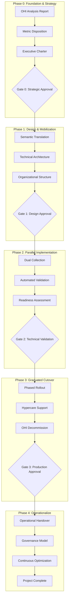

# The Definitive Enterprise Playbook for OHI to OpenTelemetry Migration

## Executive Summary

This playbook represents the definitive strategic framework for migrating from New Relic's On-Host Integrations (OHI) to OpenTelemetry (OTEL). It treats this migration not as a simple technical swap, but as a full-scale socio-technical transformation that will modernize our observability posture, reduce vendor lock-in, and improve data quality.

## Table of Contents

1. [Executive Mandate & Guiding Principles](#executive-mandate--guiding-principles)
2. [Strategic Context](#strategic-context)
3. [Five-Phase Migration Framework](#five-phase-migration-framework)
4. [Critical Success Metrics](#critical-success-metrics)
5. [Governance Structure](#governance-structure)
6. [Risk Management Framework](#risk-management-framework)
7. [Investment & Resources](#investment--resources)
8. [Communication Strategy](#communication-strategy)

## Executive Mandate & Guiding Principles

### Our Guiding Principles

1. **No Data Left Behind, No Value Left Unchecked**
   - Every OHI metric will be assessed
   - High-value signals will be replicated or redesigned
   - Low-value metrics will be explicitly deprecated with stakeholder approval

2. **Parity is the Floor, Not the Ceiling**
   - Initial goal: Achieve semantic parity with existing OHI metrics
   - Long-term goal: Leverage OTEL's richness for superior telemetry

3. **Trust but Verify, Continuously**
   - Assume nothing about correctness
   - Every stage validated through automated, data-driven analysis
   - Pre-defined success criteria gate each phase

4. **Humans are the Core of the System**
   - Success measured by teams' ability to use the new system seamlessly
   - Organizational change management is a first-class citizen
   - Training and enablement are mandatory, not optional

5. **Govern the Future State**
   - Not just migration, but establishing sustainable governance
   - Ensure telemetry ecosystem remains clean, efficient, and well-documented
   - Build for the next decade, not just the next quarter

## Strategic Context

### Business Drivers

1. **Cost Optimization**
   - Current OHI licensing costs: $X per year
   - Projected OTEL costs: $Y per year (Z% reduction)
   - ROI timeline: 18 months

2. **Technical Modernization**
   - Eliminate vendor lock-in
   - Adopt industry-standard telemetry
   - Enable multi-vendor observability strategy

3. **Operational Excellence**
   - Reduce integration maintenance overhead by 60%
   - Improve mean time to detect (MTTD) by 25%
   - Standardize telemetry across all platforms

### Current State Assessment

- **Total OHI Deployments**: X integrations across Y hosts
- **Critical Business Services Affected**: Z services
- **Total Metrics Generated**: A metrics/minute
- **Dashboards Dependent on OHI**: B dashboards
- **Alerts Using OHI Metrics**: C alert conditions

## Five-Phase Migration Framework



### Phase Timeline

| Phase | Duration | Key Milestone | Go/No-Go Criteria |
|-------|----------|---------------|-------------------|
| Phase 0 | 4 weeks | Executive Charter Signed | Business case approved, resources allocated |
| Phase 1 | 6 weeks | Architecture Approved | Semantic guide complete, org mobilized |
| Phase 2 | 8-12 weeks | Validation Passed | All success metrics met for 7+ days |
| Phase 3 | 6-8 weeks | Production Migrated | Zero P1 incidents for 5+ days |
| Phase 4 | 4 weeks | Operational Handover | Governance established, team trained |

## Critical Success Metrics

### Technical Metrics

| Metric | Target | Critical Threshold | Measurement Method |
|--------|--------|-------------------|-------------------|
| Data Completeness | 100% | Yes | All designated metrics available |
| Value Accuracy | ±5% | Yes | Statistical correlation > 0.95 |
| Entity Correlation | 100% | Yes | Same entity GUIDs generated |
| Collection Latency | <10s | No | Time to metric availability |
| Resource Overhead | <110% | No | CPU/Memory vs OHI baseline |
| Error Rate | <0.1% | Yes | Failed collections per hour |

### Business Metrics

| Metric | Target | Measurement Method |
|--------|--------|-------------------|
| Cost per Metric | -20% | Monthly billing analysis |
| Dashboard Migration | 100% | Automated inventory tracking |
| Alert Coverage | 100% | Alert firing comparison |
| User Satisfaction | >85% | Post-migration survey |
| Support Tickets | <2x baseline | Ticket volume tracking |

## Governance Structure

### Migration Guild Leadership

```yaml
executive_sponsor:
  role: "VP of Engineering"
  responsibilities:
    - Remove organizational blockers
    - Approve phase gates
    - Allocate resources
    - Communicate strategic importance

technical_lead:
  role: "Principal SRE"
  responsibilities:
    - Own technical implementation
    - Design validation framework
    - Make architectural decisions
    - Lead technical reviews

program_manager:
  role: "Senior Program Manager"
  responsibilities:
    - Coordinate cross-functional efforts
    - Track milestones and risks
    - Facilitate guild meetings
    - Manage stakeholder communications

workstream_leads:
  - integration_migration:
      owner: "Platform Team Lead"
      focus: "Technical implementation"
  
  - dashboard_alerts:
      owner: "Observability Team Lead"
      focus: "User-facing migrations"
  
  - training_enablement:
      owner: "Developer Experience Lead"
      focus: "Organizational readiness"
```

### Decision Rights Matrix (RACI)

| Decision | Sponsor | Tech Lead | PM | Workstream | Service Owner |
|----------|---------|-----------|----|-----------:|---------------|
| Phase Gate | A | R | C | I | I |
| Metric Disposition | I | R | C | C | A |
| Architecture | I | A | I | R | C |
| Rollback | A | R | I | C | I |
| Training | I | C | R | A | I |

*R=Responsible, A=Accountable, C=Consulted, I=Informed*

## Risk Management Framework

### Top Risks & Mitigations

1. **Entity Correlation Failure**
   - **Impact**: High - Breaks dashboards and alerts
   - **Probability**: Medium
   - **Mitigation**: Hierarchical identifier strategy with fallbacks
   - **Owner**: Technical Lead

2. **Cost Overrun**
   - **Impact**: High - Budget exceeded due to cardinality
   - **Probability**: Medium
   - **Mitigation**: Continuous cost monitoring, cardinality controls
   - **Owner**: Program Manager

3. **Performance Degradation**
   - **Impact**: Medium - Collection delays or data loss
   - **Probability**: Low
   - **Mitigation**: Resource limits, auto-scaling, circuit breakers
   - **Owner**: Platform Lead

4. **User Resistance**
   - **Impact**: Medium - Slow adoption, shadow IT
   - **Probability**: High
   - **Mitigation**: Early engagement, comprehensive training
   - **Owner**: Training Lead

### Risk Response Strategies

```yaml
risk_thresholds:
  automated_rollback:
    - missing_critical_metrics: 0
    - accuracy_degradation: ">10%"
    - entity_correlation_failures: ">1%"
    
  manual_intervention:
    - cost_increase: ">20%"
    - performance_degradation: ">15%"
    - support_ticket_spike: ">3x"
    
  accept_and_monitor:
    - minor_ui_differences: "documented"
    - temporary_dual_costs: "<30 days"
```

## Investment & Resources

### Budget Allocation

| Category | Amount | Justification |
|----------|--------|---------------|
| Infrastructure | $150K | OTEL collector fleet, storage |
| Tooling | $50K | Migration automation, validation |
| Training | $30K | Workshops, documentation, labs |
| Contractor Support | $100K | Specialized expertise |
| Contingency | $70K | 20% buffer for unknowns |
| **Total** | **$400K** | One-time migration investment |

### Resource Requirements

```yaml
dedicated_team:
  - technical_lead: 1.0 FTE
  - sre_engineers: 2.0 FTE
  - platform_engineers: 2.0 FTE
  - program_manager: 1.0 FTE
  
part_time_contributors:
  - service_owners: 0.2 FTE each (10 teams)
  - training_specialist: 0.5 FTE
  - technical_writer: 0.5 FTE
  
total_effort: "9.5 FTE for 6 months"
```

## Communication Strategy

### Stakeholder Communications

| Audience | Frequency | Channel | Content |
|----------|-----------|---------|---------|
| Executive Team | Bi-weekly | Email + Dashboard | Progress, risks, decisions needed |
| Service Owners | Weekly | Guild Meeting | Technical updates, action items |
| Engineering Teams | Bi-weekly | All-hands | Migration status, training schedule |
| On-call Teams | Real-time | Slack | Cutover notifications, issues |

### Communication Templates

1. **Phase Kickoff Announcement**
   - What's happening and why
   - Timeline and impacts
   - Support resources
   - Action items

2. **Service Migration Notice**
   - 2-week advance notice
   - Specific changes to expect
   - Testing instructions
   - Rollback procedures

3. **Post-Migration Summary**
   - What was migrated
   - Success metrics achieved
   - Known issues and fixes
   - Next steps

## Success Criteria & Exit Strategy

### Project Success Definition

The migration will be considered successful when:

1. All in-scope OHI integrations are decommissioned
2. All critical success metrics are met or exceeded
3. Zero P1 incidents attributable to migration for 30 days
4. Governance model is operational
5. 90% of affected teams trained and certified

### Exit Strategy

If the migration cannot proceed:

1. **Partial Success**: Maintain dual collection for successful integrations
2. **Technical Blocker**: Engage vendor support, consider alternatives
3. **Business Decision**: Document learnings, maintain OHI with optimization
4. **Complete Rollback**: Automated procedures ensure rapid restoration

## Appendices

- A. [Detailed Phase Documentation](01-foundation-strategy.md)
- B. [Technical Reference Guide](06-technical-reference.md)
- C. [Validation Framework](07-validation-framework.md)
- D. [Emergency Procedures](08-rollback-procedures.md)
- E. [Governance Templates](09-governance-templates.md)

---

*This playbook is a living document. Version control and change management procedures apply. Last updated: [Date]*