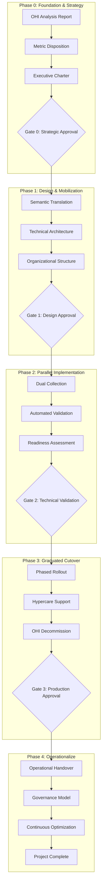

# PostgreSQL Monitoring: Enterprise Migration to OpenTelemetry

## Executive Summary

This playbook provides the strategic framework for migrating PostgreSQL database monitoring from legacy systems to OpenTelemetry. With over 250 PostgreSQL instances generating 50M+ metrics per minute, this migration represents a critical infrastructure modernization that will reduce costs by 30-40%, eliminate vendor lock-in, and establish a foundation for advanced observability capabilities.

## Table of Contents

1. [Executive Mandate & Guiding Principles](#executive-mandate--guiding-principles)
2. [Strategic Context](#strategic-context)
3. [Five-Phase Migration Framework](#five-phase-migration-framework)
4. [Critical Success Metrics](#critical-success-metrics)
5. [Governance Structure](#governance-structure)
6. [Risk Management Framework](#risk-management-framework)
7. [Investment & Resources](#investment--resources)
8. [Communication Strategy](#communication-strategy)

## Executive Mandate & Guiding Principles

### Our Guiding Principles

1. **Database-First Observability**
   - Every PostgreSQL metric critical to operations must be preserved
   - Query performance, replication lag, and connection pools are non-negotiable
   - Custom extensions and business-specific metrics included

2. **Zero Downtime Migration**
   - No monitoring blind spots during transition
   - Parallel operation validates before cutover
   - Rollback capability maintained throughout

3. **Performance Over Features**
   - Collection overhead must remain under 2% CPU
   - Network bandwidth optimized through batching
   - Cardinality controls prevent metric explosion

4. **DBA Empowerment**
   - Self-service metric exploration
   - Custom query integration
   - Historical data preservation (2+ years)

5. **Enterprise-Grade Reliability**
   - 99.99% metric collection reliability
   - Sub-minute detection of database issues
   - Automated failover for collectors

## Strategic Context

### Business Drivers

1. **Cost Optimization**
   - Current monitoring costs: $[CURRENT_ANNUAL_COST]
   - Projected OpenTelemetry costs: $[PROJECTED_COST] (target: 30-40% reduction)
   - Additional savings: Reduced operational overhead
   - ROI timeline: [TO BE CALCULATED based on actual costs]

2. **Technical Modernization**
   - Consolidate multiple monitoring tools into unified platform
   - Enable correlation across application and database metrics
   - Support for all PostgreSQL versions in use with single collector

3. **Operational Excellence**
   - Reduce false positive alerts (target: >50% reduction)
   - Improve MTTR (target: <30 minutes)
   - Enable predictive maintenance capabilities

### Current State Assessment

- **PostgreSQL Fleet**: [NUMBER] instances across [NUMBER] data centers
- **Database Sizes**: Range from [MIN_SIZE] to [MAX_SIZE]
- **Metrics Volume**: [NUMBER] data points/minute
- **Critical Dashboards**: [NUMBER] dashboards across [NUMBER] teams
- **Active Alerts**: [NUMBER] alert rules
- **Peak Query Load**: [NUMBER] queries/second

## Five-Phase Migration Framework



### Phase Timeline

| Phase | Duration | Key Milestone | Go/No-Go Criteria |
|-------|----------|---------------|-------------------|
| Phase 0 | 4 weeks | Executive Charter Signed | Business case approved, resources allocated |
| Phase 1 | 6 weeks | Architecture Approved | Semantic guide complete, org mobilized |
| Phase 2 | 8-12 weeks | Validation Passed | All success metrics met for 7+ days |
| Phase 3 | 6-8 weeks | Production Migrated | Zero P1 incidents for 5+ days |
| Phase 4 | 4 weeks | Operational Handover | Governance established, team trained |

## Critical Success Metrics

### Technical Metrics

| Metric | Target | Critical Threshold | Measurement Method |
|--------|--------|-------------------|-------------------|
| Core PostgreSQL Metrics | 100% | Yes | pg_stat_*, pg_replication_*, etc. |
| Custom Query Metrics | 100% | Yes | User-defined SQL queries |
| Metric Accuracy | ±1% | Yes | Side-by-side comparison |
| Collection Latency | <30s | Yes | Time from DB to storage |
| Collection Overhead | <2% CPU | Yes | pg_stat_activity monitoring |
| Connection Pool Usage | <10 connections | No | Per-database connection count |
| Network Bandwidth | <100Mbps per DB | No | Network monitoring |

### Operational Metrics

| Metric | Target | Measurement Method |
|--------|--------|-------------------|
| Alert Accuracy | >95% | Alert validation testing |
| Dashboard Load Time | <3s | Frontend performance monitoring |
| Query History Retention | 2 years | Storage capacity planning |
| Failover Time | <60s | Automated failover testing |
| Team Readiness | 100% certified | Training completion tracking |

## Governance Structure

### Migration Guild Leadership

```yaml
executive_sponsor:
  role: "VP of Engineering"
  responsibilities:
    - Remove organizational blockers
    - Approve phase gates
    - Allocate resources
    - Communicate strategic importance

technical_lead:
  role: "Principal SRE"
  responsibilities:
    - Own technical implementation
    - Design validation framework
    - Make architectural decisions
    - Lead technical reviews

program_manager:
  role: "Senior Program Manager"
  responsibilities:
    - Coordinate cross-functional efforts
    - Track milestones and risks
    - Facilitate guild meetings
    - Manage stakeholder communications

workstream_leads:
  - integration_migration:
      owner: "Platform Team Lead"
      focus: "Technical implementation"
  
  - dashboard_alerts:
      owner: "Observability Team Lead"
      focus: "User-facing migrations"
  
  - training_enablement:
      owner: "Developer Experience Lead"
      focus: "Organizational readiness"
```

### Decision Rights Matrix (RACI)

| Decision | Sponsor | Tech Lead | PM | Workstream | Service Owner |
|----------|---------|-----------|----|-----------:|---------------|
| Phase Gate | A | R | C | I | I |
| Metric Disposition | I | R | C | C | A |
| Architecture | I | A | I | R | C |
| Rollback | A | R | I | C | I |
| Training | I | C | R | A | I |

*R=Responsible, A=Accountable, C=Consulted, I=Informed*

## Risk Management Framework

### Top Risks & Mitigations

1. **Replication Lag Monitoring Gap**
   - **Impact**: Critical - Undetected data lag could cause data loss
   - **Probability**: Medium
   - **Mitigation**: Parallel monitoring during transition, custom lag queries
   - **Owner**: DBA Team Lead

2. **Connection Pool Exhaustion**
   - **Impact**: High - Monitoring connections could impact application
   - **Probability**: Medium
   - **Mitigation**: Dedicated monitoring user, connection limits, pgBouncer
   - **Owner**: Platform Lead

3. **Slow Query Detection Miss**
   - **Impact**: High - Performance issues go undetected
   - **Probability**: Low
   - **Mitigation**: pg_stat_statements integration, query sampling
   - **Owner**: Performance Team

4. **Storage Growth Monitoring**
   - **Impact**: High - Unexpected growth could cause outages
   - **Probability**: Medium
   - **Mitigation**: Predictive analytics, automated alerts at 80% capacity
   - **Owner**: Operations Lead

### Risk Response Strategies

```yaml
risk_thresholds:
  automated_rollback:
    - missing_critical_metrics: 0
    - accuracy_degradation: ">10%"
    - entity_correlation_failures: ">1%"
    
  manual_intervention:
    - cost_increase: ">20%"
    - performance_degradation: ">15%"
    - support_ticket_spike: ">3x"
    
  accept_and_monitor:
    - minor_ui_differences: "documented"
    - temporary_dual_costs: "<30 days"
```

## Investment & Resources

### Budget Categories

| Category | Allocation % | Justification |
|----------|--------------|---------------|
| Infrastructure | 35-40% | OpenTelemetry collectors, storage expansion |
| Tooling | 10-15% | Migration automation, validation tools |
| Training | 5-10% | DBA workshops, documentation, hands-on labs |
| Professional Services | 20-25% | PostgreSQL and OpenTelemetry expertise |
| Contingency | 20% | Risk buffer for unknowns |
| **Total** | **100%** | One-time migration investment |

### Resource Requirements

```yaml
dedicated_team:
  - technical_lead: 1.0 FTE
  - sre_engineers: 2.0 FTE
  - platform_engineers: 2.0 FTE
  - program_manager: 1.0 FTE
  
part_time_contributors:
  - service_owners: 0.2 FTE each (10 teams)
  - training_specialist: 0.5 FTE
  - technical_writer: 0.5 FTE
  
total_effort: "9.5 FTE for 6 months"
```

## Communication Strategy

### Stakeholder Communications

| Audience | Frequency | Channel | Content |
|----------|-----------|---------|---------|
| Executive Team | Bi-weekly | Email + Dashboard | Progress, risks, decisions needed |
| Service Owners | Weekly | Guild Meeting | Technical updates, action items |
| Engineering Teams | Bi-weekly | All-hands | Migration status, training schedule |
| On-call Teams | Real-time | Slack | Cutover notifications, issues |

### Communication Templates

1. **Phase Kickoff Announcement**
   - What's happening and why
   - Timeline and impacts
   - Support resources
   - Action items

2. **Service Migration Notice**
   - 2-week advance notice
   - Specific changes to expect
   - Testing instructions
   - Rollback procedures

3. **Post-Migration Summary**
   - What was migrated
   - Success metrics achieved
   - Known issues and fixes
   - Next steps

## PostgreSQL-Specific Considerations

### Critical PostgreSQL Metrics

```yaml
essential_metrics:
  availability:
    - pg_up
    - pg_postmaster_start_time
    - connection_count vs max_connections
    
  performance:
    - transaction_rate
    - cache_hit_ratio
    - checkpoint_frequency
    - vacuum_progress
    
  replication:
    - replication_lag_bytes
    - replication_slot_status
    - wal_segment_count
    
  resource_usage:
    - database_size
    - table_bloat
    - index_usage_stats
    - temp_file_usage
```

### Extension Support Requirements

- **pg_stat_statements**: Query performance monitoring
- **pg_stat_kcache**: Kernel-level statistics
- **pgaudit**: Audit logging integration
- **pg_repack**: Maintenance operation tracking
- **Custom Extensions**: Business-specific metric collection

## Success Criteria & Exit Strategy

### Project Success Definition

The migration will be considered successful when:

1. All PostgreSQL instances have OpenTelemetry collectors deployed
2. 100% of critical PostgreSQL metrics are collected with ±1% accuracy
3. Zero database monitoring blind spots for 30 consecutive days
4. All DBAs certified on new monitoring platform
5. Automated rollback tested and proven

### Exit Strategy

If the migration cannot proceed:

1. **Partial Success**: Maintain hybrid monitoring for complex databases
2. **Technical Blocker**: Engage PostgreSQL consultants and OpenTelemetry community
3. **Performance Impact**: Implement sampling and filtering strategies
4. **Complete Rollback**: Restore previous monitoring within 1 hour

## Appendices

- A. [Detailed Phase Documentation](01-foundation-strategy.md)
- B. [Technical Reference Guide](06-technical-reference.md)
- C. [Validation Framework](07-validation-framework.md)
- D. [Emergency Procedures](08-rollback-procedures.md)
- E. [Governance Templates](09-governance-templates.md)

---

*This playbook is a living document. Version control and change management procedures apply. Last updated: [Date]*