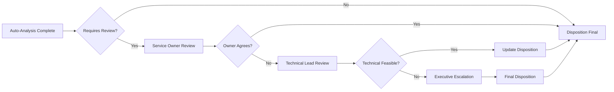
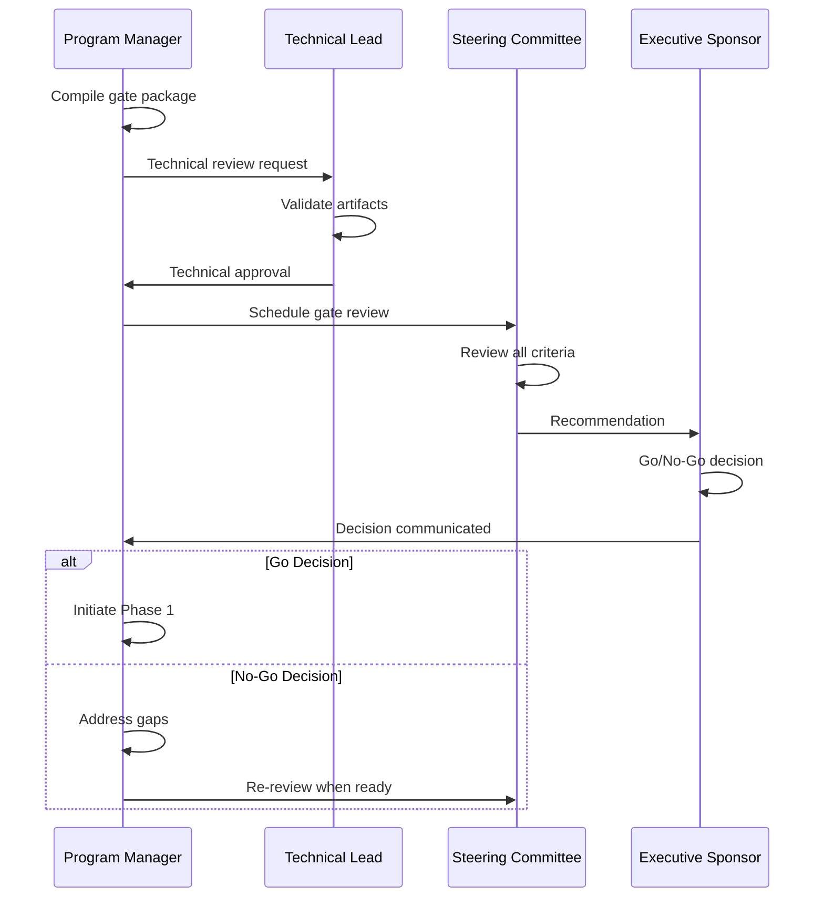

# Phase 0: Foundation & Strategy — The "Why" and "What"

## Overview

Phase 0 establishes the strategic mandate, scope, and business case for the OHI to OpenTelemetry migration. This phase ensures executive alignment and provides clarity on what will (and will not) be migrated.

## Table of Contents

1. [Phase Objectives](#phase-objectives)
2. [Entry Criteria](#entry-criteria)
3. [Metric Disposition Analysis](#metric-disposition-analysis)
4. [Risk Assessment Framework](#risk-assessment-framework)
5. [Executive Charter Development](#executive-charter-development)
6. [Cost-Benefit Analysis](#cost-benefit-analysis)
7. [Stakeholder Engagement](#stakeholder-engagement)
8. [Phase Artifacts](#phase-artifacts)
9. [Exit Criteria & Gate 0](#exit-criteria--gate-0)

## Phase Objectives

### Primary Objectives
1. Establish clear business justification for the migration
2. Define precise scope boundaries
3. Assign disposition to every OHI metric
4. Secure executive sponsorship and budget
5. Identify and mitigate strategic risks

### Success Criteria
- 100% of OHI metrics analyzed and dispositioned
- Executive charter signed by all stakeholders
- Budget approved and resources allocated
- Risk mitigation strategies defined
- Phase 1 team identified and committed

## Entry Criteria

### Required Inputs
```yaml
static_analysis_report:
  description: "Comprehensive inventory of all OHIs"
  format: "JSON/CSV"
  contents:
    - integration_name
    - version
    - deployment_count
    - host_list
    - metric_inventory
    - configuration_details

business_context:
  strategic_goals:
    - "Reduce observability costs by 15%"
    - "Standardize on open-source telemetry"
    - "Enable multi-vendor strategy"
  
  constraints:
    - "Zero downtime during migration"
    - "No degradation in alert coverage"
    - "Complete by end of fiscal year"
```

## Metric Disposition Analysis

### Automated Metric Assessment

```python
# metric_disposition_analyzer.py
import pandas as pd
import requests
from datetime import datetime, timedelta

class MetricDispositionAnalyzer:
    def __init__(self, nr_api_key, account_id):
        self.api_key = nr_api_key
        self.account_id = account_id
        self.dispositions = pd.DataFrame()
        
    def analyze_metric_usage(self, metric_name, integration):
        """Analyze usage patterns for disposition decision"""
        
        # Query usage over past 6 months
        usage_data = self._query_metric_usage(metric_name, integration)
        
        analysis = {
            'metric_name': metric_name,
            'integration': integration,
            'query_count_6mo': usage_data['query_count'],
            'unique_users': usage_data['unique_users'],
            'dashboard_count': self._count_dashboard_usage(metric_name),
            'alert_count': self._count_alert_usage(metric_name),
            'avg_value': usage_data['avg_value'],
            'has_recent_usage': usage_data['last_query_days_ago'] < 30
        }
        
        # Auto-assign disposition based on rules
        analysis['recommended_disposition'] = self._recommend_disposition(analysis)
        analysis['requires_review'] = self._needs_human_review(analysis)
        
        return analysis
    
    def _recommend_disposition(self, analysis):
        """Rule-based disposition recommendation"""
        
        if analysis['alert_count'] > 0:
            return 'REPLICATE'  # Critical - used in alerts
            
        if analysis['dashboard_count'] > 5 and analysis['has_recent_usage']:
            return 'REPLICATE'  # High visibility metric
            
        if analysis['query_count_6mo'] > 1000:
            return 'REPLICATE'  # Frequently queried
            
        if analysis['query_count_6mo'] == 0:
            return 'DEPRECATE'  # Never used
            
        if not analysis['has_recent_usage']:
            return 'DEPRECATE'  # Stale metric
            
        return 'REDESIGN'  # Moderate usage, consider optimization
    
    def generate_disposition_matrix(self, ohi_inventory):
        """Generate complete disposition matrix"""
        
        results = []
        for integration in ohi_inventory:
            for metric in integration['metrics']:
                analysis = self.analyze_metric_usage(
                    metric['name'], 
                    integration['name']
                )
                results.append(analysis)
        
        self.dispositions = pd.DataFrame(results)
        return self.dispositions
    
    def export_for_review(self, filename='metric_dispositions.xlsx'):
        """Export disposition matrix with review worksheets"""
        
        with pd.ExcelWriter(filename, engine='xlsxwriter') as writer:
            # Main disposition sheet
            self.dispositions.to_excel(
                writer, 
                sheet_name='All Metrics',
                index=False
            )
            
            # Separate sheets by disposition
            for disposition in ['REPLICATE', 'REDESIGN', 'DEPRECATE']:
                filtered = self.dispositions[
                    self.dispositions['recommended_disposition'] == disposition
                ]
                filtered.to_excel(
                    writer,
                    sheet_name=disposition,
                    index=False
                )
            
            # Metrics requiring review
            review_needed = self.dispositions[
                self.dispositions['requires_review'] == True
            ]
            review_needed.to_excel(
                writer,
                sheet_name='Needs Review',
                index=False
            )
```

### Disposition Categories

```yaml
disposition_types:
  REPLICATE:
    description: "Mission-critical metric with direct OTEL equivalent"
    criteria:
      - Used in production alerts
      - High query frequency (>1000/month)
      - Business KPI dependency
    action: "Map 1:1 to OTEL metric"
    
  REDESIGN:
    description: "Important metric requiring semantic transformation"
    criteria:
      - Moderate usage but inefficient structure
      - Opportunity for improvement
      - Multiple related metrics to consolidate
    action: "Create optimized OTEL design"
    
  DEPRECATE:
    description: "Low/no value metric to be retired"
    criteria:
      - Zero usage in 6 months
      - No business value
      - Redundant with other metrics
    action: "Document and remove"
    approval_required: "Service owner sign-off"
    
  ACCEPT_LOSS:
    description: "Technical limitation prevents migration"
    criteria:
      - No OTEL equivalent possible
      - Vendor-specific metric
      - Cost-prohibitive to replicate
    action: "Document impact and workarounds"
    approval_required: "Executive sponsor + service owner"
```

### Stakeholder Review Process



## Risk Assessment Framework

### Risk Identification Matrix

```yaml
risk_categories:
  technical_risks:
    - id: "TECH-001"
      name: "Entity Correlation Failure"
      description: "OTEL metrics create different entities than OHI"
      impact: "CRITICAL"
      probability: "MEDIUM"
      indicators:
        - Different host.id generation
        - Missing correlation attributes
        - Duplicate entities in UI
        
    - id: "TECH-002"
      name: "Metric Semantic Mismatch"
      description: "OTEL metrics have different meaning than OHI"
      impact: "HIGH"
      probability: "MEDIUM"
      indicators:
        - Rate vs gauge confusion
        - Unit differences
        - Aggregation mismatches
        
    - id: "TECH-003"
      name: "Performance Degradation"
      description: "OTEL collection impacts system performance"
      impact: "MEDIUM"
      probability: "LOW"
      indicators:
        - CPU usage >10% increase
        - Memory usage >20% increase
        - Network bandwidth saturation
        
  financial_risks:
    - id: "FIN-001"
      name: "Cost Overrun - Cardinality"
      description: "Metric cardinality explosion increases costs"
      impact: "HIGH"
      probability: "MEDIUM"
      indicators:
        - DPM increase >50%
        - High-cardinality attributes
        - Inefficient metric design
        
    - id: "FIN-002"
      name: "Dual Collection Costs"
      description: "Running both systems temporarily"
      impact: "MEDIUM"
      probability: "CERTAIN"
      indicators:
        - 2x infrastructure costs
        - 2x data ingestion costs
        - Extended timeline
        
  organizational_risks:
    - id: "ORG-001"
      name: "User Resistance"
      description: "Teams refuse to adopt new system"
      impact: "HIGH"
      probability: "MEDIUM"
      indicators:
        - Low training attendance
        - Continued OHI usage
        - Shadow monitoring solutions
        
    - id: "ORG-002"
      name: "Knowledge Gap"
      description: "Teams lack OTEL expertise"
      impact: "MEDIUM"
      probability: "HIGH"
      indicators:
        - Failed implementations
        - Misconfigured collectors
        - Poor metric design
```

### Risk Mitigation Strategies

```python
# risk_mitigation_planner.py
class RiskMitigationPlanner:
    def __init__(self, risk_registry):
        self.risks = risk_registry
        self.mitigation_plans = {}
        
    def create_mitigation_plan(self, risk_id):
        """Create specific mitigation plan for identified risk"""
        
        risk = self.risks.get(risk_id)
        
        if risk_id == "TECH-001":  # Entity Correlation
            return {
                'preventive_controls': [
                    'Implement hierarchical identifier strategy',
                    'Test entity correlation in dev first',
                    'Create entity mapping documentation'
                ],
                'detective_controls': [
                    'Automated entity comparison queries',
                    'Daily correlation report',
                    'Alert on entity mismatches'
                ],
                'corrective_controls': [
                    'Entity remapping procedures',
                    'Manual correlation override',
                    'Rollback automation'
                ],
                'owner': 'Technical Lead',
                'review_frequency': 'Weekly'
            }
            
        elif risk_id == "FIN-001":  # Cardinality
            return {
                'preventive_controls': [
                    'Cardinality analysis before deployment',
                    'Attribute allowlist enforcement',
                    'Sampling strategies for high-volume'
                ],
                'detective_controls': [
                    'Real-time cardinality monitoring',
                    'Cost projection dashboards',
                    'Daily spend alerts'
                ],
                'corrective_controls': [
                    'Emergency sampling activation',
                    'Attribute dropping rules',
                    'Metric disabling procedures'
                ],
                'owner': 'Program Manager',
                'review_frequency': 'Daily'
            }
```

## Executive Charter Development

### Charter Template

```markdown
# OHI to OpenTelemetry Migration Executive Charter

## Project Authorization

**Project Name**: Enterprise OHI to OpenTelemetry Migration
**Project Sponsor**: [Name, Title]
**Date**: [Date]
**Version**: 1.0

## Business Case

### Problem Statement
New Relic's On-Host Integrations represent a legacy approach to infrastructure monitoring that:
- Locks us into proprietary vendor formats
- Incurs licensing costs of $X annually
- Requires specialized knowledge to maintain
- Limits our ability to adopt best-of-breed observability tools

### Proposed Solution
Migrate all infrastructure monitoring to OpenTelemetry, the industry-standard, vendor-neutral telemetry framework.

### Expected Benefits
1. **Cost Reduction**: 20% reduction in observability spend
2. **Flexibility**: Multi-vendor tool support
3. **Standardization**: Industry-standard telemetry
4. **Innovation**: Access to community contributions
5. **Talent**: Easier hiring with standard skills

## Scope Definition

### In Scope
- All standard OHI integrations (MySQL, PostgreSQL, Redis, etc.)
- Associated dashboards and alerts
- Team training and documentation
- Governance model establishment

### Out of Scope
- Custom-built OHI integrations (separate project)
- Application APM migration (future phase)
- Historical data migration (retain in New Relic)

## Success Criteria
1. 100% of in-scope OHIs decommissioned
2. Zero degradation in observability coverage
3. Cost per metric reduced by minimum 20%
4. 95% user satisfaction score
5. All teams trained and certified

## Resource Commitment

### Budget
- One-time migration cost: $400,000
- Approved budget source: IT Transformation Fund

### Personnel
- Dedicated team: 6 FTEs for 6 months
- Part-time contributors: 3.5 FTE equivalent
- Executive steering: Monthly time commitment

## Timeline
- Phase 0 (Foundation): 4 weeks
- Phase 1 (Design): 6 weeks  
- Phase 2 (Implementation): 12 weeks
- Phase 3 (Migration): 8 weeks
- Phase 4 (Operationalize): 4 weeks
- **Total Duration**: 34 weeks

## Governance

### Steering Committee
- Executive Sponsor (Chair)
- VP of Engineering
- VP of Operations  
- CFO Representative
- Chief Architect

### Meeting Cadence
- Steering Committee: Monthly
- Working Group: Weekly
- Technical Reviews: Bi-weekly

## Risk Acknowledgment
Key risks have been identified and mitigation plans developed. The steering committee accepts these risks and commits to supporting mitigation efforts.

## Approval

By signing below, stakeholders commit to supporting this initiative with the required resources and authority.

| Role | Name | Signature | Date |
|------|------|-----------|------|
| Executive Sponsor | | | |
| VP Engineering | | | |
| VP Operations | | | |
| CFO | | | |
```

## Cost-Benefit Analysis

### Total Cost of Ownership (TCO) Model

```python
# tco_calculator.py
class TCOCalculator:
    def __init__(self):
        self.current_costs = {}
        self.projected_costs = {}
        self.migration_costs = {}
        
    def calculate_current_ohi_costs(self, ohi_inventory):
        """Calculate current annual OHI costs"""
        
        costs = {
            'licensing': 0,
            'infrastructure': 0,
            'operations': 0,
            'opportunity': 0
        }
        
        # Per-host licensing
        host_count = sum(len(ohi['hosts']) for ohi in ohi_inventory)
        costs['licensing'] = host_count * 150 * 12  # $150/host/month
        
        # Operations (maintenance, updates, troubleshooting)
        costs['operations'] = 2.5 * 150000  # 2.5 FTEs at $150k/year
        
        # Infrastructure (agents, network, storage)
        costs['infrastructure'] = host_count * 5 * 12  # $5/host/month
        
        # Opportunity cost (vendor lock-in premium)
        costs['opportunity'] = costs['licensing'] * 0.15  # 15% premium
        
        self.current_costs = costs
        return sum(costs.values())
    
    def calculate_otel_costs(self, ohi_inventory):
        """Project annual OTEL costs"""
        
        costs = {
            'infrastructure': 0,
            'operations': 0,
            'data_ingestion': 0,
            'tooling': 0
        }
        
        # Collector infrastructure
        collector_count = len(ohi_inventory) // 50  # 1 collector per 50 hosts
        costs['infrastructure'] = collector_count * 200 * 12  # $200/month/collector
        
        # Reduced operations (standard tooling)
        costs['operations'] = 1.5 * 150000  # 1.5 FTEs
        
        # Data ingestion (assumes 20% reduction via optimization)
        current_dpm = sum(ohi['metrics_per_minute'] for ohi in ohi_inventory)
        projected_dpm = current_dpm * 0.8
        costs['data_ingestion'] = projected_dpm * 0.00001 * 60 * 24 * 30 * 12
        
        # One-time tooling investment amortized
        costs['tooling'] = 50000 / 3  # 3-year amortization
        
        self.projected_costs = costs
        return sum(costs.values())
    
    def calculate_migration_investment(self):
        """One-time migration costs"""
        
        self.migration_costs = {
            'personnel': 400000,  # 6 months of dedicated team
            'infrastructure': 50000,  # Temporary dual-running
            'training': 30000,
            'tooling': 50000,
            'contingency': 70000
        }
        
        return sum(self.migration_costs.values())
    
    def calculate_roi(self, years=3):
        """Calculate ROI over specified period"""
        
        annual_savings = sum(self.current_costs.values()) - sum(self.projected_costs.values())
        total_savings = annual_savings * years
        migration_investment = sum(self.migration_costs.values())
        
        roi = {
            'payback_period_months': migration_investment / (annual_savings / 12),
            'three_year_roi': ((total_savings - migration_investment) / migration_investment) * 100,
            'annual_savings': annual_savings,
            'break_even_date': datetime.now() + timedelta(days=365 * migration_investment / annual_savings)
        }
        
        return roi
```

### Benefits Realization Plan

```yaml
benefits_tracking:
  immediate_benefits:  # 0-3 months
    - metric: "Reduced licensing costs"
      baseline: "$X/month"
      target: "$0/month for migrated hosts"
      measurement: "Monthly billing statements"
      
  short_term_benefits:  # 3-6 months
    - metric: "Operational efficiency"
      baseline: "40 hours/week maintenance"
      target: "20 hours/week"
      measurement: "Time tracking analysis"
      
  medium_term_benefits:  # 6-12 months
    - metric: "Tool flexibility"
      baseline: "1 vendor (New Relic)"
      target: "3+ compatible tools"
      measurement: "Tool inventory"
      
  long_term_benefits:  # 12+ months
    - metric: "Innovation velocity"
      baseline: "2 new integrations/year"
      target: "10+ new integrations/year"
      measurement: "Integration catalog growth"
```

## Stakeholder Engagement

### Stakeholder Analysis Matrix

```yaml
stakeholder_groups:
  decision_makers:
    - role: "Executive Sponsor"
      interest: "HIGH"
      influence: "HIGH"
      engagement_strategy: "Manage Closely"
      communication_needs:
        - Executive dashboard
        - Monthly steering committee
        - Exception-based escalations
        
  affected_teams:
    - role: "Service Owners"
      interest: "HIGH"
      influence: "MEDIUM"
      engagement_strategy: "Keep Satisfied"
      communication_needs:
        - Detailed migration schedules
        - Training opportunities
        - Support channels
        
    - role: "On-Call Engineers"
      interest: "HIGH"
      influence: "LOW"
      engagement_strategy: "Keep Informed"
      communication_needs:
        - Alert migration notices
        - Runbook updates
        - Emergency procedures
        
  support_teams:
    - role: "Platform Team"
      interest: "MEDIUM"
      influence: "HIGH"
      engagement_strategy: "Maintain Confidence"
      communication_needs:
        - Technical deep-dives
        - Architecture reviews
        - Resource requirements
```

### Communication Plan

```python
# communication_scheduler.py
class CommunicationScheduler:
    def __init__(self, stakeholder_matrix, project_timeline):
        self.stakeholders = stakeholder_matrix
        self.timeline = project_timeline
        self.communication_calendar = []
        
    def generate_phase0_communications(self):
        """Create Phase 0 specific communications"""
        
        communications = [
            {
                'week': 1,
                'audience': 'All Stakeholders',
                'type': 'Kickoff Announcement',
                'channel': 'Email + All-Hands',
                'content': 'project_kickoff_template.md',
                'owner': 'Program Manager'
            },
            {
                'week': 2,
                'audience': 'Service Owners',
                'type': 'Metric Review Request',
                'channel': 'Email + Meeting',
                'content': 'metric_disposition_review.md',
                'owner': 'Technical Lead'
            },
            {
                'week': 3,
                'audience': 'Executive Sponsors',
                'type': 'Charter Review',
                'channel': 'Presentation',
                'content': 'executive_charter_deck.pptx',
                'owner': 'Program Manager'
            },
            {
                'week': 4,
                'audience': 'All Engineers',
                'type': 'Phase 1 Preview',
                'channel': 'Tech Talk',
                'content': 'technical_approach_preview.md',
                'owner': 'Technical Lead'
            }
        ]
        
        return communications
```

## Phase Artifacts

### Required Deliverables

```yaml
phase_0_artifacts:
  metric_disposition_matrix:
    format: "Excel/CSV"
    location: "sharepoint://migration/phase0/dispositions.xlsx"
    status: "REQUIRED"
    approvers: ["Service Owners", "Technical Lead"]
    
  executive_charter:
    format: "PDF (signed)"
    location: "sharepoint://migration/phase0/charter.pdf"
    status: "REQUIRED"
    approvers: ["All Executives"]
    
  risk_register:
    format: "JIRA/Excel"
    location: "jira://MIGRATE/risks"
    status: "REQUIRED"
    approvers: ["Program Manager", "Sponsor"]
    
  cost_benefit_analysis:
    format: "Excel with models"
    location: "sharepoint://migration/phase0/tco.xlsx"
    status: "REQUIRED"
    approvers: ["CFO Representative"]
    
  communication_plan:
    format: "Project document"
    location: "sharepoint://migration/phase0/comms.docx"
    status: "REQUIRED"
    approvers: ["Program Manager"]
    
  phase_1_team_roster:
    format: "YAML/Doc"
    location: "sharepoint://migration/phase0/team.yaml"
    status: "REQUIRED"
    approvers: ["All Managers"]
```

### Artifact Quality Checklist

```markdown
## Metric Disposition Matrix
- [ ] 100% of OHI metrics included
- [ ] Usage data for past 6 months analyzed
- [ ] Service owner sign-off obtained
- [ ] Technical feasibility validated
- [ ] No metrics marked "Unknown"

## Executive Charter
- [ ] All sections completed
- [ ] Success criteria quantified
- [ ] Budget approved by finance
- [ ] Timeline validated by teams
- [ ] All signatures obtained

## Risk Register
- [ ] All risk categories assessed
- [ ] Mitigation plans defined
- [ ] Owners assigned
- [ ] Review schedule established
- [ ] Contingency budget allocated

## Cost-Benefit Analysis
- [ ] Current costs validated
- [ ] Projections peer-reviewed
- [ ] Assumptions documented
- [ ] Sensitivity analysis complete
- [ ] ROI clearly demonstrated
```

## Exit Criteria & Gate 0

### Go/No-Go Decision Framework

```yaml
gate_0_criteria:
  mandatory_requirements:  # All must be YES
    - criterion: "Executive charter signed"
      verification: "Signed document in repository"
      status: "REQUIRED"
      
    - criterion: "Budget approved"
      verification: "Finance approval email"
      status: "REQUIRED"
      
    - criterion: "100% metrics dispositioned"
      verification: "Completed disposition matrix"
      status: "REQUIRED"
      
    - criterion: "Phase 1 team committed"
      verification: "Manager confirmations"
      status: "REQUIRED"
      
  quality_thresholds:  # Minimum scores required
    - criterion: "Stakeholder alignment"
      measurement: "Survey score > 80%"
      status: "REQUIRED"
      
    - criterion: "Risk mitigation readiness"
      measurement: "> 90% risks have mitigation plans"
      status: "REQUIRED"
      
    - criterion: "ROI demonstration"
      measurement: "Payback period < 18 months"
      status: "REQUIRED"
```

### Gate Review Process



### No-Go Remediation

```yaml
no_go_scenarios:
  missing_executive_support:
    indicators:
      - Charter not signed
      - Budget not approved
      - Stakeholder resistance
    remediation:
      - Executive 1:1 sessions
      - Business case refinement
      - Pilot program proposal
      
  incomplete_metric_analysis:
    indicators:
      - Metrics without disposition
      - Service owner disagreement
      - Technical blockers found
    remediation:
      - Extended analysis period
      - Technical spike investigations
      - Compromise negotiations
      
  unacceptable_risk:
    indicators:
      - Critical risks without mitigation
      - Cost projections unfavorable
      - Resource unavailability
    remediation:
      - Risk workshop sessions
      - Phased approach design
      - Resource reallocation
```

## Phase 0 Success Metrics

```yaml
phase_metrics:
  efficiency:
    - metric: "Phase duration"
      target: "4 weeks"
      actual: "TBD"
      
    - metric: "Stakeholder meetings"
      target: "< 20 total"
      actual: "TBD"
      
  quality:
    - metric: "Disposition accuracy"
      target: "> 95% on first pass"
      actual: "TBD"
      
    - metric: "Artifact completeness"
      target: "100%"
      actual: "TBD"
      
  engagement:
    - metric: "Stakeholder participation"
      target: "> 90% attendance"
      actual: "TBD"
      
    - metric: "Feedback score"
      target: "> 4.0/5.0"
      actual: "TBD"
```

---

*Phase 0 is the foundation of success. A thorough, well-executed Phase 0 prevents costly mistakes and ensures smooth execution in subsequent phases.*