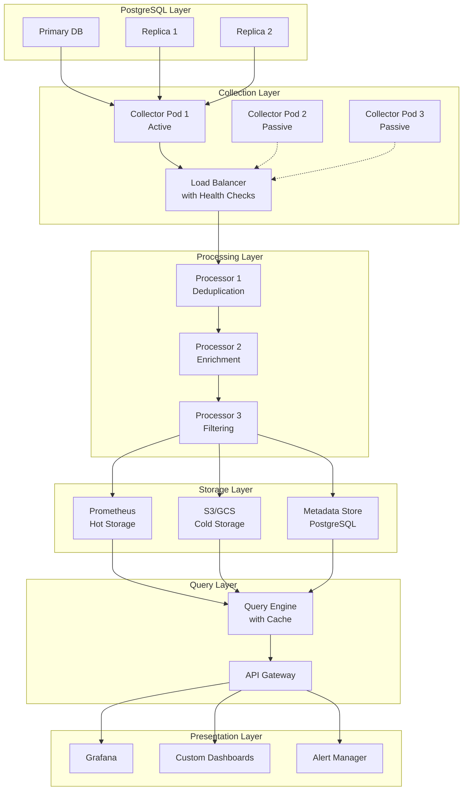

# PostgreSQL OpenTelemetry Architecture Reference

## Executive Summary

This document provides the comprehensive architectural blueprint for PostgreSQL monitoring with OpenTelemetry, addressing multi-version support, high availability, security, and scalability for enterprise deployments.

## Table of Contents

1. [Architecture Principles](#architecture-principles)
2. [Multi-Version PostgreSQL Support](#multi-version-postgresql-support)
3. [High Availability Design](#high-availability-design)
4. [Scalability Architecture](#scalability-architecture)
5. [Security Architecture](#security-architecture)
6. [Data Flow Architecture](#data-flow-architecture)
7. [Integration Architecture](#integration-architecture)

## Architecture Principles

### Core Principles

1. **Version Agnostic**: Support PostgreSQL 11-16 with single architecture
2. **Zero Single Points of Failure**: All components must be redundant
3. **Horizontal Scalability**: Handle growth from 10 to 10,000 databases
4. **Security First**: Zero-trust network model, encryption everywhere
5. **Observable Observability**: Monitor the monitoring system

### Design Decisions

```yaml
architectural_decisions:
  collector_deployment:
    decision: "Sidecar pattern with DaemonSet fallback"
    rationale: "Provides best isolation with fallback for legacy systems"
    
  metric_storage:
    decision: "Prometheus + Object Storage"
    rationale: "Hot/cold tiering for cost optimization"
    
  high_availability:
    decision: "Active-passive with automatic failover"
    rationale: "Simplifies deduplication while ensuring availability"
    
  security_model:
    decision: "mTLS + RBAC + Secret rotation"
    rationale: "Defense in depth approach"
```

## Multi-Version PostgreSQL Support

### Version Compatibility Matrix

```yaml
postgresql_versions:
  "11.x":
    min_version: "11.9"
    catalog_schema: "v11"
    features:
      wal_directory: "pg_xlog"
      replication_function: "pg_xlog_location_diff"
      stats_reset_function: "pg_stat_reset"
    limitations:
      - "No pg_stat_progress_* views"
      - "Limited wait event types"
      
  "12.x":
    min_version: "12.4"
    catalog_schema: "v12"
    features:
      wal_directory: "pg_wal"
      replication_function: "pg_wal_lsn_diff"
      stats_reset_function: "pg_stat_reset"
      progress_reporting: ["vacuum", "cluster", "create_index"]
    
  "13.x":
    min_version: "13.0"
    catalog_schema: "v13"
    features:
      wal_directory: "pg_wal"
      replication_function: "pg_wal_lsn_diff"
      parallel_vacuum: true
      trusted_extensions: true
      
  "14.x":
    min_version: "14.0"
    catalog_schema: "v14"
    features:
      predefined_roles: ["pg_read_all_data", "pg_write_all_data"]
      query_id_in_stats: true
      
  "15.x":
    min_version: "15.0"
    catalog_schema: "v15"
    features:
      merge_command: true
      unique_nulls: true
      icu_collations: true
      
  "16.x":
    min_version: "16.0"
    catalog_schema: "v16"
    features:
      logical_replication_parallel: true
      stats_io: true
```

### Version-Specific Query Templates

```sql
-- version_queries.sql
-- Template system for version-specific queries

-- Replication lag query template

SELECT 
  application_name,
  client_addr,
  state,
  sent_lsn,
  write_lsn,
  flush_lsn,
  replay_lsn,
  pg_wal_lsn_diff(sent_lsn, replay_lsn) as lag_bytes,
  extract(epoch from (now() - reply_time)) as lag_seconds
FROM pg_stat_replication;

SELECT 
  application_name,
  client_addr,
  state,
  sent_location as sent_lsn,
  write_location as write_lsn,
  flush_location as flush_lsn,
  replay_location as replay_lsn,
  pg_xlog_location_diff(sent_location, replay_location) as lag_bytes,
  extract(epoch from (now() - reply_time)) as lag_seconds
FROM pg_stat_replication;


-- Stats I/O query (PostgreSQL 16+ only)

SELECT 
  backend_type,
  object,
  context,
  reads,
  writes,
  extends,
  op_bytes,
  evictions,
  reuses,
  fsyncs
FROM pg_stat_io
WHERE backend_type NOT IN ('autovacuum launcher', 'autovacuum worker');

```

### Version Detection and Auto-Configuration

```go
// version_detector.go
package collector

import (
    "database/sql"
    "fmt"
    "regexp"
)

type PostgreSQLVersion struct {
    Major   int
    Minor   int
    Patch   int
    String  string
    Numeric int // e.g., 140005 for 14.5
}

type VersionConfig struct {
    Queries        map[string]string
    MetricMappings map[string]string
    Features       map[string]bool
}

func DetectVersion(db *sql.DB) (*PostgreSQLVersion, error) {
    var versionString string
    err := db.QueryRow("SELECT version()").Scan(&versionString)
    if err != nil {
        return nil, err
    }
    
    // Parse version string
    re := regexp.MustCompile(`PostgreSQL (\d+)\.(\d+)(?:\.(\d+))?`)
    matches := re.FindStringSubmatch(versionString)
    
    if len(matches) < 3 {
        return nil, fmt.Errorf("unable to parse version: %s", versionString)
    }
    
    version := &PostgreSQLVersion{
        String: versionString,
    }
    
    fmt.Sscanf(matches[1], "%d", &version.Major)
    fmt.Sscanf(matches[2], "%d", &version.Minor)
    if len(matches) > 3 && matches[3] != "" {
        fmt.Sscanf(matches[3], "%d", &version.Patch)
    }
    
    // Calculate numeric version
    version.Numeric = version.Major * 10000 + version.Minor * 100 + version.Patch
    
    return version, nil
}

func GetVersionConfig(version *PostgreSQLVersion) *VersionConfig {
    config := &VersionConfig{
        Queries:        make(map[string]string),
        MetricMappings: make(map[string]string),
        Features:       make(map[string]bool),
    }
    
    // Base queries for all versions
    config.Queries["database_size"] = `
        SELECT datname, pg_database_size(datname) as size_bytes 
        FROM pg_database WHERE datname NOT IN ('template0', 'template1')
    `
    
    // Version-specific configurations
    switch {
    case version.Major >= 16:
        config.Features["stats_io"] = true
        config.Queries["io_stats"] = `SELECT * FROM pg_stat_io`
        
    case version.Major >= 14:
        config.Features["query_id"] = true
        config.Queries["statements"] = `
            SELECT queryid, query, calls, total_exec_time 
            FROM pg_stat_statements
        `
        
    case version.Major >= 12:
        config.Features["progress_reporting"] = true
        config.Queries["vacuum_progress"] = `
            SELECT * FROM pg_stat_progress_vacuum
        `
    }
    
    // WAL/XLOG function names
    if version.Major >= 12 {
        config.MetricMappings["wal_function"] = "pg_wal_lsn_diff"
        config.MetricMappings["wal_directory"] = "pg_wal"
    } else {
        config.MetricMappings["wal_function"] = "pg_xlog_location_diff"
        config.MetricMappings["wal_directory"] = "pg_xlog"
    }
    
    return config
}
```

## High Availability Design

### HA Architecture Overview

```
┌─────────────────────────────────────────────────────────────┐
│                   PostgreSQL Cluster                        │
│  ┌──────────────┐  ┌──────────────┐  ┌──────────────┐    │
│  │   Primary    │  │  Replica 1   │  │  Replica 2   │    │
│  └──────┬───────┘  └──────┬───────┘  └──────┬───────┘    │
│         │                  │                  │             │
└─────────┼──────────────────┼──────────────────┼────────────┘
          │                  │                  │
          ▼                  ▼                  ▼
    ┌─────────────────────────────────────────────────┐
    │            Collector Pool (HA)                   │
    │  ┌─────────────┐  ┌─────────────┐  ┌─────────┐ │
    │  │ Collector 1 │  │ Collector 2 │  │  Backup │ │
    │  │  (Active)   │  │  (Passive)  │  │         │ │
    │  └──────┬──────┘  └──────┬──────┘  └────┬────┘ │
    │         │                 │               │      │
    │    ┌────▼─────────────────▼───────────────▼───┐ │
    │    │     Coordination Service (etcd/consul)    │ │
    │    │  - Leader Election                        │ │
    │    │  - Configuration Management               │ │
    │    │  - Health Monitoring                      │ │
    │    └───────────────────┬───────────────────────┘ │
    └────────────────────────┼─────────────────────────┘
                             │
                    ┌────────▼────────┐
                    │ Load Balancer   │
                    │ (VIP/HAProxy)   │
                    └────────┬────────┘
                             │
                    ┌────────▼────────┐
                    │ Storage Layer   │
                    │ (Prometheus HA) │
                    └─────────────────┘
```

### Leader Election Implementation

```go
// leader_election.go
package ha

import (
    "context"
    "time"
    
    "go.etcd.io/etcd/client/v3"
    "go.etcd.io/etcd/client/v3/concurrency"
)

type LeaderElector struct {
    client   *clientv3.Client
    session  *concurrency.Session
    election *concurrency.Election
    id       string
    isLeader bool
}

func NewLeaderElector(endpoints []string, id string) (*LeaderElector, error) {
    client, err := clientv3.New(clientv3.Config{
        Endpoints:   endpoints,
        DialTimeout: 5 * time.Second,
    })
    if err != nil {
        return nil, err
    }
    
    session, err := concurrency.NewSession(client, concurrency.WithTTL(10))
    if err != nil {
        return nil, err
    }
    
    election := concurrency.NewElection(session, "/otel-collector-leader")
    
    return &LeaderElector{
        client:   client,
        session:  session,
        election: election,
        id:       id,
    }, nil
}

func (le *LeaderElector) RunForLeader(ctx context.Context) error {
    // Campaign to be leader
    if err := le.election.Campaign(ctx, le.id); err != nil {
        return err
    }
    
    le.isLeader = true
    return nil
}

func (le *LeaderElector) IsLeader() bool {
    return le.isLeader
}

func (le *LeaderElector) Resign(ctx context.Context) error {
    le.isLeader = false
    return le.election.Resign(ctx)
}
```

### Deduplication Strategy

```go
// deduplication.go
package ha

import (
    "crypto/md5"
    "fmt"
    "sync"
    "time"
)

type MetricDeduplicator struct {
    seen     map[string]time.Time
    mu       sync.RWMutex
    ttl      time.Duration
    cleanupInterval time.Duration
}

func NewMetricDeduplicator(ttl, cleanupInterval time.Duration) *MetricDeduplicator {
    md := &MetricDeduplicator{
        seen:            make(map[string]time.Time),
        ttl:             ttl,
        cleanupInterval: cleanupInterval,
    }
    
    go md.cleanup()
    return md
}

func (md *MetricDeduplicator) IsDuplicate(metric Metric) bool {
    fingerprint := md.fingerprint(metric)
    
    md.mu.RLock()
    lastSeen, exists := md.seen[fingerprint]
    md.mu.RUnlock()
    
    if !exists {
        md.mu.Lock()
        md.seen[fingerprint] = time.Now()
        md.mu.Unlock()
        return false
    }
    
    // If we've seen this metric recently, it's a duplicate
    if time.Since(lastSeen) < md.ttl {
        return true
    }
    
    // Update last seen time
    md.mu.Lock()
    md.seen[fingerprint] = time.Now()
    md.mu.Unlock()
    
    return false
}

func (md *MetricDeduplicator) fingerprint(metric Metric) string {
    h := md5.New()
    h.Write([]byte(metric.Name))
    h.Write([]byte(fmt.Sprintf("%d", metric.Timestamp.Unix())))
    
    // Include sorted labels in fingerprint
    for _, label := range metric.SortedLabels() {
        h.Write([]byte(label.Key))
        h.Write([]byte(label.Value))
    }
    
    return fmt.Sprintf("%x", h.Sum(nil))
}

func (md *MetricDeduplicator) cleanup() {
    ticker := time.NewTicker(md.cleanupInterval)
    defer ticker.Stop()
    
    for range ticker.C {
        md.mu.Lock()
        now := time.Now()
        for fingerprint, lastSeen := range md.seen {
            if now.Sub(lastSeen) > md.ttl {
                delete(md.seen, fingerprint)
            }
        }
        md.mu.Unlock()
    }
}
```

## Scalability Architecture

### Large-Scale Database Handling

```yaml
# scalability_config.yaml
scalability:
  cardinality_limits:
    max_tables_per_query: 1000
    max_indexes_per_query: 5000
    max_metrics_per_batch: 10000
    
  sampling_strategies:
    table_metrics:
      enabled: true
      rules:
        - condition: "table_count > 10000"
          sample_rate: 0.1
          priority_filter: "n_live_tup > 100000 OR n_dead_tup > 10000"
          
        - condition: "table_count > 1000"
          sample_rate: 0.5
          priority_filter: "n_live_tup > 10000"
    
    index_metrics:
      enabled: true
      rules:
        - condition: "index_count > 10000"
          sample_rate: 0.05
          priority_filter: "idx_scan > 1000 OR idx_tup_read > 100000"
  
  partitioning_support:
    detect_partitioned_tables: true
    aggregate_partition_metrics: true
    partition_limit_per_parent: 100
```

### Query Optimization for Scale

```sql
-- optimized_queries.sql

-- Batched table statistics query with sampling
WITH sampled_tables AS (
    -- For large schemas, sample tables based on activity
    SELECT 
        schemaname,
        tablename,
        n_live_tup,
        n_dead_tup
    FROM pg_stat_user_tables
    WHERE 
        CASE 
            WHEN (SELECT COUNT(*) FROM pg_stat_user_tables) > 10000 
            THEN random() < 0.1 AND (n_live_tup > 100000 OR n_dead_tup > 10000)
            
            WHEN (SELECT COUNT(*) FROM pg_stat_user_tables) > 1000
            THEN random() < 0.5 AND (n_live_tup > 10000)
            
            ELSE true
        END
),
table_metrics AS (
    SELECT 
        schemaname,
        tablename,
        pg_total_relation_size(schemaname||'.'||tablename) as total_size,
        n_live_tup,
        n_dead_tup,
        n_mod_since_analyze,
        last_vacuum,
        last_autovacuum,
        last_analyze,
        last_autoanalyze
    FROM sampled_tables
)
SELECT 
    json_build_object(
        'timestamp', EXTRACT(epoch FROM now()),
        'metrics', json_agg(table_metrics)
    ) as batch_result
FROM table_metrics;

-- Partitioned table aggregation
WITH partition_hierarchy AS (
    SELECT 
        c.oid AS partition_oid,
        p.oid AS parent_oid,
        c.relname AS partition_name,
        p.relname AS parent_name,
        n.nspname AS schemaname
    FROM pg_class c
    JOIN pg_inherits i ON c.oid = i.inhrelid
    JOIN pg_class p ON i.inhparent = p.oid
    JOIN pg_namespace n ON c.relnamespace = n.oid
    WHERE c.relkind = 'r' AND p.relkind = 'p'
),
partition_stats AS (
    SELECT 
        ph.parent_name,
        ph.schemaname,
        COUNT(*) as partition_count,
        SUM(pg_total_relation_size(ph.partition_oid)) as total_size,
        SUM(s.n_live_tup) as total_live_tuples,
        SUM(s.n_dead_tup) as total_dead_tuples
    FROM partition_hierarchy ph
    LEFT JOIN pg_stat_user_tables s 
        ON s.schemaname = ph.schemaname 
        AND s.tablename = ph.partition_name
    GROUP BY ph.parent_name, ph.schemaname
    -- Limit partitions analyzed per parent
    HAVING COUNT(*) <= 100
)
SELECT json_agg(partition_stats) as partition_metrics
FROM partition_stats;
```

### Auto-Scaling Configuration

```yaml
# autoscaling.yaml
apiVersion: autoscaling/v2
kind: HorizontalPodAutoscaler
metadata:
  name: otel-collector-hpa
  namespace: monitoring
spec:
  scaleTargetRef:
    apiVersion: apps/v1
    kind: Deployment
    name: otel-collector
  minReplicas: 3
  maxReplicas: 50
  behavior:
    scaleDown:
      stabilizationWindowSeconds: 300
      policies:
      - type: Percent
        value: 10
        periodSeconds: 60
    scaleUp:
      stabilizationWindowSeconds: 60
      policies:
      - type: Percent
        value: 50
        periodSeconds: 60
      - type: Pods
        value: 5
        periodSeconds: 60
  metrics:
  - type: Resource
    resource:
      name: cpu
      target:
        type: Utilization
        averageUtilization: 70
  - type: Resource
    resource:
      name: memory
      target:
        type: Utilization
        averageUtilization: 80
  - type: Pods
    pods:
      metric:
        name: otelcol_receiver_accepted_metric_points_rate
      target:
        type: AverageValue
        averageValue: "1000000"  # 1M metrics/second per pod
```

## Security Architecture

### Zero-Trust Security Model

```yaml
security_architecture:
  network_security:
    principles:
      - "No implicit trust"
      - "Verify explicitly"
      - "Least privilege access"
    
    implementation:
      mtls:
        enabled: true
        ca_issuer: "internal-ca"
        certificate_rotation: "30d"
        
      network_policies:
        default_deny: true
        allowed_connections:
          - from: "otel-collector"
            to: "postgresql"
            port: 5432
            protocol: "TCP"
          
          - from: "otel-collector"
            to: "prometheus"
            port: 9090
            protocol: "TCP"
  
  authentication:
    postgresql:
      method: "scram-sha-256"
      password_rotation: "automated"
      rotation_interval: "30d"
      
    service_accounts:
      token_expiry: "1h"
      refresh_enabled: true
      
  authorization:
    rbac:
      enabled: true
      roles:
        - name: "metrics-reader"
          permissions: ["read"]
          resources: ["metrics", "dashboards"]
          
        - name: "metrics-admin"
          permissions: ["read", "write", "delete"]
          resources: ["metrics", "dashboards", "alerts"]
  
  encryption:
    at_rest:
      enabled: true
      algorithm: "AES-256-GCM"
      key_management: "HSM"
      
    in_transit:
      tls_version: "1.3"
      cipher_suites:
        - "TLS_AES_256_GCM_SHA384"
        - "TLS_CHACHA20_POLY1305_SHA256"
```

### Secret Management Implementation

```go
// secret_manager.go
package security

import (
    "context"
    "fmt"
    "time"
    
    vault "github.com/hashicorp/vault/api"
    "github.com/aws/aws-sdk-go/service/secretsmanager"
)

type SecretManager interface {
    GetDatabaseCredentials(ctx context.Context, dbName string) (*DatabaseCredentials, error)
    RotateCredentials(ctx context.Context, dbName string) error
}

type DatabaseCredentials struct {
    Username string
    Password string
    Host     string
    Port     int
    Database string
    SSLMode  string
    ValidUntil time.Time
}

// HashiCorp Vault implementation
type VaultSecretManager struct {
    client *vault.Client
    path   string
}

func (v *VaultSecretManager) GetDatabaseCredentials(ctx context.Context, dbName string) (*DatabaseCredentials, error) {
    secret, err := v.client.Logical().Read(fmt.Sprintf("%s/creds/%s", v.path, dbName))
    if err != nil {
        return nil, err
    }
    
    return &DatabaseCredentials{
        Username: secret.Data["username"].(string),
        Password: secret.Data["password"].(string),
        ValidUntil: time.Now().Add(time.Duration(secret.LeaseDuration) * time.Second),
    }, nil
}

// AWS Secrets Manager implementation
type AWSSecretManager struct {
    client *secretsmanager.SecretsManager
}

func (a *AWSSecretManager) GetDatabaseCredentials(ctx context.Context, dbName string) (*DatabaseCredentials, error) {
    input := &secretsmanager.GetSecretValueInput{
        SecretId: aws.String(fmt.Sprintf("rds/%s/monitoring", dbName)),
    }
    
    result, err := a.client.GetSecretValueWithContext(ctx, input)
    if err != nil {
        return nil, err
    }
    
    var creds DatabaseCredentials
    if err := json.Unmarshal([]byte(*result.SecretString), &creds); err != nil {
        return nil, err
    }
    
    return &creds, nil
}

// Credential rotation coordinator
type CredentialRotator struct {
    secretManager SecretManager
    databases     []string
    interval      time.Duration
}

func (cr *CredentialRotator) Start(ctx context.Context) {
    ticker := time.NewTicker(cr.interval)
    defer ticker.Stop()
    
    for {
        select {
        case <-ticker.C:
            for _, db := range cr.databases {
                if err := cr.rotateDatabase(ctx, db); err != nil {
                    // Log error and continue
                    continue
                }
            }
        case <-ctx.Done():
            return
        }
    }
}
```

## Data Flow Architecture

### End-to-End Data Flow



### Data Processing Pipeline

```go
// pipeline.go
package processing

type MetricPipeline struct {
    stages []PipelineStage
}

type PipelineStage interface {
    Process(context.Context, []Metric) ([]Metric, error)
    Name() string
}

// Deduplication stage
type DeduplicationStage struct {
    deduplicator *MetricDeduplicator
}

func (d *DeduplicationStage) Process(ctx context.Context, metrics []Metric) ([]Metric, error) {
    unique := make([]Metric, 0, len(metrics))
    
    for _, metric := range metrics {
        if !d.deduplicator.IsDuplicate(metric) {
            unique = append(unique, metric)
        }
    }
    
    return unique, nil
}

// Enrichment stage
type EnrichmentStage struct {
    metadataStore MetadataStore
}

func (e *EnrichmentStage) Process(ctx context.Context, metrics []Metric) ([]Metric, error) {
    for i := range metrics {
        // Add cluster metadata
        if cluster, err := e.metadataStore.GetClusterInfo(metrics[i].Labels["instance"]); err == nil {
            metrics[i].Labels["cluster"] = cluster.Name
            metrics[i].Labels["environment"] = cluster.Environment
            metrics[i].Labels["region"] = cluster.Region
        }
        
        // Add business metadata
        if business, err := e.metadataStore.GetBusinessInfo(metrics[i].Labels["database"]); err == nil {
            metrics[i].Labels["team"] = business.OwnerTeam
            metrics[i].Labels["service"] = business.ServiceName
            metrics[i].Labels["criticality"] = business.Criticality
        }
    }
    
    return metrics, nil
}

// Filtering stage
type FilteringStage struct {
    rules []FilterRule
}

func (f *FilteringStage) Process(ctx context.Context, metrics []Metric) ([]Metric, error) {
    filtered := make([]Metric, 0, len(metrics))
    
    for _, metric := range metrics {
        if f.shouldKeep(metric) {
            filtered = append(filtered, metric)
        }
    }
    
    return filtered, nil
}
```

## Integration Architecture

### Service Mesh Integration

```yaml
# istio-integration.yaml
apiVersion: v1
kind: Service
metadata:
  name: otel-collector
  namespace: monitoring
  labels:
    app: otel-collector
spec:
  ports:
  - name: grpc-otlp
    port: 4317
    protocol: TCP
  - name: http-metrics
    port: 8888
    protocol: TCP
  selector:
    app: otel-collector

---
apiVersion: networking.istio.io/v1beta1
kind: VirtualService
metadata:
  name: otel-collector
  namespace: monitoring
spec:
  hosts:
  - otel-collector
  http:
  - match:
    - uri:
        prefix: "/metrics"
    route:
    - destination:
        host: otel-collector
        port:
          number: 8888
  tcp:
  - match:
    - port: 4317
    route:
    - destination:
        host: otel-collector
        port:
          number: 4317

---
apiVersion: security.istio.io/v1beta1
kind: PeerAuthentication
metadata:
  name: otel-collector
  namespace: monitoring
spec:
  selector:
    matchLabels:
      app: otel-collector
  mtls:
    mode: STRICT

---
apiVersion: networking.istio.io/v1beta1
kind: DestinationRule
metadata:
  name: otel-collector
  namespace: monitoring
spec:
  host: otel-collector
  trafficPolicy:
    connectionPool:
      tcp:
        maxConnections: 100
      http:
        http1MaxPendingRequests: 100
        http2MaxRequests: 100
    loadBalancer:
      simple: LEAST_REQUEST
    tls:
      mode: ISTIO_MUTUAL
```

### API Gateway Design

```go
// api_gateway.go
package api

import (
    "net/http"
    "time"
    
    "github.com/gorilla/mux"
    "github.com/prometheus/client_golang/prometheus"
)

type APIGateway struct {
    router        *mux.Router
    queryEngine   QueryEngine
    cache         Cache
    rateLimiter   RateLimiter
    authenticator Authenticator
}

func (ag *APIGateway) SetupRoutes() {
    ag.router.Use(ag.authMiddleware)
    ag.router.Use(ag.rateLimitMiddleware)
    ag.router.Use(ag.metricsMiddleware)
    
    // Query endpoints
    ag.router.HandleFunc("/api/v1/query", ag.handleQuery).Methods("GET", "POST")
    ag.router.HandleFunc("/api/v1/query_range", ag.handleQueryRange).Methods("GET", "POST")
    
    // Metadata endpoints
    ag.router.HandleFunc("/api/v1/labels", ag.handleLabels).Methods("GET")
    ag.router.HandleFunc("/api/v1/series", ag.handleSeries).Methods("GET")
    
    // Health checks
    ag.router.HandleFunc("/health", ag.handleHealth).Methods("GET")
    ag.router.HandleFunc("/ready", ag.handleReady).Methods("GET")
}

func (ag *APIGateway) handleQuery(w http.ResponseWriter, r *http.Request) {
    ctx := r.Context()
    query := r.FormValue("query")
    
    // Check cache
    cacheKey := ag.cacheKey(query, time.Now().Truncate(15*time.Second))
    if cached, found := ag.cache.Get(cacheKey); found {
        ag.writeJSON(w, cached)
        return
    }
    
    // Execute query
    result, err := ag.queryEngine.Query(ctx, query)
    if err != nil {
        ag.writeError(w, err)
        return
    }
    
    // Cache result
    ag.cache.Set(cacheKey, result, 15*time.Second)
    
    ag.writeJSON(w, result)
}

func (ag *APIGateway) authMiddleware(next http.Handler) http.Handler {
    return http.HandlerFunc(func(w http.ResponseWriter, r *http.Request) {
        token := r.Header.Get("Authorization")
        
        user, err := ag.authenticator.Authenticate(token)
        if err != nil {
            http.Error(w, "Unauthorized", http.StatusUnauthorized)
            return
        }
        
        ctx := context.WithValue(r.Context(), "user", user)
        next.ServeHTTP(w, r.WithContext(ctx))
    })
}

func (ag *APIGateway) rateLimitMiddleware(next http.Handler) http.Handler {
    return http.HandlerFunc(func(w http.ResponseWriter, r *http.Request) {
        user := r.Context().Value("user").(User)
        
        if !ag.rateLimiter.Allow(user.ID) {
            http.Error(w, "Rate limit exceeded", http.StatusTooManyRequests)
            return
        }
        
        next.ServeHTTP(w, r)
    })
}
```

## Next Steps

This architecture document provides the foundation for our PostgreSQL monitoring with OpenTelemetry. The key improvements include:

1. **Multi-version support** with automatic detection and configuration
2. **High availability** with leader election and deduplication
3. **Scalability** for large databases with sampling and optimization
4. **Security** with zero-trust model and automated secret rotation
5. **Integration** with service mesh and API gateway

The next logical step would be to create the security operations guide that details the implementation of these security controls.