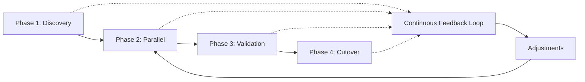

# New Relic OHI to OpenTelemetry Migration: Experimental Framework

## Table of Contents
1. [Executive Summary](#executive-summary)
2. [OHI to OTEL Mapping Matrix](#ohi-to-otel-mapping-matrix)
3. [Experimental Migration Framework](#experimental-migration-framework)
4. [Feedback Loop Architecture](#feedback-loop-architecture)
5. [Phase 1: Discovery & Baseline](#phase-1-discovery--baseline)
6. [Phase 2: Parallel Running](#phase-2-parallel-running)
7. [Phase 3: Validation & Tuning](#phase-3-validation--tuning)
8. [Phase 4: Cutover Strategy](#phase-4-cutover-strategy)
9. [Critical Success Metrics](#critical-success-metrics)
10. [Rollback Procedures](#rollback-procedures)

## Executive Summary

Migrating from New Relic's On-Host Integrations (OHIs) to OpenTelemetry represents a fundamental shift in how infrastructure metrics are collected. The "black box" nature of New Relic's backend requires an experimental approach with tight feedback loops to ensure:

1. **Data Parity**: OTEL metrics match OHI metrics in value and meaning
2. **Entity Preservation**: Infrastructure entities remain properly correlated
3. **Feature Coverage**: Critical OHI features are replicated or replaced
4. **Performance**: No degradation in collection efficiency or accuracy
5. **Cost Control**: Cardinality and DPM remain within bounds

## OHI to OTEL Mapping Matrix

### Core OHI Replacements

| New Relic OHI | OTEL Receiver | Critical Differences | Risk Level |
|---------------|---------------|---------------------|------------|
| **MySQL** | `mysql` receiver | Different metric names, no query monitoring | High |
| **PostgreSQL** | `postgresql` receiver | Missing pg_stat_statements by default | High |
| **Redis** | `redis` receiver | Command stats need configuration | Medium |
| **NGINX** | `nginx` receiver | Requires status module enabled | Low |
| **Apache** | `apache` receiver | Different metric granularity | Low |
| **Kafka** | `kafka` receiver | JMX complexity, topic-level metrics | High |
| **RabbitMQ** | `rabbitmq` receiver | Management plugin required | Medium |
| **Elasticsearch** | `elasticsearch` receiver | Cluster vs node metrics | Medium |
| **MongoDB** | `mongodb` receiver | Auth complexity, different namespaces | High |
| **Cassandra** | JMX + `jmx` receiver | Complex JMX setup required | Very High |
| **AWS (RDS, ELB, etc.)** | `awscloudwatch` receiver | API rate limits, cost implications | Medium |
| **Docker** | `docker_stats` receiver | Different from cAdvisor metrics | Medium |
| **Kubernetes** | `k8s_cluster` receiver | Overlaps with K8s integration | Low |

### Detailed MySQL Example

```yaml
# New Relic MySQL OHI produces metrics like:
# - mysql.node.net.bytesReceivedPerSecond
# - mysql.node.query.questionsPerSecond
# - mysql.node.innodb.bufferPoolPagesData

# OTEL MySQL receiver produces:
# - mysql.buffer_pool.pages{status="data"}
# - mysql.commands{command="select"}
# - mysql.net.bytes{direction="received"}

receivers:
  mysql:
    endpoint: localhost:3306
    username: "${MYSQL_USERNAME}"
    password: "${MYSQL_PASSWORD}"
    collection_interval: 60s
    initial_delay: 1s
    statement_events:
      digest_text_limit: 120
      limit: 250
      time_limit: 24h
      
processors:
  # Transform OTEL metrics to match OHI names
  metricstransform/mysql_compat:
    transforms:
      # Network metrics
      - include: mysql.net.bytes
        action: insert
        new_name: mysql.node.net.bytesReceivedPerSecond
        match_type: strict
        experimental_match_labels: {"direction": "received"}
        aggregation_type: rate
        
      # Buffer pool metrics
      - include: mysql.buffer_pool.pages
        action: insert
        new_name: mysql.node.innodb.bufferPoolPagesData
        match_type: strict
        experimental_match_labels: {"status": "data"}
        
      # Query metrics (more complex)
      - include: mysql.commands
        action: insert
        new_name: mysql.node.query.questionsPerSecond
        match_type: strict
        aggregation_type: sum  # Sum all command types
        submatch_case: "command"
```

## Experimental Migration Framework

### The 4-Phase Approach



### Experiment Configuration

```yaml
# experiment-config.yaml
experiments:
  mysql_migration:
    enabled: true
    ohi_integration: "nri-mysql"
    otel_receiver: "mysql"
    comparison_window: "5m"
    tolerance_percentage: 5
    critical_metrics:
      - name: "mysql.node.net.bytesReceivedPerSecond"
        otel_name: "mysql.net.bytes"
        transformation: "rate"
        tags_mapping:
          direction: "received"
      - name: "mysql.node.query.questionsPerSecond"
        otel_name: "mysql.commands"
        transformation: "sum_rate"
    validation_queries:
      - name: "connection_count"
        nrql: |
          SELECT average(mysql.node.net.maxUsedConnections) 
          FROM MysqlSample 
          WHERE hostname = '${HOSTNAME}'
          SINCE 5 minutes ago
      - name: "query_rate"
        nrql: |
          SELECT rate(sum(mysql.node.query.questionsPerSecond), 1 minute)
          FROM MysqlSample
          WHERE hostname = '${HOSTNAME}'
          SINCE 5 minutes ago
```

### Experimental Collector Configuration

```yaml
# otel-experiment-collector.yaml
receivers:
  # Original OHI data via Infrastructure agent
  otlp/infra_agent:
    protocols:
      grpc:
        endpoint: 0.0.0.0:4317
        
  # New OTEL receiver
  mysql:
    endpoint: "${MYSQL_ENDPOINT}"
    username: "${MYSQL_USERNAME}"
    password: "${MYSQL_PASSWORD}"
    collection_interval: 60s
    
  # Collector's own metrics for monitoring
  prometheus/internal:
    config:
      scrape_configs:
        - job_name: 'otel-collector'
          scrape_interval: 10s
          static_configs:
            - targets: ['0.0.0.0:8888']

processors:
  # Add experiment metadata
  attributes/experiment:
    actions:
      - key: experiment.name
        value: "mysql_ohi_migration"
        action: insert
      - key: experiment.phase
        value: "${EXPERIMENT_PHASE}"
        action: insert
      - key: collection.method
        value: "otel"
        action: insert
        
  # Keep both metric names for comparison
  metricstransform/dual_write:
    transforms:
      - include: "mysql.*"
        action: update
        new_name: "otel.mysql.${1}"
        match_type: regexp
        regex: "mysql\\.(.+)"
        
  # Resource detection for entity correlation
  resourcedetection:
    detectors: [env, system, docker, ec2]
    system:
      hostname_sources: ["os", "dns"]
      
  # Ensure entity correlation attributes
  resource/entity_correlation:
    attributes:
      - key: host.id
        from_attribute: host.name
        action: insert
      - key: service.name
        value: "mysql"
        action: insert
      - key: instrumentation.source
        value: "opentelemetry"
        action: insert

exporters:
  # Debug exporter for local validation
  debug/detailed:
    verbosity: detailed
    sampling_initial: 5
    sampling_thereafter: 1
    
  # New Relic with experiment tag
  otlp/newrelic_experiment:
    endpoint: "https://otlp.nr-data.net"
    headers:
      api-key: "${NEW_RELIC_LICENSE_KEY}"
    retry_on_failure:
      enabled: true
      initial_interval: 5s
      max_interval: 30s

service:
  pipelines:
    # Experimental OTEL pipeline
    metrics/experiment:
      receivers: [mysql]
      processors: [
        memory_limiter,
        attributes/experiment,
        metricstransform/dual_write,
        resourcedetection,
        resource/entity_correlation,
        batch
      ]
      exporters: [debug/detailed, otlp/newrelic_experiment]
      
    # Self-monitoring pipeline
    metrics/internal:
      receivers: [prometheus/internal]
      processors: [memory_limiter, batch]
      exporters: [otlp/newrelic_experiment]
```

## Feedback Loop Architecture

### Real-Time Validation System

```yaml
# feedback-validator.yaml
apiVersion: batch/v1
kind: CronJob
metadata:
  name: ohi-otel-validator
spec:
  schedule: "*/5 * * * *"  # Every 5 minutes
  jobTemplate:
    spec:
      template:
        spec:
          containers:
          - name: validator
            image: ohi-migration-validator:latest
            env:
            - name: NEW_RELIC_API_KEY
              valueFrom:
                secretKeyRef:
                  name: newrelic-secrets
                  key: api-key
            - name: EXPERIMENT_CONFIG
              value: "/config/experiment-config.yaml"
            command: ["/app/validate.sh"]
```

### Validation Script

```bash
#!/bin/bash
# validate.sh

# Function to run NRQL query
run_nrql() {
    local query=$1
    curl -s -H "Api-Key: ${NEW_RELIC_API_KEY}" \
         -H "Content-Type: application/json" \
         -d "{\"nrql\": \"${query}\"}" \
         "https://api.newrelic.com/graphql" | jq -r '.data.nrql.results[0]'
}

# Compare OHI vs OTEL metrics
compare_metrics() {
    local metric=$1
    local tolerance=$2
    
    # OHI metric query
    ohi_query="SELECT average(${metric}) FROM MysqlSample WHERE collection.method != 'otel' SINCE 5 minutes ago"
    ohi_value=$(run_nrql "$ohi_query")
    
    # OTEL metric query
    otel_query="SELECT average(otel.${metric}) FROM Metric WHERE collection.method = 'otel' SINCE 5 minutes ago"
    otel_value=$(run_nrql "$otel_query")
    
    # Calculate difference
    diff=$(echo "scale=2; abs($ohi_value - $otel_value) / $ohi_value * 100" | bc)
    
    if (( $(echo "$diff > $tolerance" | bc -l) )); then
        echo "ALERT: Metric ${metric} differs by ${diff}% (OHI: ${ohi_value}, OTEL: ${otel_value})"
        send_alert "$metric" "$diff" "$ohi_value" "$otel_value"
    else
        echo "OK: Metric ${metric} within tolerance (${diff}%)"
    fi
}

# Main validation loop
while IFS= read -r metric; do
    compare_metrics "$metric" 5
done < critical_metrics.txt
```

### Continuous Monitoring Dashboard

```sql
-- NRQL Queries for Validation Dashboard

-- 1. Metric Comparison Overview
SELECT 
  average(mysql.node.net.bytesReceivedPerSecond) as 'OHI Bytes Received',
  average(otel.mysql.node.net.bytesReceivedPerSecond) as 'OTEL Bytes Received',
  abs(average(mysql.node.net.bytesReceivedPerSecond) - average(otel.mysql.node.net.bytesReceivedPerSecond)) / average(mysql.node.net.bytesReceivedPerSecond) * 100 as 'Difference %'
FROM MysqlSample, Metric
WHERE hostname = 'prod-mysql-01'
SINCE 30 minutes ago
TIMESERIES

-- 2. Collection Method Distribution
SELECT count(*)
FROM MysqlSample, Metric
FACET collection.method
SINCE 1 hour ago
TIMESERIES

-- 3. Missing Metrics Detection
SELECT uniques(metricName)
FROM MysqlSample
WHERE hostname = 'prod-mysql-01'
AND metricName NOT IN (
  SELECT uniques(metricName) 
  FROM Metric 
  WHERE collection.method = 'otel'
)
SINCE 1 hour ago

-- 4. Entity Correlation Check
SELECT 
  latest(entity.guid) as 'Entity GUID',
  latest(entity.name) as 'Entity Name',
  latest(entity.type) as 'Entity Type',
  count(*) as 'Metric Count'
FROM Metric
WHERE collection.method = 'otel'
AND instrumentation.source = 'opentelemetry'
FACET hostname
SINCE 30 minutes ago

-- 5. Cardinality Comparison
SELECT 
  uniqueCount(dimensions()) as 'Unique Dimensions'
FROM MysqlSample, Metric
FACET collection.method, metricName
SINCE 1 hour ago
LIMIT 100
```

## Phase 1: Discovery & Baseline

### 1.1 Inventory Current OHIs

```bash
#!/bin/bash
# inventory-ohis.sh

# List all OHIs on a host
sudo /var/db/newrelic-infra/newrelic-integrations/bin/nri-discovery-kubernetes --list

# Get OHI configurations
for ohi in $(ls /etc/newrelic-infra/integrations.d/*.yml); do
    echo "=== $ohi ==="
    cat $ohi
    echo
done

# Extract metrics from each OHI
for ohi in mysql postgresql redis nginx; do
    echo "=== Metrics for nri-$ohi ==="
    sudo /var/db/newrelic-infra/newrelic-integrations/bin/nri-$ohi --metrics | jq '.metrics[].event_type' | sort | uniq
done
```

### 1.2 Baseline Metrics Collection

```yaml
# baseline-collector.yaml
apiVersion: v1
kind: ConfigMap
metadata:
  name: baseline-config
data:
  collect-baseline.py: |
    import requests
    import json
    import time
    from datetime import datetime, timedelta
    
    class MetricBaseliner:
        def __init__(self, api_key, account_id):
            self.api_key = api_key
            self.account_id = account_id
            self.baseline = {}
            
        def collect_ohi_metrics(self, integration, duration_hours=24):
            """Collect all metrics from an OHI for baseline"""
            end_time = datetime.now()
            start_time = end_time - timedelta(hours=duration_hours)
            
            # Get all metric names
            metric_query = f"""
            SELECT uniques(metricName) 
            FROM {integration}Sample 
            SINCE {duration_hours} hours ago
            """
            
            metrics = self.run_nrql(metric_query)
            
            for metric in metrics:
                # Get metric statistics
                stats_query = f"""
                SELECT 
                  average({metric}) as avg,
                  min({metric}) as min,
                  max({metric}) as max,
                  stddev({metric}) as stddev,
                  count({metric}) as samples
                FROM {integration}Sample
                SINCE {duration_hours} hours ago
                """
                
                stats = self.run_nrql(stats_query)
                
                # Get cardinality
                cardinality_query = f"""
                SELECT uniqueCount(dimensions())
                FROM {integration}Sample
                WHERE metricName = '{metric}'
                SINCE {duration_hours} hours ago
                """
                
                cardinality = self.run_nrql(cardinality_query)
                
                self.baseline[metric] = {
                    'stats': stats,
                    'cardinality': cardinality,
                    'sample_rate': stats['samples'] / (duration_hours * 60)
                }
                
        def save_baseline(self, filename):
            with open(filename, 'w') as f:
                json.dump(self.baseline, f, indent=2)
                
    # Usage
    baseliner = MetricBaseliner(api_key, account_id)
    baseliner.collect_ohi_metrics('Mysql', 24)
    baseliner.save_baseline('mysql-baseline.json')
```

### 1.3 Identify Critical Metrics

```yaml
# critical-metrics.yaml
mysql:
  business_critical:
    - mysql.node.net.maxUsedConnections  # Connection exhaustion
    - mysql.node.query.slowQueriesPerSecond  # Performance degradation
    - mysql.node.innodb.bufferPoolPagesFree  # Memory pressure
    - mysql.node.replication.secondsBehindMaster  # Replication lag
    
  operational:
    - mysql.node.net.connectionsPerSecond
    - mysql.node.query.questionsPerSecond
    - mysql.node.innodb.rowLockWaitsPerSecond
    
  nice_to_have:
    - mysql.node.innodb.bufferPoolPagesTotal
    - mysql.node.net.bytesReceivedPerSecond
    - mysql.node.net.bytesSentPerSecond

postgresql:
  business_critical:
    - postgresql.node.connection.max
    - postgresql.node.transaction.rollbacksPerSecond
    - postgresql.node.replication.lag
    
redis:
  business_critical:
    - redis.node.net.connectedClients
    - redis.node.memory.used
    - redis.node.net.evictedKeysPerSecond
```

## Phase 2: Parallel Running

### 2.1 Dual Collection Architecture

```yaml
# dual-collection-deployment.yaml
apiVersion: apps/v1
kind: DaemonSet
metadata:
  name: otel-ohi-experimental
spec:
  selector:
    matchLabels:
      app: otel-ohi-experimental
  template:
    metadata:
      labels:
        app: otel-ohi-experimental
    spec:
      containers:
      # Existing Infrastructure Agent
      - name: newrelic-infra
        image: newrelic/infrastructure:latest
        env:
        - name: NRIA_LICENSE_KEY
          valueFrom:
            secretKeyRef:
              name: newrelic-secret
              key: license-key
        volumeMounts:
        - name: host-root
          mountPath: /host
          readOnly: true
          
      # Experimental OTEL Collector
      - name: otel-collector
        image: otel/opentelemetry-collector-contrib:latest
        args: ["--config=/etc/otel/config.yaml"]
        env:
        - name: NEW_RELIC_LICENSE_KEY
          valueFrom:
            secretKeyRef:
              name: newrelic-secret
              key: license-key
        - name: EXPERIMENT_PHASE
          value: "parallel"
        volumeMounts:
        - name: otel-config
          mountPath: /etc/otel
          
      # Validation sidecar
      - name: validator
        image: ohi-validator:latest
        env:
        - name: VALIDATION_INTERVAL
          value: "300"  # 5 minutes
        - name: ALERT_THRESHOLD
          value: "10"   # 10% difference triggers alert
```

### 2.2 Traffic Splitting Strategy

```yaml
# For gradual migration
processors:
  probabilistic_sampler:
    sampling_percentage: 10  # Start with 10% OTEL
    hash_seed: 22
    
  routing:
    from_attribute: "collection.percentage"
    table:
      - value: "10"
        exporters: ["otlp/experimental"]
      - value: "90"
        exporters: ["otlp/production"]
```

## Phase 3: Validation & Tuning

### 3.1 Automated Validation Framework

```python
# validation_framework.py
import asyncio
import aiohttp
from datetime import datetime, timedelta
import numpy as np
from scipy import stats

class MetricValidator:
    def __init__(self, nrql_client, config):
        self.nrql = nrql_client
        self.config = config
        self.results = []
        
    async def validate_metric_pair(self, ohi_metric, otel_metric, tolerance=0.05):
        """Compare OHI and OTEL metrics with statistical validation"""
        
        # Collect samples over time
        samples = []
        for i in range(12):  # 1 hour of 5-minute samples
            ohi_value = await self.query_metric(ohi_metric, "OHISample")
            otel_value = await self.query_metric(otel_metric, "Metric")
            
            samples.append({
                'timestamp': datetime.now() - timedelta(minutes=i*5),
                'ohi': ohi_value,
                'otel': otel_value,
                'diff_pct': abs(ohi_value - otel_value) / ohi_value * 100
            })
            
        # Statistical analysis
        diffs = [s['diff_pct'] for s in samples]
        
        result = {
            'metric': ohi_metric,
            'mean_diff': np.mean(diffs),
            'std_diff': np.std(diffs),
            'max_diff': np.max(diffs),
            'within_tolerance': np.mean(diffs) < tolerance * 100,
            'correlation': stats.pearsonr(
                [s['ohi'] for s in samples],
                [s['otel'] for s in samples]
            )[0]
        }
        
        return result
        
    async def validate_entity_correlation(self, hostname):
        """Ensure entities are properly linked"""
        
        # Check if both create the same entity
        entity_query = f"""
        SELECT uniques(entity.guid), uniques(entity.type)
        FROM MysqlSample, Metric
        WHERE hostname = '{hostname}'
        FACET collection.method
        SINCE 1 hour ago
        """
        
        results = await self.nrql.query(entity_query)
        
        # Verify same entity GUID
        if len(set(r['entity.guid'] for r in results)) > 1:
            return {
                'status': 'FAILED',
                'message': 'Different entities created',
                'details': results
            }
            
        return {'status': 'PASSED'}
        
    async def validate_metric_semantics(self, metric_mapping):
        """Ensure metric meanings are preserved"""
        
        validations = []
        
        for ohi_metric, otel_config in metric_mapping.items():
            # Rate metrics
            if otel_config.get('transformation') == 'rate':
                # Verify rate calculation
                ohi_rate = await self.calculate_rate(ohi_metric, "OHISample")
                otel_rate = await self.calculate_rate(
                    otel_config['otel_name'], 
                    "Metric"
                )
                
                rate_diff = abs(ohi_rate - otel_rate) / ohi_rate
                validations.append({
                    'metric': ohi_metric,
                    'type': 'rate',
                    'valid': rate_diff < 0.05
                })
                
        return validations
```

### 3.2 Performance Impact Analysis

```yaml
# performance-monitor.yaml
apiVersion: v1
kind: ConfigMap
metadata:
  name: performance-monitor
data:
  monitor.sh: |
    #!/bin/bash
    
    # Monitor resource usage of both agents
    while true; do
        # Infrastructure agent resources
        INFRA_CPU=$(ps aux | grep newrelic-infra | awk '{print $3}')
        INFRA_MEM=$(ps aux | grep newrelic-infra | awk '{print $4}')
        
        # OTEL collector resources
        OTEL_CPU=$(ps aux | grep otel-collector | awk '{print $3}')
        OTEL_MEM=$(ps aux | grep otel-collector | awk '{print $4}')
        
        # Network usage
        INFRA_NET=$(nethogs -t -c 2 | grep newrelic-infra | awk '{print $2}')
        OTEL_NET=$(nethogs -t -c 2 | grep otel-collector | awk '{print $2}')
        
        # Log comparison
        echo "{
          \"timestamp\": \"$(date -u +%Y-%m-%dT%H:%M:%SZ)\",
          \"infra_agent\": {
            \"cpu_percent\": $INFRA_CPU,
            \"mem_percent\": $INFRA_MEM,
            \"network_kbps\": $INFRA_NET
          },
          \"otel_collector\": {
            \"cpu_percent\": $OTEL_CPU,
            \"mem_percent\": $OTEL_MEM,
            \"network_kbps\": $OTEL_NET
          }
        }" | tee -a /var/log/performance-comparison.json
        
        sleep 60
    done
```

### 3.3 Data Quality Scorecard

```python
# scorecard_generator.py
class DataQualityScorecard:
    def __init__(self):
        self.scores = {}
        
    def calculate_completeness_score(self, ohi_metrics, otel_metrics):
        """What percentage of OHI metrics are available in OTEL?"""
        available = len(set(ohi_metrics) & set(otel_metrics))
        total = len(ohi_metrics)
        return (available / total) * 100
        
    def calculate_accuracy_score(self, validation_results):
        """How closely do OTEL metrics match OHI values?"""
        within_tolerance = sum(1 for r in validation_results 
                              if r['within_tolerance'])
        total = len(validation_results)
        return (within_tolerance / total) * 100
        
    def calculate_latency_score(self, ohi_latency, otel_latency):
        """Is OTEL collection as timely as OHI?"""
        if otel_latency <= ohi_latency:
            return 100
        else:
            return max(0, 100 - (otel_latency - ohi_latency))
            
    def calculate_reliability_score(self, ohi_errors, otel_errors):
        """Error rate comparison"""
        if otel_errors <= ohi_errors:
            return 100
        else:
            return max(0, 100 - (otel_errors - ohi_errors) * 10)
            
    def generate_report(self):
        return {
            'overall_score': np.mean(list(self.scores.values())),
            'breakdown': self.scores,
            'recommendation': self.get_recommendation()
        }
        
    def get_recommendation(self):
        overall = np.mean(list(self.scores.values()))
        if overall >= 95:
            return "READY FOR PRODUCTION"
        elif overall >= 85:
            return "READY WITH MONITORING"
        elif overall >= 75:
            return "NEEDS TUNING"
        else:
            return "NOT READY"
```

## Phase 4: Cutover Strategy

### 4.1 Graduated Rollout Plan

```yaml
# rollout-strategy.yaml
rollout_phases:
  - name: "Dev Environment"
    duration: "1 week"
    rollback_threshold: "any_failure"
    validation:
      - completeness: 100%
      - accuracy: 95%
      - alerts_working: true
      
  - name: "Staging Environment"
    duration: "2 weeks"
    rollback_threshold: "critical_failure"
    validation:
      - completeness: 100%
      - accuracy: 98%
      - performance_impact: "< 5%"
      - entity_correlation: "verified"
      
  - name: "Production Canary (5%)"
    duration: "1 week"
    rollback_threshold: "automated"
    validation:
      - error_rate: "< 0.1%"
      - missing_metrics: "none"
      - dashboards_working: true
      
  - name: "Production Partial (50%)"
    duration: "2 weeks"
    rollback_threshold: "manual_decision"
    validation:
      - cost_increase: "< 10%"
      - support_tickets: "< 2x baseline"
      
  - name: "Production Full (100%)"
    duration: "ongoing"
    rollback_threshold: "emergency_only"
```

### 4.2 Cutover Automation

```bash
#!/bin/bash
# cutover.sh

PHASE=$1
ENVIRONMENT=$2

case $PHASE in
  "prepare")
    # Verify OTEL collector is healthy
    kubectl get pods -l app=otel-collector -o json | \
      jq -r '.items[].status.phase' | grep -v Running && exit 1
      
    # Verify metrics are flowing
    METRIC_COUNT=$(curl -s "$NRQL_ENDPOINT" -d "{
      \"query\": \"SELECT count(*) FROM Metric WHERE collection.method = 'otel' SINCE 5 minutes ago\"
    }" | jq -r '.results[0].count')
    
    [[ $METRIC_COUNT -lt 1000 ]] && echo "Insufficient OTEL metrics" && exit 1
    ;;
    
  "disable-ohi")
    # Stop OHI but keep agent
    kubectl patch daemonset newrelic-infra -p '{
      "spec": {
        "template": {
          "spec": {
            "containers": [{
              "name": "newrelic-infra",
              "env": [{
                "name": "NRIA_DISABLE_INTEGRATIONS",
                "value": "true"
              }]
            }]
          }
        }
      }
    }'
    ;;
    
  "enable-otel-only")
    # Remove dual-write, go full OTEL
    kubectl apply -f otel-production-config.yaml
    ;;
    
  "validate")
    # Run comprehensive validation
    python3 /scripts/post_cutover_validation.py
    ;;
    
  "rollback")
    # Emergency rollback
    kubectl rollout undo daemonset/newrelic-infra
    kubectl delete -f otel-production-config.yaml
    ;;
esac
```

## Critical Success Metrics

### Real-Time KPIs

```sql
-- 1. Migration Progress Dashboard
SELECT 
  filter(count(*), WHERE collection.method = 'ohi') as 'OHI Metrics',
  filter(count(*), WHERE collection.method = 'otel') as 'OTEL Metrics',
  percentage(
    filter(count(*), WHERE collection.method = 'otel'),
    count(*)
  ) as 'OTEL Percentage'
FROM Metric, MysqlSample
SINCE 1 hour ago
TIMESERIES

-- 2. Data Quality Metrics
SELECT 
  average(metric_accuracy_score) as 'Accuracy',
  average(metric_completeness_score) as 'Completeness',
  average(entity_correlation_score) as 'Entity Correlation',
  average(latency_score) as 'Collection Latency'
FROM MigrationMetrics
WHERE experiment.name = 'mysql_ohi_migration'
SINCE 1 day ago
TIMESERIES

-- 3. Cost Impact Analysis
SELECT 
  rate(sum(DPM), 1 minute) as 'Data Points/Minute'
FROM (
  SELECT count(*) as DPM
  FROM Metric, MysqlSample
  FACET collection.method
)
SINCE 1 week ago
COMPARE WITH 1 week ago

-- 4. Alert Coverage Verification
SELECT 
  uniques(conditionName) as 'Alert Conditions',
  sum(openIncidentCount) as 'Open Incidents'
FROM NrAiIncident
WHERE targetName LIKE '%mysql%'
FACET policy.name
SINCE 1 day ago
```

### Success Criteria Matrix

| Metric | Target | Critical | Measurement |
|--------|--------|----------|-------------|
| **Data Completeness** | 100% | Yes | All OHI metrics available |
| **Value Accuracy** | ±5% | Yes | Statistical comparison |
| **Entity Correlation** | 100% | Yes | Same entity GUIDs |
| **Collection Latency** | <10s | No | Time to availability |
| **Resource Usage** | <110% | No | CPU/Memory vs baseline |
| **Error Rate** | <0.1% | Yes | NrIntegrationError events |
| **Cardinality Change** | <120% | No | Unique dimension count |
| **Cost Impact** | <110% | No | DPM comparison |
| **Alert Functionality** | 100% | Yes | All alerts firing correctly |
| **Dashboard Accuracy** | 100% | Yes | Visual verification |

## Rollback Procedures

### Automated Rollback Triggers

```yaml
# rollback-controller.yaml
apiVersion: v1
kind: ConfigMap
metadata:
  name: rollback-controller
data:
  rollback_rules.yaml: |
    triggers:
      - name: "missing_critical_metrics"
        condition: |
          SELECT count(*)
          FROM CriticalMetricsList
          WHERE metricName NOT IN (
            SELECT uniques(metricName)
            FROM Metric
            WHERE collection.method = 'otel'
            SINCE 10 minutes ago
          )
        threshold: 0
        action: "immediate_rollback"
        
      - name: "accuracy_degradation"
        condition: |
          SELECT average(abs(ohi_value - otel_value) / ohi_value * 100)
          FROM MetricComparison
          WHERE metric IN ({{critical_metrics}})
          SINCE 10 minutes ago
        threshold: 10  # 10% difference
        action: "alert_and_rollback"
        
      - name: "entity_correlation_broken"
        condition: |
          SELECT uniqueCount(entity.guid)
          FROM Metric
          WHERE hostname = '{{hostname}}'
          FACET collection.method
          SINCE 10 minutes ago
        threshold: 1  # Should be exactly 1
        action: "investigate_then_rollback"
```

### Manual Rollback Procedure

```bash
#!/bin/bash
# emergency_rollback.sh

echo "=== STARTING EMERGENCY ROLLBACK ==="

# 1. Re-enable OHIs
kubectl patch daemonset newrelic-infra -n newrelic --type='json' -p='[
  {"op": "remove", "path": "/spec/template/spec/containers/0/env/name=NRIA_DISABLE_INTEGRATIONS"}
]'

# 2. Stop OTEL collectors
kubectl scale deployment otel-collector --replicas=0

# 3. Verify OHI metrics returning
echo "Waiting for OHI metrics..."
for i in {1..30}; do
  COUNT=$(curl -s -X POST "$NRQL_ENDPOINT" \
    -H "Api-Key: $NR_API_KEY" \
    -d '{"nrql": "SELECT count(*) FROM MysqlSample SINCE 1 minute ago"}' | \
    jq -r '.data.nrql.results[0].count')
    
  if [[ $COUNT -gt 0 ]]; then
    echo "OHI metrics confirmed: $COUNT"
    break
  fi
  sleep 10
done

# 4. Update alerts to use OHI metrics
./update_alerts.sh --source ohi

# 5. Notify stakeholders
./send_notification.sh --severity critical --message "OHI rollback completed"
```

### Post-Rollback Analysis

```python
# post_rollback_analysis.py
class RollbackAnalyzer:
    def __init__(self, nrql_client, timerange):
        self.nrql = nrql_client
        self.timerange = timerange
        
    def analyze_failure(self):
        """Determine root cause of migration failure"""
        
        findings = []
        
        # Check for missing metrics
        missing = self.find_missing_metrics()
        if missing:
            findings.append({
                'issue': 'missing_metrics',
                'severity': 'critical',
                'metrics': missing,
                'recommendation': 'Update OTEL receiver configuration'
            })
            
        # Check for accuracy issues
        accuracy_issues = self.check_accuracy_issues()
        if accuracy_issues:
            findings.append({
                'issue': 'accuracy_problems',
                'severity': 'high',
                'details': accuracy_issues,
                'recommendation': 'Review metric transformations'
            })
            
        # Check for performance impact
        perf_impact = self.analyze_performance_impact()
        if perf_impact > 20:  # 20% degradation
            findings.append({
                'issue': 'performance_degradation',
                'severity': 'medium',
                'impact_percent': perf_impact,
                'recommendation': 'Optimize collector configuration'
            })
            
        return findings
        
    def generate_retry_plan(self, findings):
        """Create plan to address issues before retry"""
        
        plan = {
            'fixes_required': [],
            'testing_enhanced': [],
            'estimated_duration': 0
        }
        
        for finding in findings:
            if finding['issue'] == 'missing_metrics':
                plan['fixes_required'].append({
                    'action': 'Update OTEL receiver config',
                    'details': f"Add metrics: {finding['metrics']}",
                    'duration_days': 3
                })
                
        return plan
```

## Conclusion

This experimental framework provides:

1. **Systematic Approach**: Phased migration with clear validation gates
2. **Tight Feedback Loops**: Real-time validation and automated rollback
3. **Risk Mitigation**: Parallel running and graduated rollout
4. **Data Integrity**: Comprehensive metric comparison and entity correlation
5. **Operational Safety**: Performance monitoring and emergency procedures

The key to success is treating the New Relic backend as a black box while maintaining rigorous validation at every step. Start with non-critical integrations, validate thoroughly, and scale gradually.